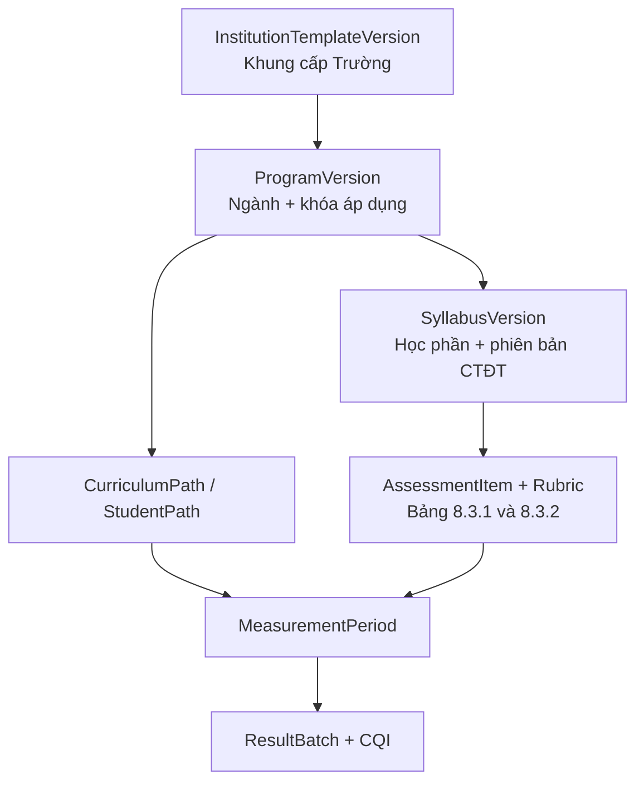

# OutcomeHub

## Tài liệu yêu cầu nghiệp vụ (BRD)

**Hệ thống quản trị, đo lường, đánh giá và cải tiến chuẩn đầu ra theo OBE**

Tài liệu được xây dựng từ khảo sát hệ thống tham chiếu, bộ hồ sơ BM13, dự thảo quy định đo lường PI theo trọng số học phần A và bộ khung cấp Trường về Bản mô tả CTĐT/ĐCCT học phần.

| **Thông tin**     | **Giá trị**                       |
|-------------------|-----------------------------------|
| **Tên sản phẩm**  | OutcomeHub                        |
| **Mã tài liệu**   | BRD-OBE-02                        |
| **Phiên bản**     | 1.2                               |
| **Trạng thái**    | Dự thảo cập nhật theo khung BM+HD |
| **Ngày cập nhật** | 17/08/2026                        |
| **Phạm vi**       | Hệ thống web cấp Trường/Khoa/CTĐT |

|     | **Nguyên tắc xuyên suốt.** Khung cấp Trường được phiên bản hóa và sinh ra các bản thể CTĐT theo ngành/khóa; mỗi ĐCCT phải gắn đúng một phiên bản CTĐT. Mỗi kết quả CLO–PI–PLO phải truy vết được tới tiêu chí rubric, học phần A, trọng số nguồn theo lộ trình thực tế, điểm nguồn, quần thể, ngưỡng và phiên bản công thức; AI chỉ tạo nháp, con người phê duyệt. |
|-----|------------------------------------------------------------------------------------------------------------------------------------------------------------------------------------------------------------------------------------|

**BẢN DỰ THẢO — KHÔNG PHẢI ĐẶC TẢ MÃ NGUỒN CỦA HỆ THỐNG THAM CHIẾU**

# Kiểm soát tài liệu

| **Thuộc tính**           | **Nội dung**                                                      |
|--------------------------|-------------------------------------------------------------------|
| **Tên tài liệu**         | BRD OutcomeHub — hệ thống đo lường, đánh giá và cải tiến chuẩn đầu ra theo OBE |
| **Chủ sở hữu nghiệp vụ** | Đơn vị Khảo thí/Đảm bảo chất lượng — xác nhận khi phê duyệt       |
| **Đơn vị phối hợp**      | Phòng Đào tạo, Khoa/Viện, Trung tâm CNTT, chủ nhiệm CTĐT          |
| **Mức bảo mật**          | Nội bộ; không đưa dữ liệu cá nhân thật vào bản mẫu                |
| **Chu kỳ rà soát**       | Khi thay đổi chính sách OBE, CTĐT, công thức hoặc tích hợp nguồn  |

## Lịch sử phiên bản

| **Phiên bản** | **Ngày**   | **Trạng thái**   | **Nội dung thay đổi**                                                                                                                                                         |
|---------------|------------|------------------|-------------------------------------------------------------------------------------------------------------------------------------------------------------------------------|
| **1.0**       | 04/08/2026 | Dự thảo          | Tạo mới sau khảo sát website, đối chiếu BRD nền, BM13 và đề cương ACC4104; bổ sung phân tích API.                                                                             |
| **1.1**       | 05/08/2026 | Dự thảo cập nhật | Bổ sung quy định dự thảo đo PI theo trọng số học phần A; chuẩn hóa I/R/M/IA/RA/MA, công thức hai tầng, lộ trình thực tế, học phần/bài đánh giá neo và kiểm soát số lượng M/A. |
| **1.2**       | 17/08/2026 | Dự thảo cập nhật | Bổ sung khung cấp Trường cho Bản mô tả CTĐT và ĐCCT; chuẩn hóa quan hệ Template–ProgramVersion–SyllabusVersion; khóa PLO/PI chung; sửa A thành cờ độc lập với I/R/M; ưu tiên 1, tối đa 2 nguồn đo/PI; lấy tỷ trọng PI trực tiếp từ bảng 8.3.2 đã duyệt. |

## Phê duyệt

| **Vai trò phê duyệt**    | **Họ tên** | **Ý kiến/Ký duyệt** | **Ngày** |
|--------------------------|------------|---------------------|----------|
| **Chủ sở hữu nghiệp vụ** |            |                     |          |
| **Phòng Đào tạo**        |            |                     |          |
| **Trung tâm CNTT**       |            |                     |          |
| **Đại diện Khoa/CTĐT**   |            |                     |          |

## Nguồn đầu vào

| **Mã** | **Nguồn**                                                                                                                                                             |
|--------|-----------------------------------------------------------------------------------------------------------------------------------------------------------------------|
| **S1** | Khảo sát trực tiếp giao diện có đăng nhập tại https://lhu.dgcdr.com/ ngày 04/08/2026; chỉ quan sát và gọi GET không xác thực.                                         |
| **S2** | Tài liệu yêu cầu nghiệp vụ đo lường CĐR do người dùng cung cấp (BRD nền, 22 trang).                                                                                   |
| **S3** | DNU_Mẫu chung BM13 thí điểm OBE 26.7.2026 — công thức tỷ trọng tiêu chí trực tiếp PI.                                                                                 |
| **S4** | BM13_ACC4104_Kế toán Máy — ví dụ thật về CLO, PI9.1, PI9.2, đánh giá và rubric.                                                                                       |
| **S5** | Kiểm tra gói JavaScript client công khai: 51 chunk, 110 tổ hợp method–path; không sử dụng hoặc xuất token trình duyệt.                                                |
| **S6** | 05.8.2026 Quy định đo lường PI theo trọng số A DNU — dự thảo; định nghĩa I/R/M/IA/RA/MA, học phần A, học phần/bài đánh giá neo, trọng số A và kiểm soát số lượng M/A. |
| **S7** | PHỤ LỤC: Biểu mẫu Bản mô tả CTĐT & ĐCCT học phần — bộ khung cấp Trường cho CTĐT theo ngành/khóa, PLO/PI chung, ma trận I/R/M/A, kế hoạch đo trực tiếp và ĐCCT có bảng truy vết 8.3.1/8.3.2. |

# Mục lục nội dung

| **Mục**     | **Nội dung**                                       |
|-------------|----------------------------------------------------|
| **1**       | Tóm tắt điều hành                                  |
| **2**       | Mục tiêu, phạm vi và nguyên tắc                    |
| **3**       | Kết quả khảo sát hệ thống tham chiếu               |
| **4**       | Bên liên quan và mô hình phân quyền                |
| **5**       | Mô hình nghiệp vụ và dữ liệu cốt lõi               |
| **6**       | Quy trình nghiệp vụ đầu-cuối                       |
| **7**       | Mô hình đo lường và công thức                      |
| **8**       | Yêu cầu chức năng                                  |
| **9**       | Quy tắc nghiệp vụ                                  |
| **10**      | Tích hợp và API                                    |
| **11**      | Báo cáo và cảnh báo                                |
| **12**      | Yêu cầu phi chức năng                              |
| **13**      | Tiêu chí nghiệm thu                                |
| **14**      | MVP và lộ trình                                    |
| **15**      | Rủi ro, phụ thuộc và quyết định mở                 |
| **Phụ lục** | Ví dụ ACC4104, danh mục API, truy vết, checklist và ánh xạ khung S7 |

# 1. Tóm tắt điều hành

Hệ thống đề xuất là nền tảng quản trị vòng đời đo lường chuẩn đầu ra theo OBE, từ cấu hình CTĐT và đề cương học phần đến thu thập minh chứng, tính CLO–PI–PLO, công bố kết quả và đóng vòng cải tiến chất lượng. **Sản phẩm có độ tương đồng chức năng với hệ thống tham chiếu ở cấp nghiệp vụ, nhưng không sao chép mã nguồn, dữ liệu, giao diện thương hiệu hoặc cơ chế xác thực của bên thứ ba.**

- Một nguồn sự thật có phiên bản theo chuỗi: Khung cấp Trường → ProgramVersion theo ngành/khóa → StudentPath → SyllabusVersion → CourseOffering → đợt đo → ResultBatch.

- Ma trận CTĐT lưu mức đóng góp I/R/M và cờ đo trực tiếp A ở hai trường độc lập. Khi hiển thị có thể dùng A, RA hoặc MA; IA không được khuyến nghị trong khung hiện hành. A không phải mã bài đánh giá A1/A2/A3.

- PLO1–PLO4 và PI chung tương ứng thuộc khung cấp Trường, không được đơn vị tự ý sửa; PLO5–PLO9 và PI ngành được xây dựng theo khung năng lực ngành và phải qua phê duyệt.

- Điểm PI được tính hai tầng: từ tiêu chí rubric trong từng học phần A, sau đó tổng hợp giữa các học phần A theo trọng số đã duyệt và lộ trình thực học của từng sinh viên.

- Điểm đo được lưu ở mức tiêu chí rubric/câu hỏi khi cần; mọi phép tổng hợp giữ điểm gốc, trọng số, tử số, mẫu số và tập sinh viên.

- Hai ngưỡng độc lập: ngưỡng đạt của từng người học và mục tiêu tỷ lệ người học đạt của tập thể; không cố định 50%/70% cho mọi CTĐT.

- Nguồn trực tiếp và gián tiếp luôn tách riêng; chỉ kết hợp khi có chính sách được phê duyệt và có phiên bản.

- Kết quả chính thức chạy trên snapshot bất biến; sửa điểm hoặc cấu hình sau công bố phải tạo lần tính mới và giải thích chênh lệch.

- AI hỗ trợ đọc BM13, tạo nháp rubric/đề thi, hỏi đáp và phát hiện bất thường; không tự phê duyệt quyết định học thuật.

|     | **Kết luận API.** Có thể khai thác dữ liệu qua API khi có Bearer token hợp lệ và đúng phạm vi quyền. Truy cập ẩn danh bị chặn 401. Sản phẩm mới phải cung cấp API tích hợp chính thức, tài khoản dịch vụ, OpenAPI và nhật ký; không xây giải pháp dựa trên việc lấy token từ trình duyệt. |
|-----|-------------------------------------------------------------------------------------------------------------------------------------------------------------------------------------------------------------------------------------------------------------------------------------------|

## Giá trị nghiệp vụ kỳ vọng

| **Kết quả**        | **Chỉ số đề xuất để nghiệm thu/đo sau triển khai**                                                            |
|--------------------|---------------------------------------------------------------------------------------------------------------|
| **Tin cậy**        | 100% kết quả công bố truy vết tới snapshot điểm, công thức, ngưỡng và phiên bản CTĐT.                         |
| **Đúng tính toán** | Bộ dữ liệu đối chứng cho sai lệch tối đa 0,01 điểm hoặc 0,01 điểm phần trăm sau quy tắc làm tròn.             |
| **Minh bạch**      | 100% tỷ lệ đạt hiển thị tử số, mẫu số, số loại trừ, cỡ mẫu và thời điểm dữ liệu.                              |
| **Hiệu quả**       | Giảm tối thiểu 50% thời gian chuẩn bị đợt đo sau giai đoạn thí điểm so với quy trình thủ công đã đo baseline. |
| **An toàn**        | Không có truy cập chéo đơn vị/CTĐT ngoài scope trong UAT; mọi xuất dữ liệu cá nhân có audit.                  |
| **Cải tiến**       | 100% CĐR dưới ngưỡng được tạo hoặc miễn trừ action plan có phê duyệt; kế hoạch có minh chứng đóng vòng.       |

# 2. Mục tiêu, phạm vi và nguyên tắc

## 2.1. Mục tiêu nghiệp vụ

1\. Chuẩn hóa dữ liệu học thuật và công thức đo cho nhiều ngành, nhiều khóa, nhiều phiên bản CTĐT.

2\. Tự động hóa thu thập/đối soát điểm và tính mức đạt, nhưng vẫn giữ các chốt phê duyệt của đơn vị chuyên môn.

3\. Cung cấp báo cáo đa chiều, cảnh báo sớm và hồ sơ kiểm định có thể tái lập.

4\. Khép kín vòng CQI: phát hiện → nguyên nhân → hành động → minh chứng → đo lại → xác minh tác động.

5\. Tạo nền tảng tích hợp ổn định với SIS/LMS/SSO/DMS/BI qua API có hợp đồng và quản trị dữ liệu.

6\. Chuẩn hóa một khung cấp Trường có thể tái sử dụng để tạo CTĐT và ĐCCT cho mọi ngành/khóa, đồng thời giữ độc lập lịch sử từng phiên bản.

## 2.2. Phạm vi trong và ngoài dự án

| **Trong phạm vi**                                                            | **Ngoài phạm vi/không mặc định**                                              |
|------------------------------------------------------------------------------|-------------------------------------------------------------------------------|
| **Khung cấp Trường, cơ cấu, CTĐT, khóa, học phần, PO/PLO/PI/CLO/LLO, chương trình học và các ma trận.** | Thay thế toàn bộ SIS/LMS hoặc hệ thống nhân sự. |
| **ĐCCT, đề thi/bài đánh giá, rubric, bảng 8.3.1/8.3.2, minh chứng và phiên bản tài liệu.** | Tổ chức thi trực tuyến, giám sát thi, ngân hàng câu hỏi thích ứng đầy đủ. |
| **Đợt đo, phân công, nhập/đồng bộ điểm, snapshot, tính và duyệt kết quả.**   | Tự thay đổi điểm học phần chính thức trong hệ thống nguồn.                    |
| **Dashboard, báo cáo CLO/PI/PLO/sinh viên, cảnh báo và CQI.**                | Tự động kết luận kiểm định hoặc thay quyền phê duyệt học thuật.               |
| **Chatbot/AI có trích dẫn và kiểm soát quyền; nhập/xuất Word/PDF/Excel.**    | Huấn luyện mô hình bên ngoài bằng dữ liệu Trường khi chưa có phê duyệt riêng. |
| **API tích hợp, service account, audit và quản trị cấu hình.**               | Cào endpoint private của hệ thống tham chiếu làm tích hợp sản xuất.           |

## 2.3. Nguyên tắc thiết kế bắt buộc

| **Mã**   | **Nguyên tắc**  | **Diễn giải**                                                                                 |
|----------|-----------------|-----------------------------------------------------------------------------------------------|
| **P-01** | Version first   | CTĐT, CĐR, ma trận, rubric, ngưỡng và công thức đều có hiệu lực theo thời gian/khóa.          |
| **P-02** | Traceability    | Kết quả đi ngược được tới tiêu chí, bài đánh giá, sinh viên, lớp, batch và nguồn điểm.        |
| **P-03** | Reproducibility | Một batch dùng đúng một snapshot và một bộ cấu hình; chạy lại cùng đầu vào cho cùng kết quả.  |
| **P-04** | Human approval  | AI và quy tắc tự động không thay người có thẩm quyền ở bước duyệt/công bố.                    |
| **P-05** | Least privilege | Quyền gắn vai trò và phạm vi tổ chức/CTĐT/lớp; dữ liệu nhạy cảm được tối thiểu hóa.           |
| **P-06** | Explainability  | Báo cáo hiển thị công thức, nguồn, tử số/mẫu số, loại trừ và lý do cảnh báo.                  |
| **P-07** | API as contract | Tích hợp dựa trên API được tài liệu hóa, không dựa vào UI scraping hoặc bundle không ổn định. |
| **P-08** | Template-instance | Khung cấp Trường và bản thể ngành/khóa là hai lớp dữ liệu riêng; cập nhật khung không tự ghi đè CTĐT/ĐCCT đã ban hành. |
| **P-09** | Single binding | Mỗi ĐCCT, lớp học phần và ResultBatch phải tham chiếu chính xác phiên bản CTĐT/rubric/policy đã áp dụng. |

# 3. Kết quả khảo sát hệ thống tham chiếu

Khảo sát được thực hiện trên phiên đăng nhập do người dùng cung cấp, ở chế độ chỉ đọc. **Tenant tại thời điểm khảo sát hầu hết chưa có dữ liệu; dashboard chứa nhãn “Dữ liệu mẫu” và một số chỉ số N/A/0.** Vì vậy, BRD chỉ dùng cấu trúc màn hình, trường dữ liệu và luồng chức năng làm bằng chứng; không dùng số minh họa làm yêu cầu nghiệp vụ.

| **Phân hệ**                | **Quan sát được \[S1\]**                                                                 | **Yêu cầu hoàn thiện trong sản phẩm mới**                                                       |
|----------------------------|------------------------------------------------------------------------------------------|-------------------------------------------------------------------------------------------------|
| **Dashboard**              | Thẻ tổng SV/đợt đo/PLO/học phần; biểu đồ PLO; tình trạng đạt; kế hoạch cải tiến gần đây. | Thêm thời điểm dữ liệu, phiên bản, drill-down, nhãn dữ liệu mẫu rõ ràng và theo scope quyền.    |
| **Quản lý CTĐT**           | Khoa → ngành/CTĐT → niên khóa; tìm nhanh; thêm Khoa.                                     | Bổ sung phiên bản quyết định, PLO/PI/CLO, ma trận, phê duyệt và so sánh phiên bản.              |
| **Sinh viên**              | Danh sách/báo cáo; lọc Khoa–Ngành–Lớp; thống kê phân bổ.                                 | Đồng bộ SIS, StudentPath theo thời gian, học lại/chuyển ngành và che dữ liệu cá nhân.           |
| **Giảng viên**             | Danh sách tài khoản, email, Khoa; tìm kiếm.                                              | Tách hồ sơ giảng viên, tài khoản, phân công chấm và phạm vi dữ liệu.                            |
| **Đợt đo**                 | Mã/tên/năm học/HK/niên khóa/Khoa/Ngành; mục tiêu 50% điểm và 70% SV.                     | Tách ngưỡng cá nhân/tập thể, khóa cấu hình, quần thể, snapshot và workflow công bố.             |
| **Quản lý điểm**           | Danh sách đợt, lọc và định hướng phân công/nhập điểm OBE.                                | Điểm ở mức rubric/câu hỏi, nhập hàng loạt, kiểm tra lỗi, dual control và delta sau sửa.         |
| **Kết quả**                | Danh sách đợt; dashboard chương trình theo Khoa–Ngành–Khóa–Đợt.                          | Kết quả có phiên bản, duyệt, trực tiếp/gián tiếp, drill-down và giải thích chênh lệch.          |
| **Đề cương/Đề thi/Rubric** | Tạo mới, lọc, tải file; AI tạo nội dung; loại bài đánh giá.                              | BM13 có cấu trúc, versioning, mapping rubric–CLO–PI, checksum, trích dẫn và phê duyệt.          |
| **Báo cáo**                | Tổng quan, Ngành, Học phần, PLO, PI, CLO, Sinh viên, Cảnh báo; xuất Excel/PDF.           | Thêm quality gate, denominator, tập loại trừ, direct/indirect, so sánh cohort và gói kiểm định. |
| **Cải tiến**               | Trang quản lý kế hoạch; empty state ở tenant khảo sát.                                   | Root cause, KPI, workflow, nhắc hạn, đo lại, minh chứng và xác minh đóng vòng.                  |
| **Chatbot**                | Câu hỏi gợi ý về khoa/môn/SV/điểm; phiên khảo sát báo không kết nối.                     | RAG theo quyền, trích dẫn, từ chối dữ liệu ngoài scope, nhật ký và ngăn prompt injection.       |
| **RBAC**                   | Vai trò–quyền; gán vai trò cho người dùng theo Khoa/trạng thái.                          | Scope chi tiết, separation of duties, role template, audit và kiểm thử quyền phủ định.          |
| **Cấu hình**               | AI Prompt và Loại câu hỏi; tài khoản khảo sát không đủ quyền.                            | Phiên bản prompt/cấu hình, phê duyệt thay đổi, rollback và ground-truth test.                   |

## 3.1. Giới hạn của khảo sát

- Không có quyền và không thực hiện kiểm thử bảo mật, tải, phân quyền sâu hoặc chất lượng thuật toán backend.

- Không tạo/sửa/xóa dữ liệu; các nút POST/PATCH/DELETE chỉ được nhận diện từ client, không được gọi.

- Không sử dụng, hiển thị hoặc sao chép token của phiên đăng nhập; GET không token được dùng để xác nhận cơ chế 401.

- Danh mục API quan sát từ client không phải OpenAPI chính thức và có thể thay đổi sau mỗi lần triển khai.

## 3.2. Kết luận khoảng trống cần giải quyết

|     | **Khoảng trống trọng yếu.** Giao diện tham chiếu thể hiện đúng bản đồ module, nhưng một sản phẩm dùng chính thức cần bổ sung quản trị phiên bản, workflow phê duyệt, snapshot bất biến, công thức rubric-level, chính sách quần thể/học lại, bảo vệ API, audit và gói minh chứng. |
|-----|-----------------------------------------------------------------------------------------------------------------------------------------------------------------------------------------------------------------------------------------------------------------------------------|

# 4. Bên liên quan và mô hình phân quyền

| **Vai trò**                     | **Trách nhiệm chính**                                                    | **Phạm vi**                          |
|---------------------------------|--------------------------------------------------------------------------|--------------------------------------|
| **Ban Giám hiệu**               | Ban hành khung/chính sách cấp Trường; xem tổng hợp, xu hướng và rủi ro.  | Toàn Trường; phê duyệt/đọc.          |
| **Hội đồng chuyên môn**         | Thẩm định khung, PLO/PI chung, CTĐT ngành, ĐCCT và ngoại lệ học thuật.    | Theo quyết định/phạm vi được giao.   |
| **Đảm bảo chất lượng/Khảo thí** | Quản trị template OBE, đợt đo, quality gate, công bố và CQI.             | Trường/Khoa/CTĐT theo phân công.     |
| **Phòng Đào tạo**               | Quản lý khung CTĐT/ĐCCT, khóa, học phần, chính sách điểm và dữ liệu nguồn. | Trường/CTĐT.                       |
| **Khoa/Viện**                   | Quản trị ngành, giảng viên, ma trận, kế hoạch đo và cải tiến.            | Đơn vị và CTĐT trực thuộc.           |
| **Chủ nhiệm CTĐT**              | Soạn/duyệt PLO–PI, coverage, ngưỡng và báo cáo chương trình.             | Một/nhiều CTĐT được giao.            |
| **Bộ môn/Giảng viên**           | Soạn đề cương/rubric, nhập điểm tiêu chí, nộp minh chứng, đề xuất CQI.   | Học phần/lớp được phân công.         |
| **Người chấm/Phản biện**        | Chấm hoặc kiểm tra; không tự công bố kết quả mình tạo.                   | Đợt/học phần được giao.              |
| **Kiểm định viên/Auditor**      | Đọc báo cáo, truy vết và gói minh chứng; không sửa dữ liệu.              | Phạm vi được cấp, có thời hạn.       |
| **Sinh viên**                   | Tùy chọn: xem tiến độ cá nhân đã công bố và hướng dẫn cải thiện.         | Chỉ dữ liệu của chính mình.          |
| **Quản trị hệ thống**           | Tài khoản, vai trò, cấu hình, vận hành; không mặc định duyệt học thuật.  | Hệ thống, tách khỏi quyền học thuật. |
| **Tài khoản tích hợp**          | Đồng bộ SIS/LMS/BI theo scope API máy-máy.                               | Endpoint và dữ liệu tối thiểu.       |

## 4.1. Nguyên tắc RBAC

- Quyền = hành động × loại tài nguyên × phạm vi; ví dụ score:update × CourseOffering × lớp được giao.

- Tách tối thiểu các quyền tạo, sửa, thẩm định, duyệt, công bố, mở lại, xuất dữ liệu và quản trị vai trò.

- Người tạo batch hoặc nhập điểm không được là người duyệt cuối cùng nếu chính sách yêu cầu dual control.

- Vai trò hệ thống có thể dùng template nhưng mọi gán người dùng phải có thời hạn, đơn vị và lịch sử.

# 5. Mô hình nghiệp vụ và dữ liệu cốt lõi

## 5.1. Chuỗi giá trị đầu-cuối

| **1. Nguồn** | **2. Chuẩn hóa** | **3. Cấu hình** | **4. Thu thập** | **5. Tính và duyệt** | **6. CQI** |
|---|---|---|---|---|---|
| SIS/LMS/SSO; BM13/tài liệu | Danh mục, phiên bản và đối soát lỗi | PLO–PI–CLO; rubric và ngưỡng | Điểm tiêu chí và minh chứng | Snapshot → batch → thẩm định → công bố | Cảnh báo → hành động → đo lại → đóng vòng |

## 5.2. Thực thể bắt buộc

| **Thực thể**                         | **Nội dung tối thiểu**                                                                                              |
|--------------------------------------|---------------------------------------------------------------------------------------------------------------------|
| **OrgUnit**                          | Trường/Khoa/Viện/Bộ môn/cơ sở; cây tổ chức và hiệu lực.                                                             |
| **InstitutionTemplateVersion**       | Phiên bản khung cấp Trường cho Bản mô tả CTĐT/ĐCCT; trường bắt buộc, PLO/PI chung, quy tắc khóa, ngày hiệu lực, quyết định và trạng thái. |
| **Program**                          | Ngành/chương trình; mã, trình độ, đơn vị chủ quản.                                                                  |
| **ProgramVersion**                   | Bản thể CTĐT của một ngành áp dụng từ khóa/giai đoạn xác định; tham chiếu khung cấp Trường, quyết định, hiệu lực, tổng tín chỉ và trạng thái. |
| **ProgramObjective / Competency**    | PO, Khung năng lực Tầng 1–3 và các ma trận PO–PLO–năng lực có mức L/M/H.                                            |
| **CurriculumPlan / CurriculumPath**  | Khối kiến thức, danh mục học phần, học kỳ dự kiến, tiên quyết, bắt buộc/tự chọn, chuyên ngành và phương án tốt nghiệp. |
| **Cohort / StudentPath**             | Khóa và lộ trình CTĐT của từng sinh viên theo thời gian.                                                            |
| **Course / CourseVersion**           | Học phần, tín chỉ, tương đương/thay thế, bắt buộc/tự chọn.                                                          |
| **CourseOffering**                   | Lớp học phần theo kỳ, giảng viên và danh sách học.                                                                  |
| **PLO / PI / CLO / LLO**             | Chuẩn đầu ra có mã, nội dung, miền/Bloom, phiên bản và hiệu lực.                                                    |
| **OutcomeMapping**                   | CLO–PI/PLO, học phần–PI/PLO; lưu riêng contributionLevel I/R/M và isDirectAssessment; căn cứ, nguồn template và trạng thái phê duyệt. |
| **SyllabusTemplateVersion**          | Phiên bản khung ĐCCT cấp Trường, cấu trúc mục 1–10, trường bắt buộc, quy tắc bảng 8.3.1/8.3.2 và ngày hiệu lực.     |
| **SyllabusVersion**                  | ĐCCT của CourseVersion gắn đúng ProgramVersion; mục tiêu, CLO/LLO, học liệu, kế hoạch buổi học, đánh giá, rubric, điều kiện, trạng thái, file và checksum. |
| **AssessmentItem**                   | Mã bài/thành phần đánh giá như A1/A2/A3; độc lập với cờ học phần A; có trọng số trong học phần.                     |
| **Rubric / Criterion**               | Rubric theo từng AssessmentItem; tiêu chí có mã, mô tả mức, điểm tối đa, trọng số trong bài, vai trò dữ liệu và PI trực tiếp nếu có. |
| **DirectPICriterionWeight**          | Tỷ trọng trực tiếp của tiêu chí rubric trong điểm PI theo bảng 8.3.2; tổng đúng 100% cho mỗi PI trong một học phần A. |
| **DirectMeasurementPlan / AWeight**  | Kế hoạch đo PI theo StudentPath: ưu tiên 1, tối đa 2 nguồn; học kỳ dự kiến, đơn vị phụ trách, trọng số nguồn tổng 100%, nguồn chính thức/đối sánh, phiên bản và phê duyệt. |
| **AnchorAssessment**                 | Học phần neo, bài đánh giá neo, rubric/tiêu chí trực tiếp và nguồn minh chứng chính thức của PI.                    |
| **MeasurementPeriod**                | Đợt đo theo năm học/HK/khóa/CTĐT; mục tiêu và trạng thái.                                                           |
| **GraderAssignment**                 | Phân công chấm/kiểm tra theo học phần hoặc tiêu chí.                                                                |
| **Enrollment**                       | Sinh viên trong quần thể đo, trạng thái và lý do loại trừ.                                                          |
| **ScoreRecord**                      | Điểm gốc và chuẩn hóa ở mức thành phần/tiêu chí; nguồn và người nhập.                                               |
| **InputSnapshot**                    | Ảnh bất biến của dữ liệu đầu vào và checksum cho một batch.                                                         |
| **CalculationPolicy**                | Công thức hai tầng, tỷ trọng criterion/nguồn A, giới hạn nguồn, lộ trình, ngưỡng, làm tròn, học lại, direct/indirect và cổng PI cốt lõi. |
| **CoursePIResult / StudentPIResult** | Điểm PI trong từng học phần A và điểm PI tổng hợp; lưu trọng số, đóng góp, StudentPath và nguồn neo.                |
| **ResultBatch / Result**             | Lần tính, phiên bản, kết quả cá nhân/tập thể và giải thích.                                                         |
| **Evidence**                         | File/URL, loại, chủ sở hữu, checksum, thời hạn lưu và liên kết.                                                     |
| **ImprovementPlan**                  | Vấn đề, nguyên nhân, hành động, KPI, chủ trì, hạn và trạng thái.                                                    |
| **User / Role / Permission**         | Tài khoản, quyền, scope, trạng thái và hiệu lực.                                                                    |
| **AuditEvent**                       | Ai, khi nào, hành động, đối tượng, before/after, lý do và request ID.                                               |
| **AIJob / AIArtifact**               | Tài liệu, model/prompt/schema, đầu ra, trích dẫn, confidence và quyết định duyệt.                                   |

## 5.3. Trạng thái chuẩn

| **Đối tượng**          | **Dòng trạng thái**                                                                       |
|------------------------|-------------------------------------------------------------------------------------------|
| **Cấu hình học thuật** | Nháp → Gửi thẩm định → Đã duyệt → Đang áp dụng → Hết hiệu lực                             |
| **Đợt đo**             | Nháp → Mở dữ liệu → Đang thu thập → Đối soát → Đã tính → Đã duyệt → Công bố → Đóng/Mở lại |
| **Tài liệu portfolio** | Nháp → Thẩm định → Đã duyệt → Đang áp dụng → Thay thế/Lưu trữ                             |
| **CQI**                | Mới → Đã duyệt → Đang thực hiện → Chờ xác minh → Đã đóng / Từ chối / Quá hạn              |
| **AI**                 | Đang xử lý → Cần duyệt → Chấp nhận một phần/Chấp nhận/Từ chối → Đã áp dụng                |

## 5.4. Phân tầng khung, phiên bản và dữ liệu vận hành

| **Lớp** | **Được tái sử dụng** | **Được phép thay đổi** | **Nguyên tắc dữ liệu** |
|----------|----------------------|-------------------------|-------------------------|
| **Khung cấp Trường** | Cho nhiều ngành và khóa | Chỉ bằng phiên bản khung mới có phê duyệt | PLO1–PLO4 và PI chung là nội dung khóa; quy tắc biểu mẫu/policy có hiệu lực. |
| **ProgramVersion** | Chỉ trong phạm vi ngành/khóa được ban hành | Tạo version mới, không sửa đè bản đã áp dụng | Chứa PLO/PI ngành, PO, khung năng lực, chương trình học, ma trận và kế hoạch đo. |
| **SyllabusVersion** | Có thể dùng cho nhiều lớp học phần phù hợp | Tạo version mới khi CTĐT, mapping, đánh giá hoặc rubric thay đổi | Luôn chỉ rõ ProgramVersion đối chiếu; học phần dùng chung có phần lõi và mapping được quản trị tập trung/phụ lục đã duyệt. |
| **CourseOffering/MeasurementPeriod** | Không phải mẫu | Chỉ cập nhật dữ liệu vận hành theo workflow | Gắn snapshot chính xác của CTĐT, ĐCCT, rubric, policy và quần thể. |
| **ResultBatch** | Không tái sử dụng đầu ra | Bất biến sau công bố; sửa tạo batch mới | Cho phép tái lập và truy vết tới từng tiêu chí/minh chứng. |

**Quy tắc kế thừa:** cập nhật `InstitutionTemplateVersion` không tự động thay đổi `ProgramVersion` hoặc `SyllabusVersion` đã ban hành. Hệ thống chỉ tạo đề nghị nâng cấp, hiển thị khác biệt và yêu cầu người có thẩm quyền phê duyệt trước khi sinh phiên bản mới.

# 6. Quy trình nghiệp vụ đầu-cuối

## 6.0. WF-00 — Ban hành khung cấp Trường

| **Bước** | **Vai trò** | **Hoạt động** | **Đầu ra/kiểm soát** |
|----------|-------------|---------------|----------------------|
| **1** | Đào tạo/ĐBCL | Tạo `InstitutionTemplateVersion` và `SyllabusTemplateVersion`, khai báo cấu trúc biểu mẫu, trường bắt buộc, PLO1–PLO4, PI chung và quy tắc đo. | Bản nháp khung cấp Trường. |
| **2** | Hội đồng chuyên môn | Thẩm định nội dung khóa/mở, chính sách A, số nguồn đo, bảng 8.3.1/8.3.2, ngưỡng và công thức. | Biên bản, yêu cầu sửa hoặc đề nghị duyệt. |
| **3** | Người có thẩm quyền | Ban hành số quyết định, ngày hiệu lực, phạm vi áp dụng và cơ chế chuyển tiếp. | Phiên bản khung Đã duyệt/Đang áp dụng. |
| **4** | Hệ thống | Không sửa đè khung đã dùng; khi có bản mới, tạo báo cáo tác động tới ProgramVersion/SyllabusVersion nhưng không tự nâng cấp. | Lịch sử và danh sách đối tượng cần rà soát. |

## 6.1. WF-01 — Thiết lập CTĐT và bộ đo

| **Bước** | **Vai trò**      | **Hoạt động**                                                                                                                               | **Đầu ra/kiểm soát**                |
|----------|------------------|---------------------------------------------------------------------------------------------------------------------------------------------|-------------------------------------|
| **1**    | Đào tạo/Khoa     | Chọn khung cấp Trường đang hiệu lực; tạo `ProgramVersion` cho ngành và khóa áp dụng, khai báo quyết định, thông tin tổng quát và chương trình đối sánh. | Phiên bản CTĐT nháp có nguồn template. |
| **2**    | Chủ nhiệm CTĐT   | Khai báo PO, Khung năng lực Tầng 3 và ma trận L/M/H; kế thừa PLO1–PLO4, PI chung bị khóa; xây dựng PLO5–PLO9 và PI ngành.                    | Bộ PO–PLO–PI có truy vết nguồn.     |
| **3**    | Khoa/Bộ môn      | Xây dựng khối kiến thức, danh mục học phần, học kỳ, tiên quyết, tự chọn/chuyên ngành/phương án tốt nghiệp và các `CurriculumPath`.           | Chương trình học theo từng lộ trình. |
| **4**    | Chủ nhiệm/Bộ môn | Lập ma trận học phần–PI; lưu riêng I/R/M và cờ A, ưu tiên RA/MA khi đo trực tiếp; lập kế hoạch nguồn đo theo từng lộ trình.                  | Ma trận và DirectMeasurementPlan.   |
| **5**    | Giảng viên       | Tạo `SyllabusVersion` từ khung ĐCCT và mapping của ProgramVersion; khai báo CLO/LLO, kế hoạch buổi học, đánh giá, rubric, bảng 8.3.1/8.3.2 và minh chứng. | ĐCCT có cấu trúc, gắn đúng CTĐT.    |
| **6**    | Hệ thống         | Kiểm tra mã trùng, trường bắt buộc, khóa PLO/PI chung, độ phủ mọi lộ trình, mỗi PI có 1–2 nguồn A, trọng số nguồn=100%, tỷ trọng tiêu chí PI=100%, học phần dùng chung và minh chứng. | Báo cáo lỗi/cảnh báo.               |
| **7**    | ĐBCL/Đào tạo     | Thẩm định, yêu cầu sửa hoặc phê duyệt CTĐT và từng ĐCCT; không cho ĐCCT vượt mapping được CTĐT giao.                                         | Cấu hình Đã duyệt.                  |
| **8**    | Hệ thống         | Đóng băng phiên bản khi dùng cho lớp học phần/đợt đo; thay đổi sau đó tạo version mới.                                                       | Baseline tái lập được.              |

## 6.2. WF-02 — Thu thập điểm, tính và công bố

| **Bước** | **Vai trò**        | **Hoạt động/kiểm soát**                                                                                                                       |
|----------|--------------------|-----------------------------------------------------------------------------------------------------------------------------------------------|
| **1**    | ĐBCL/Khoa          | Tạo đợt đo: năm học, HK, khóa, CTĐT, mục tiêu, quần thể.                                                                                      |
| **2**    | Hệ thống           | Gắn và đóng băng template, ProgramVersion, SyllabusVersion, rubric/bảng 8.3.2, AWeight, nguồn neo và policy; ngăn cấu hình chưa duyệt.       |
| **3**    | Khoa/Bộ môn        | Chọn học phần A theo StudentPath thực tế, CLO/PI đo và phân công nhập/chấm/kiểm tra.                                                          |
| **4**    | SIS/LMS/GV         | Đồng bộ danh sách học và điểm tiêu chí; hoặc import biểu mẫu chuẩn.                                                                           |
| **5**    | Hệ thống           | Đối soát định danh, lộ trình, thang điểm, tỷ trọng tiêu chí PI=100%, trọng số nguồn=100%, tối đa 2 nguồn, rubric tương đương, thiếu/ngoài miền/trùng. |
| **6**    | Người nhập         | Sửa bản ghi lỗi ở nguồn hoặc staging; không sửa snapshot.                                                                                     |
| **7**    | Người kiểm tra     | Chốt quần thể và dữ liệu; tạo InputSnapshot + checksum.                                                                                       |
| **8**    | Calculation engine | Chuẩn hóa → CLO → PI trong từng học phần A → PI tổng hợp theo trọng số A → PLO có cổng PI cốt lõi → tỷ lệ tập thể; lưu thành phần giải thích. |
| **9**    | Chủ nhiệm/ĐBCL     | Review, đối chiếu test vector, chấp nhận hoặc yêu cầu tính lại.                                                                               |
| **10**   | Người phê duyệt    | Công bố; khóa batch; tạo cảnh báo/CQI với kết quả dưới mục tiêu.                                                                              |

## 6.3. WF-03 — Cải tiến chất lượng khép kín

| **Giai đoạn**    | **Yêu cầu**                                                                             |
|------------------|-----------------------------------------------------------------------------------------|
| **Phát hiện**    | Kết quả dưới ngưỡng, xu hướng giảm, thiếu độ phủ, dữ liệu lỗi hoặc phát hiện định tính. |
| **Phân tích**    | Xác nhận tính hợp lệ; phân tích nguyên nhân, nhóm ảnh hưởng và dữ liệu nền.             |
| **Lập kế hoạch** | Hành động, chủ trì, phối hợp, hạn, nguồn lực, KPI, baseline và kỳ đo lại.               |
| **Phê duyệt**    | Người có thẩm quyền phê duyệt hoặc miễn trừ có lý do.                                   |
| **Thực hiện**    | Nhắc việc, cập nhật tiến độ, lưu minh chứng có checksum.                                |
| **Đo lại**       | Liên kết batch sau cải tiến và so sánh cùng/khác công thức/quần thể.                    |
| **Đóng vòng**    | Người độc lập xác minh tác động; đóng hoặc mở hành động tiếp theo.                      |

## 6.4. WF-04 — AI hỗ trợ tài liệu và hỏi đáp

1\. Tải tài liệu hợp lệ; quét mã độc; tính checksum; xác định CTĐT/khóa và loại tài liệu.

2\. OCR/đọc bảng; trích xuất theo schema PLO/PI/CLO/đánh giá/rubric và giữ tọa độ nguồn.

3\. Sinh đề xuất ở trạng thái Nháp; hiển thị trích dẫn, confidence, extracted/inferred và xung đột.

4\. Người thẩm định chấp nhận/sửa/từ chối theo trường; lưu before/after và lý do.

5\. Chỉ dữ liệu được duyệt mới đi vào cấu hình chính thức hoặc engine tính.

6\. Chatbot chỉ trả lời từ dữ liệu người dùng được phép xem; câu trả lời có nguồn và thời điểm dữ liệu.

# 7. Mô hình đo lường và công thức

|     | **Nguyên tắc tính.** Engine tính hai tầng: (1) điểm PI từ đúng các tiêu chí rubric trực tiếp và “Tỷ trọng trong điểm PI (%)” đã phê duyệt tại bảng 8.3.2 của từng học phần A; (2) điểm PI chung từ các nguồn A thuộc lộ trình thực tế, theo trọng số nguồn đã duyệt. Điểm chuyên cần, điểm toàn học phần, trọng số bài đánh giá hoặc tiêu chí hỗ trợ không tự động trở thành trọng số PI/PLO. |
|-----|----------------------------------------------------------------------------------------------------------------------------------------------------------------------------------------------------------------------------------------------------------------------------------------------|

## 7.1. Ký hiệu

| **Ký hiệu**     | **Ý nghĩa**                                                                                            |
|-----------------|--------------------------------------------------------------------------------------------------------|
| **s**           | Sinh viên; chỉ thuộc mẫu số khi thỏa điều kiện quần thể.                                               |
| **j**           | Bài/thành phần đánh giá có assessmentCode như A1, A2.1, A2.2, A3…; đây không phải cờ học phần A.       |
| **h / g**       | Học phần A / lộ trình StudentPath thực tế của sinh viên.                                               |
| **i**           | Tiêu chí rubric hoặc câu hỏi được dùng làm minh chứng.                                                 |
| **p / l / c**   | PI / PLO / CLO tương ứng.                                                                              |
| **xₛᵢ**         | Điểm tiêu chí i của sinh viên s, chuẩn hóa về 0–100.                                                   |
| **Wⱼ**          | Trọng số bài đánh giá j trong điểm học phần; lưu để tính điểm học phần, không mặc nhiên là trọng số PI. |
| **Rᵢⱼ**         | Trọng số tiêu chí i trong bài j; lưu trong rubric, không mặc nhiên là tỷ trọng trực tiếp của PI.       |
| **Tᵢₚₕ**        | Tỷ trọng của tiêu chí i trong điểm PI p tại học phần A h, khai báo trực tiếp ở bảng 8.3.2 và tổng bằng 1. |
| **ωₚₕg**        | Trọng số của học phần A h khi tổng hợp PI p trên lộ trình g; tổng bằng 1.                              |
| **𝒜(s,p)**      | Tập học phần A đã duyệt cho PI p mà sinh viên s thực sự học trong StudentPath.                         |
| **θᵢₙd / θcₒₕ** | Ngưỡng cá nhân / mục tiêu tỷ lệ đạt của tập thể.                                                       |

## 7.2. Chuẩn hóa điểm nguồn

> **Công thức:** `xₛᵢ = 100 × RawScoreₛᵢ / MaxScoreᵢ`  
> Điểm gốc và `MaxScore` luôn được giữ; không ghi đè bằng điểm chuẩn hóa.

- Rubric mức định tính phải có quy tắc quy đổi số được duyệt trước khi mở đợt đo.

- Vắng/hoãn/rút không mặc định là 0; trạng thái quyết định việc đưa vào mẫu số theo CalculationPolicy.

- Engine lưu đầy đủ độ chính xác; chỉ làm tròn ở lớp hiển thị hoặc theo quy tắc kết quả đã phê duyệt.

## 7.3. Tính PI trong từng học phần A theo BM13 và bảng 8.3.2 \[S3, S4, S7\]

> **Ràng buộc tỷ trọng:** `ΣᵢTᵢₚₕ = 1`  
> `Tᵢₚₕ` là giá trị được người có thẩm quyền phê duyệt tại cột “Tỷ trọng trong điểm PI (%)” của bảng 8.3.2, không phải giá trị engine tự suy ra.

> **Điểm PI trong học phần A:** `PIₛₚₕ = Σᵢ(xₛᵢ × Tᵢₚₕ)`  
> Chỉ dùng tiêu chí rubric có vai trò “Đo trực tiếp PI p”; giữ điểm gốc, điểm tối đa, tỷ trọng và đóng góp từng tiêu chí.

- `Wⱼ` và `Rᵢⱼ` có thể được dùng để đề xuất tỷ trọng khi soạn ĐCCT, nhưng chỉ `Tᵢₚₕ` đã duyệt mới đi vào batch chính thức.

- Tiêu chí “Hỗ trợ PI” hoặc “Đánh giá CLO học phần” không được đưa vào công thức PI.

- Nếu một tiêu chí rubric đang gắn hai PI, hệ thống yêu cầu tách thành hai tiêu chí có thể chấm và truy vết độc lập; ngoại lệ phải có policy, hệ số phân bổ rõ và phê duyệt riêng.

## 7.4. Tổng hợp PI theo trọng số nguồn A \[S6, S7\]

> **Điểm PI tổng hợp:** `PIₛₚ = Σₕ∈𝒜(s,p)(PIₛₚₕ × ωₚₕg(s))`  
> Chỉ lấy các học phần A sinh viên thực sự học trong `StudentPath g(s)`.

> **Ràng buộc trọng số:** `Σₕ∈𝒜(s,p) ωₚₕg(s) = 1`  
> Tổng trọng số học phần A của mỗi PI trên từng lộ trình hợp lệ bằng `100%`.

- Mỗi PI có tối thiểu 1 nguồn đo trực tiếp trên mọi lộ trình; ưu tiên 1 nguồn và tối đa 2 nguồn khi cần theo khung hiện hành. Ngoại lệ chỉ được dùng khi có `CalculationPolicy` mới được phê duyệt.

- Không tự động lấy trung bình tất cả học phần gắn A. Phải chỉ rõ nguồn chính thức, nguồn đối sánh và học phần/bài đánh giá neo.

- Khuyến nghị: 1 nguồn A = 100%; nếu có 2 nguồn, tỷ trọng từng nguồn phải do kế hoạch đo phê duyệt và tổng bằng 100%. Không tự áp dụng một mẫu phân bổ cố định.

- Lộ trình tự chọn/chuyên ngành chỉ dùng học phần sinh viên đã học; các lộ trình tương đương phải có rubric, mức đo và ngưỡng tương đương.

| **Học phần A**  | **Điểm PI trong học phần** | **Trọng số A** | **Đóng góp** |
|-----------------|----------------------------|----------------|--------------|
| **Học phần RA** | 70                         | 40%            | 28           |
| **Học phần MA** | 80                         | 60%            | 48           |
| **PI tổng hợp** |                            | 100%           | 76           |

## 7.5. Điểm CLO

> **Điểm CLO:** `CLOₛc = Σᵢ(xₛᵢ × Qᵢc) / ΣᵢQᵢc`  
> `Qᵢc` là trọng số đã duyệt của tiêu chí/câu hỏi đối với CLO `c`.

- Nếu Qᵢc được suy ra từ Wⱼ × Rᵢⱼ thì hệ thống phải hiển thị và cho thẩm định trước khi áp dụng.

- Học phần không có cờ A vẫn tính CLO và điểm học phần, nhưng không xuất kết quả PI/PLO trực tiếp chính thức.

## 7.6. Tổng hợp PI lên PLO và cổng PI cốt lõi

> **Điểm PLO trực tiếp:** `PLOˢ_direct = Σₚ(PIₛₚ × Vₚₗ) / ΣₚVₚₗ`  
> `Vₚₗ` là trọng số PI trong PLO được phê duyệt trong ProgramVersion/CalculationPolicy; tổng trọng số các PI của PLO bằng 1.

> **Cổng PI cốt lõi:** `PLOStatusₛₗ = Đạt` khi `PLOˢ_direct ≥ θᵢₙd` và mọi PI cốt lõi của PLO `l` đều đạt.  
> Điểm PI cốt lõi thấp không được bù bởi PI khác cao.

- Không tự dùng trọng số bằng nhau khi CTĐT chưa phê duyệt; equal-weight phải là policy có version.

- Tiêu chí rubric cốt lõi không được bù bởi điểm cao ở tiêu chí khác khi quy định chuyên môn yêu cầu đạt riêng.

- Nguồn direct và indirect lưu riêng. Chỉ khi có chính sách mới tính PLO_combined = α × PLO_direct + (1−α) × PLO_indirect.

- PLO thiếu độ phủ trả về “Chưa đủ dữ liệu”, không mặc định 0.

## 7.7. Ngưỡng cá nhân và tỷ lệ tập thể

> **Trạng thái cá nhân:** `Attainₛₒ = 1` nếu `Scoreₛₒ ≥ θᵢₙd`, ngược lại bằng `0`.  
> `o` có thể là CLO, PI hoặc PLO; cổng cốt lõi áp dụng bổ sung nếu có.

> **Tỷ lệ tập thể:** `Rateₒ = 100 × ΣₛAttainₛₒ / Nₒ`  
> `Nₒ` là số người học hợp lệ; phải hiển thị số loại trừ và dữ liệu thiếu.

> **Trạng thái đầu ra:** `OutcomeStatusₒ = Đạt` nếu `Rateₒ ≥ θcₒₕ`.  
> Không tự điền ngưỡng. Giá trị 50%/70% quan sát ở hệ thống tham chiếu chỉ là dữ liệu minh họa; batch chính thức phải dùng `CalculationPolicy` đang hiệu lực.

## 7.8. Chỉ số cấp CTĐT

| **Tỷ lệ PLO đạt mục tiêu = 100 × Số PLO có Rate ≥ θcₒₕ / Tổng PLO đã đánh giá** |
|---------------------------------------------------------------------------------|

| **Tỷ lệ người học đạt toàn CTĐT = 100 × Số SV đạt tất cả PLO bắt buộc / Tổng SV đủ điều kiện xét** |
|----------------------------------------------------------------------------------------------------|

| **Tỷ lệ đạt học phần = 100 × Tổng lượt SV đạt CLO / Tổng lượt SV–CLO được đánh giá** |
|--------------------------------------------------------------------------------------|

**Lưu ý diễn giải:** “Tỷ lệ PLO đạt mục tiêu” và “tỷ lệ người học đạt toàn CTĐT” là hai chỉ số khác nhau; dashboard phải dùng nhãn và công thức riêng.

## 7.9. Ví dụ kiểm chứng ACC4104 \[S4\]

| **PI/CLO**       | **Tiêu chí direct**                          | **Tỷ trọng BM13**      | **Tổng** |
|------------------|----------------------------------------------|------------------------|----------|
| **PI9.1 / CLO4** | A2.1.TC1; A2.1.TC2; A2.2.TC1; A3.TC1; A3.TC2 | 9%; 16%; 12%; 38%; 25% | 100%     |
| **PI9.2 / CLO5** | A2.2.TC2; A2.2.TC3; A3.TC3; A3.TC4           | 14%; 14%; 45%; 27%     | 100%     |

| **PI9.1 = 0,09×A2.1.TC1 + 0,16×A2.1.TC2 + 0,12×A2.2.TC1 + 0,38×A3.TC1 + 0,25×A3.TC2** |
|---------------------------------------------------------------------------------------|

| **PI9.2 = 0,14×A2.2.TC2 + 0,14×A2.2.TC3 + 0,45×A3.TC3 + 0,27×A3.TC4** |
|-----------------------------------------------------------------------|

|     | **Phân biệt hai khái niệm A.** A2.1, A2.2 và A3 trong ACC4104 là mã bài đánh giá (assessmentCode), không phải cờ đo trực tiếp A. Trong dữ liệu, A được lưu độc lập với mức I/R/M; khi trình bày ma trận có thể hiển thị A, RA hoặc MA. IA không được khuyến nghị theo khung hiện hành. |
|-----|------------------------------------------------------------------------------------------------------------------------------------------------------------------------------------------------------------------------------------------|

|     | **Điểm cần quyết định trước khi chạy ACC4104.** A2.2 là đánh giá nhóm nhưng PI là kết luận cá nhân. Phải có tiêu chí cá nhân, điểm vấn đáp/cá nhân hoặc quy tắc phân bổ đóng góp được duyệt; nếu không, A2.2 chỉ dùng hỗ trợ. |
|-----|-------------------------------------------------------------------------------------------------------------------------------------------------------------------------------------------------------------------------------|

## 7.10. Chính sách làm tròn

- Lưu W, R, T và ω với tối thiểu 6 chữ số thập phân; tổng hợp bằng giá trị chưa làm tròn. Nếu có hệ số phân bổ ngoại lệ, hệ số đó cũng phải được lưu và phê duyệt.

- Tỷ trọng hiển thị có thể làm tròn như BM13; sai số tổng dùng largest remainder và lưu dấu vết.

- Điểm công bố và tỷ lệ làm tròn theo CalculationPolicy; kết quả đối chứng dùng cùng policy.

# 8. Yêu cầu chức năng

**Ưu tiên MoSCoW:** M = Must cho MVP/tuân thủ cốt lõi; S = Should sau khi nền tảng ổn định; C = Could/thí điểm. Mã yêu cầu là định danh ổn định để truy vết thiết kế, kiểm thử và thay đổi.

**Tổng số yêu cầu chức năng: 121 (105 Must, 16 Should, 0 Could).**

## 8.1. Dashboard và điều hướng

| **Mã**        | **Yêu cầu nghiệp vụ**                                                                                  | **Ưu tiên** |
|---------------|--------------------------------------------------------------------------------------------------------|-------------|
| **FR-DSH-01** | Dashboard cá nhân hóa theo vai trò/scope, hiển thị tổng SV, đợt đo, học phần, PLO đạt và kế hoạch CQI. | M           |
| **FR-DSH-02** | Bộ lọc nhất quán: Khoa, CTĐT, niên khóa, năm học, học kỳ, đợt đo; giữ trạng thái khi drill-down.       | M           |
| **FR-DSH-03** | Mọi widget hiển thị thời điểm dữ liệu, batch, nguồn, phiên bản CTĐT và trạng thái công bố.             | M           |
| **FR-DSH-04** | Từ PLO/CQI drill-down được tới PI, CLO, học phần, lớp, sinh viên và minh chứng theo quyền.             | M           |
| **FR-DSH-05** | Dữ liệu mẫu/demo phải có nhãn rõ, tách khỏi dữ liệu chính thức và không xuất trong báo cáo chính thức. | M           |

## 8.2. Cơ cấu, CTĐT và chuẩn đầu ra

| **Mã**        | **Yêu cầu nghiệp vụ**                                                                                                                                             | **Ưu tiên** |
|---------------|-------------------------------------------------------------------------------------------------------------------------------------------------------------------|-------------|
| **FR-CTD-01** | Quản lý cây Trường/Khoa/Viện/Bộ môn/cơ sở, mã, loại, hiệu lực và trạng thái.                                                                                      | M           |
| **FR-CTD-02** | Quản lý ngành/CTĐT, trình độ, hình thức, đơn vị chủ quản và mã định danh duy nhất.                                                                                | M           |
| **FR-CTD-03** | Tạo nhiều ProgramVersion; lưu quyết định, ngày ban hành/hiệu lực, khóa áp dụng, tổng tín chỉ và trạng thái.                                                       | M           |
| **FR-CTD-04** | Quản lý cohort và gắn StudentPath của từng sinh viên với đúng ProgramVersion theo thời gian.                                                                      | M           |
| **FR-CTD-05** | Quản lý học phần, phiên bản, tín chỉ, tiên quyết, tương đương/thay thế, bắt buộc/tự chọn/định hướng.                                                              | M           |
| **FR-CTD-06** | Kế thừa PLO1–PLO4 chung từ khung cấp Trường ở trạng thái khóa; quản lý PLO5–PLO9 ngành, miền năng lực/Bloom, mô tả và căn cứ phê duyệt.                          | M           |
| **FR-CTD-07** | Kế thừa PI chung của PLO1–PLO4 ở trạng thái khóa; quản lý PI ngành của PLO5–PLO9, mặc định theo cấu trúc khung và cho điều chỉnh số PI ngành khi được phê duyệt. | M           |
| **FR-CTD-08** | Quản lý CLO/LLO có phiên bản theo học phần, CTĐT, khóa và thời gian hiệu lực.                                                                                     | M           |
| **FR-CTD-09** | Tạo ma trận CLO–PI/PLO và học phần–PI/PLO có căn cứ; lưu riêng mức I/R/M và cờ A; hiển thị A/RA/MA, cảnh báo IA và không dùng assessmentCode làm cờ A.          | M           |
| **FR-CTD-10** | Phân tích độ phủ theo từng StudentPath: PLO/PI thiếu học phần/CLO, PI không có học phần A, thiếu mức M, chồng chéo và đường tự chọn thiếu phủ.                    | M           |
| **FR-CTD-11** | Hiển thị lộ trình phát triển CĐR theo học kỳ/khóa/định hướng và so sánh các đường học.                                                                            | S           |
| **FR-CTD-12** | Workflow Nháp–Thẩm định–Đã duyệt–Áp dụng–Hết hiệu lực; giữ ý kiến, biên bản và người phê duyệt.                                                                   | M           |
| **FR-CTD-13** | Nhập/xuất Excel/CSV có template, preview, kiểm tra lỗi và không ghi đè cấu hình đã duyệt.                                                                         | M           |
| **FR-CTD-14** | So sánh hai ProgramVersion, chỉ ra thêm/bỏ/sửa và quản lý crosswalk PLO/PI/học phần.                                                                              | S           |
| **FR-CTD-15** | Quản lý DirectMeasurementPlan theo PI/StudentPath: ưu tiên 1, tối đa 2 nguồn A, học kỳ và owner, trọng số nguồn tổng 100%, nguồn chính thức/đối sánh, neo, version/phê duyệt. | M           |
| **FR-CTD-16** | Kiểm tra mỗi PI có nguồn A trên mọi lộ trình thực tế, số nguồn không vượt policy, giới hạn M/A theo loại học phần và workflow ngoại lệ có thẩm quyền.             | M           |
| **FR-CTD-17** | Quản lý học phần dùng chung bằng CourseVersion/phần lõi dùng chung và mapping do Trường quản trị; đơn vị không được tự sửa, phụ lục khác biệt phải được duyệt.   | M           |
| **FR-CTD-18** | Quản lý `InstitutionTemplateVersion`: biểu mẫu Bản mô tả CTĐT/ĐCCT, trường bắt buộc, nội dung khóa/mở, quyết định, hiệu lực và trạng thái.                         | M           |
| **FR-CTD-19** | Tạo ProgramVersion mới từ khung đang hiệu lực hoặc sao chép phiên bản trước; ghi nguồn kế thừa và không liên kết sửa đè dữ liệu cũ.                               | M           |
| **FR-CTD-20** | Quản lý PO, Khung năng lực Tầng 1–3 và ma trận PO–PLO–năng lực L/M/H có kiểm tra độ phủ.                                                                           | M           |
| **FR-CTD-21** | Quản lý đầy đủ cấu trúc CTĐT: thông tin tổng quát, đối sánh, khối kiến thức, học phần, tín chỉ, tiên quyết, học kỳ và tổng tín chỉ.                                | M           |
| **FR-CTD-22** | Quản lý CurriculumPath cho hướng chuyên ngành, nhóm tự chọn và từng phương án tốt nghiệp; kiểm tra cơ hội học và đo PI tương đương.                               | M           |
| **FR-CTD-23** | So sánh ProgramVersion với phiên bản khung mới, hiển thị tác động và tạo đề nghị nâng cấp; không tự cập nhật phiên bản đã ban hành.                                | S           |
| **FR-CTD-24** | Sinh/nhập/xuất Bản mô tả CTĐT đúng biểu mẫu từ dữ liệu cấu trúc; giữ số quyết định, khóa áp dụng, phiên bản và checksum.                                          | M           |
| **FR-CTD-25** | Chỉ cho ban hành ProgramVersion khi hoàn thành checklist: PLO/PI, chương trình học, mọi StudentPath, ma trận, nguồn A, trọng số và chủ thể phụ trách.             | M           |

## 8.3. Sinh viên, giảng viên và phân công

| **Mã**        | **Yêu cầu nghiệp vụ**                                                                                      | **Ưu tiên** |
|---------------|------------------------------------------------------------------------------------------------------------|-------------|
| **FR-PEO-01** | Đồng bộ/quản lý hồ sơ sinh viên, mã SV, lớp, khóa, CTĐT, trạng thái học và lịch sử thay đổi.               | M           |
| **FR-PEO-02** | Tìm/lọc sinh viên theo Khoa–Ngành–Lớp–Khóa; báo cáo phân bổ và dữ liệu thiếu/trùng.                        | M           |
| **FR-PEO-03** | Đồng bộ/quản lý giảng viên, mã tài khoản, đơn vị, trạng thái và hồ sơ liên hệ tối thiểu.                   | M           |
| **FR-PEO-04** | Phân công giảng dạy, chấm, kiểm tra và phê duyệt theo lớp/học phần/đợt/tiêu chí.                           | M           |
| **FR-PEO-05** | Che trường dữ liệu nhạy cảm theo vai trò; báo cáo tổng hợp áp dụng ngưỡng nhóm tối thiểu.                  | M           |
| **FR-PEO-06** | Giữ lịch sử chuyển ngành, tạm dừng, học lại, công nhận và thay đổi lớp; không xóa cứng dữ liệu đã dùng đo. | M           |

## 8.4. Đề cương, đề thi/bài đánh giá và rubric

| **Mã**        | **Yêu cầu nghiệp vụ**                                                                                                                                                          | **Ưu tiên** |
|---------------|--------------------------------------------------------------------------------------------------------------------------------------------------------------------------------|-------------|
| **FR-PRT-01** | Tạo, nhập, tìm, lọc và quản lý SyllabusVersion theo Khoa–ProgramVersion–Khóa áp dụng–CourseVersion; bắt buộc ghi Bản mô tả CTĐT đối chiếu.                                      | M           |
| **FR-PRT-02** | Biểu diễn ĐCCT dạng cấu trúc: thông tin học phần, mục tiêu, CLO/LLO, học liệu, kế hoạch buổi học, assessmentCode, rubric, bảng 8.3.1/8.3.2, điều kiện và CQI.                  | M           |
| **FR-PRT-03** | Quản lý đề thi/bài tập/dự án/trắc nghiệm/thực hành theo phiên bản và loại đánh giá.                                                                                            | M           |
| **FR-PRT-04** | Rubric builder theo từng AssessmentItem; hỗ trợ mã tiêu chí, mô tả mức, thang điểm, trọng số trong bài, CLO, vai trò dữ liệu, PI trực tiếp, cờ cốt lõi và quy đổi.             | M           |
| **FR-PRT-05** | Mapping trực tiếp ở mức bài/phần/câu hỏi/tiêu chí/sản phẩm; bảng 8.3.2 khai báo tỷ trọng trực tiếp từng tiêu chí trong PI và kiểm tra tổng đúng 100%.                           | M           |
| **FR-PRT-06** | Hỗ trợ template đánh giá 2/3 tín chỉ và cấu trúc linh hoạt; tổng trọng số học phần mặc định 100%.                                                                              | M           |
| **FR-PRT-07** | Tải PDF/Word/Excel/PowerPoint theo loại; quét mã độc, giới hạn dung lượng, checksum và metadata.                                                                               | M           |
| **FR-PRT-08** | Preview, tải xuống, lịch sử version, so sánh và khôi phục phiên bản theo quyền.                                                                                                | S           |
| **FR-PRT-09** | AI tạo nội dung nháp cho đề cương/đề thi/rubric, có nguồn, prompt version và trạng thái duyệt.                                                                                 | S           |
| **FR-PRT-10** | Workflow thẩm định/phê duyệt tài liệu; tài liệu đã dùng đo không được sửa tại chỗ.                                                                                             | M           |
| **FR-PRT-11** | Gắn minh chứng gốc, phiếu chấm, đáp án/thang điểm và file kết quả với đối tượng học thuật.                                                                                     | M           |
| **FR-PRT-12** | Xuất gói portfolio theo học phần/đợt/CTĐT có mục lục, phiên bản, checksum và watermark.                                                                                        | S           |
| **FR-PRT-13** | Lưu riêng assessmentCode A1/A2/A3, contributionLevel I/R/M và cờ isDirectAssessment; UI/API không dùng chung trường hoặc nhãn gây nhầm.                                        | M           |
| **FR-PRT-14** | Xuất dữ liệu đo theo sinh viên–lớp học phần–học phần A–bài đánh giá–tiêu chí rubric–PI–tỷ trọng trực tiếp–minh chứng, kèm mọi phiên bản.                                      | M           |
| **FR-PRT-15** | Tạo SyllabusVersion từ `SyllabusTemplateVersion` và dữ liệu đã duyệt của ProgramVersion/CourseVersion; tự điền trường kế thừa nhưng không tự suy diễn nội dung.                 | M           |
| **FR-PRT-16** | Kiểm tra PI liên kết, PI trực tiếp, mức I/R/M/A và vai trò học phần phải khớp ma trận/kế hoạch đo của ProgramVersion; sai khác bị chặn hoặc qua phụ lục duyệt.                 | M           |
| **FR-PRT-17** | Bảng 8.3.1 truy vết toàn bộ CLO–PI–AssessmentItem–Criterion–Evidence và phân biệt “đo trực tiếp”, “hỗ trợ” và “chỉ đánh giá CLO”.                                                | M           |
| **FR-PRT-18** | Bảng 8.3.2 chỉ xuất hiện cho PI được giao A; chỉ chứa tiêu chí direct và tổng tỷ trọng từng PI bằng 100%; học phần không A không được xuất PI/PLO.                              | M           |
| **FR-PRT-19** | Nếu một criterion gắn nhiều PI, yêu cầu tách criterion để chấm/truy vết riêng; ngoại lệ cần policy và phê duyệt, không ngầm sao chép điểm.                                     | M           |
| **FR-PRT-20** | Quản lý phiên bản nội dung giảng dạy theo buổi: LLO, CLO liên kết, số tiết, học liệu, phương pháp, đánh giá/minh chứng và nhiệm vụ tự học.                                      | M           |
| **FR-PRT-21** | Chỉ ban hành ĐCCT khi tổng trọng số bài đánh giá=100%, mỗi CLO có đánh giá phù hợp, rubric đầy đủ và các bảng truy vết/đo trực tiếp hợp lệ.                                     | M           |

## 8.5. Đợt đo lường, nhập điểm và tính kết quả

| **Mã**        | **Yêu cầu nghiệp vụ**                                                                                                                                             | **Ưu tiên** |
|---------------|-------------------------------------------------------------------------------------------------------------------------------------------------------------------|-------------|
| **FR-MEA-01** | Tạo MeasurementPeriod với mã/tên, năm học, học kỳ, Khoa, CTĐT, niên khóa và mô tả phạm vi.                                                                        | M           |
| **FR-MEA-02** | Khai báo riêng θind và θcoh ở cấp đợt/CLO/PI/PLO; hỗ trợ override có lý do và phê duyệt.                                                                          | M           |
| **FR-MEA-03** | Xác định quần thể đo, điều kiện đưa vào/loại trừ, cỡ mẫu tối thiểu và chính sách học lại.                                                                         | M           |
| **FR-MEA-04** | Tự chọn đúng nguồn A thuộc StudentPath thực tế từ DirectMeasurementPlan; không cho người chạy đợt tự thêm nguồn ngoài kế hoạch đã duyệt.                              | M           |
| **FR-MEA-05** | Đóng băng InstitutionTemplateVersion, ProgramVersion, SyllabusVersion, rubric/bảng 8.3.2, DirectMeasurementPlan/AWeight, neo và CalculationPolicy khi mở thu thập. | M           |
| **FR-MEA-06** | Phân công người chấm/kiểm tra/duyệt; theo dõi tiến độ theo học phần và hạn.                                                                                       | M           |
| **FR-MEA-07** | Nhập hoặc đồng bộ Enrollment/CLO theo API/CSV; preview và báo cáo bản ghi lỗi.                                                                                    | M           |
| **FR-MEA-08** | Nhập điểm tới mức tiêu chí/câu hỏi; lưu điểm gốc, thang tối đa, người nhập và thời điểm.                                                                          | M           |
| **FR-MEA-09** | Nhập hàng loạt Excel/CSV và API; idempotency, checksum, delta, retry có kiểm soát.                                                                                | M           |
| **FR-MEA-10** | Đối soát mã SV/lớp/học phần, StudentPath, thang điểm, tỷ trọng criterion PI=100%, trọng số nguồn=100%, tối đa 2 nguồn, rubric tương đương và mapping đã duyệt.   | M           |
| **FR-MEA-11** | Điểm nhóm chỉ dùng kết luận cá nhân khi có thành phần cá nhân hoặc quy tắc phân bổ được duyệt.                                                                    | M           |
| **FR-MEA-12** | Xử lý vắng/rút/hoãn/học lại/cải thiện/chuyển ngành/công nhận theo CalculationPolicy.                                                                              | M           |
| **FR-MEA-13** | Tạo InputSnapshot bất biến trước khi tính; lưu checksum và liên kết về điểm nguồn.                                                                                | M           |
| **FR-MEA-14** | Chạy CalculationBatch nền, có tiến độ, log, test vector và khả năng hủy an toàn trước công bố.                                                                    | M           |
| **FR-MEA-15** | Lưu ResultBatch có phiên bản; cùng snapshot + policy cho kết quả tái lập.                                                                                         | M           |
| **FR-MEA-16** | Theo dõi trạng thái từng học phần: chưa phân công/đang nhập/đủ dữ liệu/đã chốt/đã duyệt.                                                                          | M           |
| **FR-MEA-17** | Mở lại bắt buộc lý do và phê duyệt; giữ kết quả cũ, tạo delta và lần tính mới.                                                                                    | M           |
| **FR-MEA-18** | Thu thập khảo sát/đánh giá gián tiếp, chuẩn hóa thang và báo cáo tách khỏi direct.                                                                                | S           |
| **FR-MEA-19** | Engine tính hai tầng: PI trong từng học phần A theo tỷ trọng bảng 8.3.2, rồi PI chung theo trọng số nguồn của StudentPath; lưu từng đóng góp và không tự suy tỷ trọng. | M           |
| **FR-MEA-20** | Áp dụng cổng không bù trừ cho tiêu chí rubric cốt lõi và PI cốt lõi khi kết luận PI/PLO; báo cáo rõ nguyên nhân không đạt.                                        | M           |

## 8.6. Kết quả, phân tích và xuất báo cáo

| **Mã**        | **Yêu cầu nghiệp vụ**                                                                                                                       | **Ưu tiên** |
|---------------|---------------------------------------------------------------------------------------------------------------------------------------------|-------------|
| **FR-RES-01** | Danh sách đợt đo với thời gian, scope, mục tiêu, trạng thái, tiến độ và quyền xem.                                                          | M           |
| **FR-RES-02** | Dashboard chương trình theo Khoa–CTĐT–Khóa–Đợt, hiển thị tiến độ PI/PLO.                                                                    | M           |
| **FR-RES-03** | Báo cáo học phần: lượt SV–CLO, đạt/chưa đạt, tỷ lệ, minh chứng và người phụ trách.                                                          | M           |
| **FR-RES-04** | Báo cáo PLO: nội dung, PI con, lượt đạt/tổng, ngưỡng, tỷ lệ, trạng thái và CQI.                                                             | M           |
| **FR-RES-05** | Báo cáo PI: PLO cha, StudentPath, học phần A, điểm PI từng học phần, trọng số A/đóng góp, neo, nguồn CLO/tiêu chí, ngưỡng và biện pháp.     | M           |
| **FR-RES-06** | Báo cáo CLO: học phần, miền/Bloom, điểm, lượt đạt/tổng, tỷ lệ và drill-down rubric.                                                         | M           |
| **FR-RES-07** | Báo cáo sinh viên: tiến độ CLO/PI/PLO, dữ liệu thiếu và cảnh báo; chỉ theo đúng scope.                                                      | M           |
| **FR-RES-08** | Tổng hợp theo lớp, học kỳ, khóa, CTĐT, Khoa và Trường; hỗ trợ so sánh các nhóm hợp lệ.                                                      | M           |
| **FR-RES-09** | Hiển thị direct/indirect riêng; kết quả kết hợp phải chỉ rõ α và policy.                                                                    | M           |
| **FR-RES-10** | Mọi tỷ lệ hiển thị tử số, mẫu số, số loại trừ/thiếu, cỡ mẫu, thời điểm và batch.                                                            | M           |
| **FR-RES-11** | So sánh kỳ/khóa có cảnh báo khác công thức, ngưỡng, quần thể, mapping hoặc nguồn minh chứng.                                                | S           |
| **FR-RES-12** | Cảnh báo sớm theo PLO/PI/CLO/SV: đỏ/vàng, lý do, mức thiếu mục tiêu và hành động.                                                           | S           |
| **FR-RES-13** | Xuất Excel/PDF/Word và gói kiểm định; áp dụng phân quyền, watermark, checksum và audit.                                                     | M           |
| **FR-RES-14** | Báo cáo tuân thủ ma trận I/R/M/A/RA/MA: nguồn A theo PI–StudentPath, tỷ trọng criterion/nguồn, IA legacy, ngoại lệ và trạng thái phê duyệt. | M           |

## 8.7. Cải tiến chất lượng

| **Mã**        | **Yêu cầu nghiệp vụ**                                                                             | **Ưu tiên** |
|---------------|---------------------------------------------------------------------------------------------------|-------------|
| **FR-CQI-01** | Tạo ImprovementPlan từ kết quả/cảnh báo/phát hiện định tính; giữ liên kết nguồn.                  | M           |
| **FR-CQI-02** | Lưu vấn đề, phân tích nguyên nhân, hành động, chủ trì, phối hợp, hạn, KPI, baseline và nguồn lực. | M           |
| **FR-CQI-03** | Workflow phê duyệt–thực hiện–xác minh–đóng/mở lại; lưu ý kiến và lịch sử.                         | M           |
| **FR-CQI-04** | Nhắc hạn, escalation, dashboard quá hạn và minh chứng thực hiện có checksum.                      | S           |
| **FR-CQI-05** | Liên kết kỳ đo lại; so sánh trước/sau và ghi kết luận tác động hoặc chưa đủ bằng chứng.           | M           |
| **FR-CQI-06** | Chỉ đóng kế hoạch khi có minh chứng và người có quyền xác minh; cho phép mở action tiếp theo.     | M           |

## 8.8. Chatbot và AI

| **Mã**       | **Yêu cầu nghiệp vụ**                                                                                             | **Ưu tiên** |
|--------------|-------------------------------------------------------------------------------------------------------------------|-------------|
| **FR-AI-01** | Chatbot hỏi đáp Khoa, CTĐT, học phần, kết quả và CQI theo dữ liệu được phép xem.                                  | S           |
| **FR-AI-02** | Câu trả lời có trích dẫn đối tượng/báo cáo, thời điểm dữ liệu và công thức liên quan.                             | M           |
| **FR-AI-03** | Không trả dữ liệu cá nhân ngoài scope; áp dụng masking, ngưỡng nhóm và audit câu hỏi nhạy cảm.                    | M           |
| **FR-AI-04** | AI trích xuất BM13/PDF/Word theo schema, giữ trang/vùng nguồn, confidence và nhãn inferred.                       | S           |
| **FR-AI-05** | Phát hiện mâu thuẫn, trọng số sai, mã trùng, PI thiếu phủ và dữ liệu cần bổ sung; không tự sửa.                   | S           |
| **FR-AI-06** | Hàng đợi human-in-the-loop chấp nhận/sửa/từ chối theo trường; giữ before/after và lý do.                          | M           |
| **FR-AI-07** | Quản lý version prompt, loại câu hỏi, model, schema, ground-truth test và rollback.                               | M           |
| **FR-AI-08** | Chống prompt injection từ tài liệu; giới hạn công cụ/API và không dùng dữ liệu để huấn luyện ngoài khi chưa phép. | M           |

## 8.9. Người dùng, quyền và cấu hình

| **Mã**        | **Yêu cầu nghiệp vụ**                                                                               | **Ưu tiên** |
|---------------|-----------------------------------------------------------------------------------------------------|-------------|
| **FR-ADM-01** | SSO OIDC/SAML; ánh xạ danh tính tổ chức; xử lý khóa/nghỉ và phiên đăng nhập.                        | M           |
| **FR-ADM-02** | Quản lý Role/Permission và scope Khoa–CTĐT–Khóa–Học phần–Lớp–Đợt.                                   | M           |
| **FR-ADM-03** | Gán vai trò có hiệu lực/thời hạn; hỗ trợ template và phê duyệt với vai trò nhạy cảm.                | M           |
| **FR-ADM-04** | Separation of duties giữa nhập/chấm, kiểm tra, duyệt/công bố và quản trị hệ thống.                  | M           |
| **FR-ADM-05** | Audit bất biến cho đăng nhập, xem/xuất điểm, thay đổi cấu hình, tính, duyệt và mở khóa.             | M           |
| **FR-ADM-06** | Quản lý từ điển, năm học/HK, ngưỡng mặc định, lịch đồng bộ và trạng thái dịch vụ.                   | M           |
| **FR-ADM-07** | Chính sách lưu trữ, xóa/ẩn danh, legal hold và xuất toàn bộ dữ liệu khi kết thúc hợp đồng.          | M           |
| **FR-ADM-08** | Trang quản trị chỉ hiển thị chức năng được phép; API luôn kiểm tra quyền server-side, không tin UI. | M           |

## 8.10. Tích hợp và API

| **Mã**        | **Yêu cầu nghiệp vụ**                                                                             | **Ưu tiên** |
|---------------|---------------------------------------------------------------------------------------------------|-------------|
| **FR-INT-01** | Cung cấp API versioned \`/api/v1\`, OpenAPI, mã lỗi chuẩn và chính sách tương thích ngược.        | M           |
| **FR-INT-02** | Tích hợp SIS/LMS cho SV, CTĐT, khóa, lớp, enrollment, điểm và trạng thái học.                     | M           |
| **FR-INT-03** | Hỗ trợ tải gia tăng theo updated_since/cursor, idempotency key, checksum và tải lại có kiểm soát. | M           |
| **FR-INT-04** | Staging/quality gate cách ly bản ghi lỗi; dashboard đối soát và quy trình sửa ở nguồn.            | M           |
| **FR-INT-05** | Tích hợp DMS/Google Drive/SharePoint theo cấu hình; quyền tối thiểu, metadata và checksum.        | S           |
| **FR-INT-06** | Xuất dữ liệu tổng hợp cho BI/kho dữ liệu; không cho truy vấn vượt scope hoặc nhóm quá nhỏ.        | S           |
| **FR-INT-07** | Webhook/job bất đồng bộ cho chốt điểm, tính xong, công bố, lỗi đồng bộ và CQI quá hạn.            | S           |
| **FR-INT-08** | Service account theo scope, rotation/revocation, rate limit, request ID, metrics và audit API.    | M           |

# 9. Quy tắc nghiệp vụ

| **Mã**    | **Quy tắc**                                                                                                                                                    |
|-----------|----------------------------------------------------------------------------------------------------------------------------------------------------------------|
| **BR-01** | Một sinh viên tại một thời điểm chỉ có một StudentPath chính cho một CTĐT; lịch sử chuyển đổi phải giữ.                                                        |
| **BR-02** | Mã PLO/PI/CLO chỉ duy nhất trong phạm vi phiên bản; cùng mã ở version khác là đối tượng khác.                                                                  |
| **BR-03** | Cấu hình đã dùng cho kết quả công bố không được xóa/sửa; chỉ hết hiệu lực hoặc tạo version mới.                                                                |
| **BR-04** | Mỗi điểm đo phải truy được tới SV, lớp, lần học, bài/tiêu chí, nguồn, người nhập và thời điểm.                                                                 |
| **BR-05** | Không tính chính thức nếu khung, ProgramVersion, SyllabusVersion, mapping, rubric/bảng 8.3.2, DirectMeasurementPlan/AWeight, nguồn neo hoặc policy chưa duyệt/thiếu trường bắt buộc. |
| **BR-06** | Tổng trọng số bài đánh giá bằng 100% trừ trường hợp đặc thù có policy và phê duyệt.                                                                            |
| **BR-07** | Tổng trọng số tiêu chí trong từng rubric/bài theo cấu hình bằng 100%; tổng tỷ trọng tiêu chí direct của từng PI tại bảng 8.3.2 bằng 100%.                       |
| **BR-08** | Chỉ tiêu chí gắn cờ đo trực tiếp PI mới tham gia PI direct; tiêu chí hỗ trợ không tự góp điểm.                                                                 |
| **BR-09** | Một tiêu chí map nhiều PI phải được tách thành các tiêu chí chấm độc lập; ngoại lệ cần hệ số phân bổ và phê duyệt riêng, không ngầm nhân bản điểm.               |
| **BR-10** | Chuyên cần chỉ đo CĐR khi có tiêu chí quan sát, rubric và mapping được duyệt.                                                                                  |
| **BR-11** | Điểm nhóm không đủ kết luận cá nhân nếu không có thành phần cá nhân/quy tắc phân bổ được duyệt.                                                                |
| **BR-12** | Điểm gốc bất biến; chuẩn hóa và chuyển thang tạo giá trị dẫn xuất có version.                                                                                  |
| **BR-13** | θind và θcoh là hai tham số độc lập, có phiên bản/hiệu lực; hệ thống không tự gán 50/70 khi chưa có policy được phê duyệt.                                      |
| **BR-14** | Tỷ lệ đạt luôn hiển thị tử số, mẫu số, số thiếu/loại và cỡ mẫu; không chỉ hiện phần trăm.                                                                      |
| **BR-15** | Direct và indirect luôn nhận diện riêng; chỉ combined theo policy đã duyệt.                                                                                    |
| **BR-16** | Vắng/hoãn/rút không tự chuyển thành 0; xử lý theo trạng thái và policy quần thể.                                                                               |
| **BR-17** | Chính sách học lại/cải thiện được khai báo trước batch và xuất hiện trên báo cáo.                                                                              |
| **BR-18** | Sinh viên tự chọn/định hướng được đo trên học phần thực học của lộ trình hợp lệ.                                                                               |
| **BR-19** | Học phần công nhận/chuyển đổi chỉ góp CĐR khi có mapping tương đương và quyết định hợp lệ.                                                                     |
| **BR-20** | Một ResultBatch chỉ dùng một InputSnapshot và một bộ version; không trộn giữa chừng.                                                                           |
| **BR-21** | Sửa điểm sau công bố tạo delta và batch mới/mở lại có phê duyệt; kết quả cũ vẫn tra cứu được.                                                                  |
| **BR-22** | Giá trị thiếu căn cứ là null/Chưa đủ dữ liệu, không tự điền 0 hoặc trọng số phổ biến.                                                                          |
| **BR-23** | Làm tròn chỉ theo policy; engine tổng hợp bằng độ chính xác đầy đủ.                                                                                            |
| **BR-24** | Cỡ mẫu dưới ngưỡng riêng tư không công khai chi tiết ngoài người có thẩm quyền.                                                                                |
| **BR-25** | Mỗi CQI gắn ít nhất một phát hiện/kết quả, một đơn vị chịu trách nhiệm, KPI và hạn.                                                                            |
| **BR-26** | Chỉ đóng CQI khi có minh chứng thực hiện và xác minh tác động/không tác động.                                                                                  |
| **BR-27** | Minh chứng có loại, chủ sở hữu, mô tả, checksum, quyền và thời hạn lưu.                                                                                        |
| **BR-28** | Mọi chỉnh sửa thủ công dữ liệu đo có lý do, before/after và người duyệt; không mất nguồn.                                                                      |
| **BR-29** | Đầu ra AI mặc định Nháp; không tự duyệt mapping, ngưỡng, kết quả hoặc action plan.                                                                             |
| **BR-30** | Mỗi giá trị AI có nguồn; inferred phải có nhãn/lý do; confidence thấp/xung đột duyệt từng trường.                                                              |
| **BR-31** | API không token trả 401; token thiếu quyền trả 403; UI không phải lớp bảo vệ duy nhất.                                                                         |
| **BR-32** | Tài khoản tích hợp không dùng token người dùng lấy từ localStorage; phải có service credential được cấp/thu hồi.                                               |
| **BR-33** | POST/PATCH/DELETE và xuất dữ liệu nhạy cảm phải có scope, audit và chống replay/idempotency phù hợp.                                                           |
| **BR-34** | Dữ liệu tenant không được đưa sang môi trường demo/test nếu chưa ẩn danh và phê duyệt.                                                                         |
| **BR-35** | Thay model/prompt/schema/công thức phải chạy bộ ground truth và phê duyệt trước khi áp dụng.                                                                   |
| **BR-36** | A là cờ đo trực tiếp độc lập với contributionLevel I/R/M; UI có thể hiển thị A/RA/MA. IA chỉ được nhận diện như dữ liệu legacy/ngoại lệ và phải cảnh báo; A1/A2/A3 là assessmentCode độc lập. |
| **BR-37** | Mỗi PI có ít nhất 1 nguồn A trên mọi StudentPath; ưu tiên 1 và tối đa 2 nguồn theo khung hiện hành. Vượt giới hạn chỉ khi policy mới có phê duyệt/hiệu lực.        |
| **BR-38** | Tổng trọng số học phần A của một PI trên mỗi StudentPath bằng 100%; không đưa học phần sinh viên không học vào phép tính.                                      |
| **BR-39** | Một nguồn A có trọng số 100%; hai nguồn phải có tỷ trọng được phê duyệt và tổng 100%. Không tự gán 40–60/30–70 hoặc bất kỳ tỷ lệ mặc định nào.                    |
| **BR-40** | Học phần thông thường không nên đo trực tiếp quá 2 PI; thực tập/dự án/khóa luận có thể nhiều hơn khi rubric phân tách được tiêu chí. Giới hạn chi tiết lấy từ policy đang hiệu lực. |
| **BR-41** | Học phần dùng chung kế thừa phần lõi và mapping chung do Trường ban hành; CTĐT không tự sửa. Khác biệt chỉ qua phụ lục/mapping version được phê duyệt.             |
| **BR-42** | Một học phần A phải có CLO phù hợp, bài đánh giá trực tiếp, rubric theo thang mức của SyllabusTemplateVersion, tiêu chí cốt lõi nếu cần, minh chứng và quy tắc quy đổi được khai báo trước. |
| **BR-43** | Điểm PI trong học phần A chỉ tính từ tiêu chí rubric trực tiếp của PI; không lấy điểm toàn học phần, chuyên cần hoặc tiêu chí hỗ trợ để thay thế.              |
| **BR-44** | Phải chỉ rõ học phần/bài đánh giá neo là nguồn chính thức và nguồn đối sánh; engine không tự bình quân tất cả học phần A.                                      |
| **BR-45** | Các lộ trình thay thế/chuyên ngành phải dùng học phần thực học và bảo đảm rubric, mức đo, ngưỡng, minh chứng tương đương trước khi so sánh.                    |
| **BR-46** | Tiêu chí cốt lõi không được bù bởi tiêu chí khác; PI cốt lõi không đạt không được bù bởi PI khác để kết luận PLO đạt.                                          |
| **BR-47** | Mỗi ProgramVersion phải tham chiếu đúng một InstitutionTemplateVersion làm nguồn; thay template chỉ tạo đề nghị/version mới, không ghi đè bản đã áp dụng.        |
| **BR-48** | PLO1–PLO4 và PI chung tương ứng là dữ liệu khóa theo khung cấp Trường; Khoa/Viện chỉ được sửa PLO/PI ngành trong phạm vi và workflow được duyệt.                   |
| **BR-49** | Mỗi SyllabusVersion phải tham chiếu ProgramVersion, CourseVersion và SyllabusTemplateVersion cụ thể; không dùng một ĐCCT mơ hồ cho nhiều CTĐT khác version.      |
| **BR-50** | PI liên kết, PI direct và I/R/M/A trong ĐCCT phải là tập con hợp lệ của mapping/kế hoạch đo CTĐT; ĐCCT không tự giao thêm A.                                      |
| **BR-51** | Học phần không có A không có bảng tính PI trực tiếp 8.3.2 và không xuất dữ liệu PI/PLO chính thức; vẫn lưu CLO, rubric, minh chứng và CQI học phần.                 |
| **BR-52** | Chỉ criterion có vai trò “Đo trực tiếp PI” và có tỷ trọng bảng 8.3.2 mới được đưa vào PI; mọi criterion hỗ trợ bị loại khỏi phép tính dù có điểm.                  |
| **BR-53** | ProgramVersion chỉ được ban hành khi mọi lộ trình tự chọn/chuyên ngành/phương án tốt nghiệp đều có cơ hội đo trực tiếp từng PI theo kế hoạch hợp lệ.             |
| **BR-54** | CourseOffering và ResultBatch phải lưu snapshot định danh của khung, CTĐT, ĐCCT, rubric, kế hoạch đo và policy; không suy lại bằng cấu hình hiện hành.             |

## 9.1. Ngưỡng kiểm soát M/A theo dự thảo \[S6\]

| **Loại học phần**                      | **M tối đa** | **A tối đa** | **Ghi chú**                   |
|----------------------------------------|--------------|--------------|-------------------------------|
| **Học phần 2 tín chỉ**                 | 2            | 1            | Áp dụng mặc định              |
| **Học phần 3 tín chỉ thông thường**    | 4            | 2            | Áp dụng mặc định              |
| **Thực hành/dự án/mô phỏng 3 tín chỉ** | 5            | 3            | Theo loại học phần được duyệt |
| **Thực tập 4 tín chỉ**                 | 6            | 3            | Theo loại học phần được duyệt |
| **Đồ án/khóa luận 6 tín chỉ**          | 8            | 4            | Theo loại học phần được duyệt |
| **Khối sức khỏe/lâm sàng**             | Riêng        | Riêng        | Chờ quy định chuyên ngành     |

**Diễn giải:** bảng trên là tham số dự thảo từ S6, không phải ràng buộc mã nguồn cố định. Khung S7 bổ sung nguyên tắc chung: học phần thông thường không nên đo quá 2 PI; thực tập/dự án/khóa luận có thể đo nhiều hơn khi rubric phân tách và truy vết được từng tiêu chí.

## 9.2. Kiểm soát số nguồn và trọng số nguồn A \[S6, S7\]

| **Số nguồn A/PI/lộ trình** | **Nguyên tắc** | **Kiểm soát** |
|----------------------------|----------------|---------------|
| **1** | Ưu tiên; trọng số 100% | Nguồn chính thức, bài/tiêu chí và minh chứng phải được chỉ định. |
| **2** | Chỉ dùng khi cần đối sánh hoặc bổ sung bằng chứng | Tỷ trọng từng nguồn do kế hoạch đo phê duyệt; tổng đúng 100%. |
| **>2** | Không phù hợp khung hiện hành | Chỉ được mở bằng CalculationPolicy/version mới có căn cứ và phê duyệt. |

|     | **Trạng thái áp dụng.** S7 được dùng làm khung nghiệp vụ cho BRD 1.2: ưu tiên 1, tối đa 2 nguồn đo/PI. Các tỷ lệ 40–60, 30–70 hoặc giới hạn khác trong dự thảo S6 chỉ là phương án tham khảo, không được hard-code. Khi văn bản chính thức được ban hành, hệ thống áp dụng bằng policy có phiên bản/hiệu lực. |
|-----|---------------------------------------------------------------------------------------------------------------------------------------------------------------------------------------------------------|

# 10. Tích hợp và API

## 10.1. Kết quả kiểm tra API hệ thống tham chiếu

**Bằng chứng kỹ thuật \[S5\]:** client tạo Axios instance với baseURL \`/api\`, gắn Bearer token và xử lý 401 bằng đăng xuất/chuyển về trang login. Đã phát hiện 110 tổ hợp method–path trong 51 gói JavaScript công khai. Năm GET không token tới faculties, programs, measurement-periods, students và permissions đều trả JSON 401 “Missing or invalid Authorization header”.

|     | **Phạm vi kiểm tra an toàn.** Không gọi endpoint tạo/sửa/xóa, không lấy hoặc tái sử dụng token của phiên đăng nhập, không thử vượt quyền và không coi bundle client là hợp đồng API chính thức. |
|-----|-------------------------------------------------------------------------------------------------------------------------------------------------------------------------------------------------|

| **Nhóm**       | **Đường dẫn quan sát (rút gọn)**                      | **Ý nghĩa từ client**                                      |
|----------------|-------------------------------------------------------|------------------------------------------------------------|
| **Xác thực**   | POST /api/auth/sync                                   | Đồng bộ Firebase/OIDC identity với hồ sơ ứng dụng.         |
| **Cơ cấu**     | faculties; programs; cohorts; courses                 | CRUD danh mục và quan hệ CTĐT/khóa/học phần.               |
| **CĐR**        | plos; pis; clos; pi-clo-matrix                        | CRUD CĐR; matrix theo cohort; cập nhật/normalize trọng số. |
| **Con người**  | students; users; grader-assignments                   | Danh sách/CRUD; bulk delete có kiểm soát; phân công chấm.  |
| **Đợt đo**     | measurement-periods                                   | CRUD đợt; override target; trạng thái học phần.            |
| **Dữ liệu đo** | …/{id}/clos; enrollments; scores/bulk                 | Import CLO/enrollment; lấy điểm; nhập điểm hàng loạt.      |
| **Kết quả**    | …/{id}/results; save-results                          | Lấy kết quả và lưu/chốt kết quả.                           |
| **Portfolio**  | syllabi; rubrics; assessment-tasks; document-versions | Đề cương, rubric, đề/bài đánh giá và version tài liệu.     |
| **AI/DMS**     | ai/generate; ai/tasks; google-drive/files/upload      | Tạo nội dung, theo dõi tác vụ và quản lý file Drive.       |
| **CQI**        | improvement-plans                                     | CRUD kế hoạch cải tiến.                                    |
| **Chatbot**    | chatbot/sessions; POST /api/chatbot/message           | Phiên hội thoại và gửi câu hỏi.                            |
| **RBAC**       | permissions; roles; users/{id}/toggle-status          | Quyền, vai trò, gán người dùng và trạng thái.              |
| **Cấu hình**   | prompts; question-types; question-types/active        | Cấu hình prompt và loại câu hỏi.                           |

## 10.2. Đánh giá khả năng khai thác

| **Khả năng**                  | **Kết luận**  | **Căn cứ/giới hạn**                                                                                    |
|-------------------------------|---------------|--------------------------------------------------------------------------------------------------------|
| **Cào ẩn danh**               | Không         | Các GET mẫu trả 401; không có dữ liệu công khai được xác nhận.                                         |
| **Đọc bằng phiên người dùng** | Có điều kiện  | Client dùng Bearer token; dữ liệu phụ thuộc role/scope. Không nên dùng token trình duyệt cho tích hợp. |
| **Tích hợp máy-máy**          | Chưa xác nhận | Chưa quan sát service account, API key, OAuth client credentials hoặc OpenAPI chính thức.              |
| **Ổn định hợp đồng**          | Không bảo đảm | Endpoint rút từ bundle client có thể đổi; cần tài liệu và thỏa thuận với chủ hệ thống.                 |
| **Bulk/export**               | Có một phần   | Có scores/bulk, import enrollment/CLO, export UI; chưa xác nhận pagination/rate limit/SLA.             |

## 10.3. Hợp đồng API yêu cầu cho sản phẩm mới

| **Mã**     | **Yêu cầu**                                                                                                                                                                                                                                            |
|------------|--------------------------------------------------------------------------------------------------------------------------------------------------------------------------------------------------------------------------------------------------------|
| **API-01** | API versioned \`/api/v1\`; OpenAPI 3.1; schema request/response, ví dụ và mã lỗi.                                                                                                                                                                      |
| **API-02** | OIDC/OAuth2; service account/client credentials cho tích hợp; token ngắn hạn, scope tối thiểu và rotation.                                                                                                                                             |
| **API-03** | GET có filter, cursor pagination, sort, \`updated_since\`, ETag/If-None-Match và giới hạn kích thước.                                                                                                                                                  |
| **API-04** | POST/PATCH hỗ trợ Idempotency-Key; optimistic concurrency bằng version/If-Match.                                                                                                                                                                       |
| **API-05** | Response chuẩn: data, meta, pagination, requestId; lỗi chuẩn code/message/details/fieldErrors.                                                                                                                                                         |
| **API-06** | Rate limit trả 429 + Retry-After; job bất đồng bộ cho import/export/tính lớn.                                                                                                                                                                          |
| **API-07** | Scope trường dữ liệu/row-level; masking PII; audit ai gọi, mục đích và tập dữ liệu.                                                                                                                                                                    |
| **API-08** | Webhook ký số cho chốt điểm, batch xong, công bố, lỗi đồng bộ; chống replay.                                                                                                                                                                           |
| **API-09** | Sandbox, dữ liệu mẫu ẩn danh, collection test và backward compatibility policy.                                                                                                                                                                        |
| **API-10** | Không lưu bearer token dài hạn trong localStorage nếu có phương án an toàn hơn; ưu tiên Authorization Code + PKCE và cookie HttpOnly/SameSite khi phù hợp.                                                                                             |
| **API-11** | Cung cấp tài nguyên chuẩn cho \`/program-versions/{id}/course-pi-mappings\`, \`/pi-measurement-plans\`, \`/a-course-weights\`, \`/anchor-assessments\`, \`/student-paths\` và \`/course-pi-results\`; mọi bản ghi có version/approval/effective dates. |

| **API-12** | Cung cấp tài nguyên versioned cho institution templates, syllabus templates, curriculum paths, syllabus versions và direct PI criterion weights; phản hồi mang sourceVersion/approval/effective dates. |

## 10.4. Hợp đồng dữ liệu tối thiểu từ SIS/LMS

| **Đối tượng**           | **Trường tối thiểu**                                                                                                |
|-------------------------|---------------------------------------------------------------------------------------------------------------------|
| **Sinh viên**           | studentId, studentCode, fullName, cohortId, programVersionId, classCode, status, effectiveFrom/To                   |
| **Lớp học phần**        | offeringId, courseVersionId, academicYear, semester, orgUnitId, instructorIds, status                               |
| **Enrollment**          | offeringId, studentId, attemptNo, enrollmentStatus, repeat/improvement flag                                         |
| **Điểm**                | scoreId, studentId, offeringId, assessment/criterionCode, rawScore, maxScore, status, updatedAt                     |
| **Course–PI mapping**   | templateVersionId, programVersionId, studentPathType, courseVersionId, piId, contributionLevel, isDirectAssessment, effectiveFrom/To |
| **Kế hoạch trọng số A** | planId, piId, studentPathType, courseVersionId, plannedSemester, ownerOrgUnitId, sourceWeight, sourceRole, anchorAssessmentId, version, approvalStatus |
| **Tiêu chí rubric**     | syllabusVersionId, criterionId, assessmentId, criterionCode, cloId, piId, dataRole, rubricWeight, directPIWeight, coreFlag, levelScale |
| **Kết quả PI học phần** | studentId, offeringId, piId, coursePiScore, sourceWeight, contribution, studentPathId, evidenceIds, batchId         |
| **Danh mục**            | org/program/cohort/course IDs, codes, names, version/effective dates and sourceSystem                               |
| **Kỹ thuật**            | sourceRecordId, sourceUpdatedAt, batchId, checksum, schemaVersion, requestId                                        |

# 11. Báo cáo và cảnh báo

| **Mã**    | **Báo cáo**                | **Nội dung bắt buộc**                                                                                                    |
|-----------|----------------------------|--------------------------------------------------------------------------------------------------------------------------|
| **RP-01** | Dashboard Trường/Khoa/CTĐT | PLO đạt/chưa đạt, xu hướng, cỡ mẫu, đợt đo, CQI và data freshness.                                                       |
| **RP-02** | Theo Ngành/CTĐT            | Niên khóa, số đợt, PLO đạt/tổng, tỷ lệ PLO trung bình, trạng thái.                                                       |
| **RP-03** | Theo học phần              | Lượt SV–CLO, đạt/tổng, tỷ lệ, học phần chưa mục tiêu và người phụ trách.                                                 |
| **RP-04** | Theo PLO                   | PI/CLO nguồn, lượt đạt/tổng, θind/θcoh, direct/indirect, trend và CQI.                                                   |
| **RP-05** | Theo PI                    | PLO cha, StudentPath, học phần A, điểm từng học phần, trọng số/đóng góp, nguồn neo, tiêu chí direct, tỷ lệ và biện pháp. |
| **RP-06** | Theo CLO                   | Học phần, miền/Bloom, điểm, lượt đạt/tổng, rubric và minh chứng.                                                         |
| **RP-07** | Theo sinh viên             | Tiến độ CLO/PI/PLO, thiếu dữ liệu, cảnh báo và lịch sử batch đã công bố.                                                 |
| **RP-08** | Cảnh báo sớm               | Đỏ/vàng theo mức thiếu mục tiêu; PLO/PI/CLO/SV; chủ trì và trạng thái xử lý.                                             |
| **RP-09** | Chất lượng dữ liệu         | Thiếu/trùng/ngoài miền, sai mapping/trọng số, batch lỗi và nguồn chịu trách nhiệm.                                       |
| **RP-10** | Độ phủ CTĐT                | Heatmap học phần–CLO–PI/PLO, I/R/M/A/RA/MA, mọi StudentPath, nguồn direct, IA legacy và khoảng trống.                    |
| **RP-11** | So sánh                    | Kỳ/khóa/CTĐT; nêu rõ chênh lệch công thức, ngưỡng, quần thể và version.                                                  |
| **RP-12** | CQI                        | Vấn đề, nguyên nhân, hành động, hạn, KPI, tiến độ, minh chứng và tác động sau đo lại.                                    |
| **RP-13** | Gói kiểm định              | ProgramVersion, mapping, syllabus/rubric, policy, snapshot tổng hợp, results, CQI, checksum.                             |
| **RP-14** | Vận hành/API               | Lưu lượng, 401/403/429, lỗi đồng bộ, SLA job, service account và xuất dữ liệu.                                           |
| **RP-15** | Tuân thủ nguồn A           | Theo PI–StudentPath: ưu tiên 1/tối đa 2 nguồn, tổng trọng số nguồn 100%, tổng tỷ trọng criterion 100%, neo, ngoại lệ và phê duyệt. |
| **RP-16** | Tuân thủ khung/phiên bản   | ProgramVersion theo template, PLO/PI chung bị thay đổi, ĐCCT lệch ma trận, phiên bản sắp/hết hiệu lực và đối tượng chưa nâng cấp. |

## 11.1. Nguyên tắc hiển thị

- Màu chỉ là tín hiệu bổ trợ; luôn có nhãn Đạt/Gần đạt/Chưa đạt/Chưa đủ dữ liệu.

- Biểu đồ có bảng dữ liệu thay thế, cỡ mẫu, công thức và phiên bản; hỗ trợ bàn phím và trình đọc màn hình.

- Export dùng đúng bộ lọc và quyền đang áp dụng; file có người xuất, thời điểm, batch, watermark và checksum.

- So sánh không hợp lệ phải cảnh báo hoặc khóa, ví dụ khác khóa/CTĐT/công thức mà không có crosswalk.

# 12. Yêu cầu phi chức năng

| **Mã**     | **Nhóm**          | **Tiêu chí**                                                                                              | **Ưu tiên** |
|------------|-------------------|-----------------------------------------------------------------------------------------------------------|-------------|
| **NFR-01** | Bảo mật           | SSO/OIDC hoặc SAML; MFA theo chính sách; RBAC + scope; mã hóa khi truyền/lưu; quản lý secret.             | M           |
| **NFR-02** | API security      | Token ngắn hạn, service account, rate limit, chống replay, input validation và server-side authorization. | M           |
| **NFR-03** | Riêng tư          | Tối thiểu hóa dữ liệu; masking/ẩn danh; ngưỡng nhóm; export có lý do, watermark và audit.                 | M           |
| **NFR-04** | Nhật ký           | Log bất biến: thời gian chuẩn, người/ứng dụng, IP/thiết bị, before/after, lý do, requestId.               | M           |
| **NFR-05** | Toàn vẹn          | Checksum snapshot/tệp; transaction; version constraint; đối soát và phát hiện sửa ngoài quy trình.        | M           |
| **NFR-06** | Độ chính xác      | Kết quả khớp bộ đối chứng trong ±0,01 sau policy làm tròn; tái lập được theo batch.                       | M           |
| **NFR-07** | Hiệu năng UI      | 95% màn hình/filter thông thường \<3 giây ở quy mô mục tiêu; thao tác dài chạy nền.                       | S           |
| **NFR-08** | Hiệu năng batch   | Có SLA theo số SV×tiêu chí; tiến độ, retry, hủy an toàn và không khóa UI.                                 | M           |
| **NFR-09** | Quy mô            | Nhiều năm dữ liệu, hàng trăm CTĐT và hàng triệu score records; thử tải trước production.                  | M           |
| **NFR-10** | Sẵn sàng          | Mục tiêu ≥99,5% trong thời gian nghiệp vụ; bảo trì có thông báo; không mất batch đã chốt.                 | S           |
| **NFR-11** | Sao lưu/khôi phục | Backup mã hóa, kiểm thử restore; RPO/RTO do Trường duyệt (đề xuất 24h/8h).                                | M           |
| **NFR-12** | Khả dụng          | Tiếng Việt nhất quán; nhập ma trận nhanh; validation tại chỗ; responsive và keyboard-first.               | M           |
| **NFR-13** | Tiếp cận          | Mục tiêu WCAG 2.1 AA cho chức năng chính; tương phản, focus, nhãn và bảng thay biểu đồ.                   | S           |
| **NFR-14** | Tương thích       | Hai phiên bản mới nhất Chrome/Edge/Firefox; file Word/PDF/Excel mở bằng công cụ phổ biến.                 | M           |
| **NFR-15** | Quan sát vận hành | Metrics/log/trace; cảnh báo lỗi đồng bộ, batch, queue, dung lượng, 401/403/429 và truy cập bất thường.    | M           |
| **NFR-16** | Bảo trì           | API versioning; migration có rollback; cấu hình tách mã; data dictionary và runbook.                      | M           |
| **NFR-17** | Chủ quyền dữ liệu | Vị trí lưu, quyền sở hữu, xuất toàn bộ dữ liệu và xóa/hoàn trả khi kết thúc hợp đồng.                     | M           |
| **NFR-18** | AI reliability    | Đo accuracy theo trường; confidence không thay bằng chứng; ground-truth và human review.                  | M           |
| **NFR-19** | AI safety         | Chống prompt injection, sandbox file, quét mã độc, giới hạn tool/API, kiểm soát lưu và training.          | M           |
| **NFR-20** | Truy vết AI       | Tái lập từ checksum tài liệu, model, prompt/workflow, schema, tham số, thời điểm và quyết định duyệt.     | M           |

# 13. Tiêu chí nghiệm thu nghiệp vụ

| **Mã**     | **Kịch bản/điều kiện đạt**                                                                                                                                |
|------------|-----------------------------------------------------------------------------------------------------------------------------------------------------------|
| **UAT-01** | Từ cùng một InstitutionTemplateVersion tạo hai ProgramVersion cho hai khóa; mỗi bản có định danh riêng, không sửa đè hoặc trộn báo cáo.                    |
| **UAT-02** | Gắn đúng sinh viên với cohort/StudentPath; chuyển CTĐT giữ lịch sử và hiệu lực.                                                                           |
| **UAT-03** | Import ma trận I/R/M/A/RA/MA; hệ thống tách level và cờ A, cảnh báo IA, đồng thời phát hiện PI thiếu nguồn A/thiếu mức M trên từng StudentPath.             |
| **UAT-04** | Cấu hình mẫu 2/3 tín chỉ và cấu trúc tùy chỉnh; tổng trọng số sai bị chặn.                                                                                |
| **UAT-05** | BM13 ACC4104 tạo đúng 6 CLO; direct PI9.1/CLO4 và PI9.2/CLO5; PI hỗ trợ không xuất direct.                                                                |
| **UAT-06** | Tỷ trọng PI9.1 = 9/16/12/38/25 và PI9.2 = 14/14/45/27; tổng 100%.                                                                                         |
| **UAT-07** | Với test vector 8;7,5;8,5;9;8, PI9.1 theo trọng số đã duyệt bằng 8,36/10.                                                                                 |
| **UAT-08** | Điểm A2.2 nhóm không dùng kết luận cá nhân khi thiếu thành phần/quy tắc cá nhân hóa.                                                                      |
| **UAT-09** | Chuyên cần không gắn direct không đóng góp PI/PLO dù vẫn đóng góp điểm học phần.                                                                          |
| **UAT-10** | Tạo đợt với θind=50%, θcoh=70%; override một PI cần lý do và phê duyệt.                                                                                   |
| **UAT-11** | Cấu hình chưa duyệt hoặc mapping/trọng số thiếu không thể chạy batch chính thức.                                                                          |
| **UAT-12** | Import enrollment/score trùng không nhân đôi; điểm sai thang/thiếu tiêu chí vào quarantine.                                                               |
| **UAT-13** | Một batch dùng đúng một snapshot/policy; chạy lại cùng đầu vào cho cùng kết quả.                                                                          |
| **UAT-14** | Báo cáo hiển thị đúng điểm, lượt đạt, tử số, mẫu số, loại trừ, cỡ mẫu và thời điểm.                                                                       |
| **UAT-15** | Từ PLO drill-down tới PI, CLO, tiêu chí, lớp, SV và snapshot đúng quyền.                                                                                  |
| **UAT-16** | Direct/indirect hiển thị riêng; combined chỉ xuất hiện khi có α đã duyệt.                                                                                 |
| **UAT-17** | Hai policy học lại cho hai kết quả khác; báo cáo nêu policy và giải thích delta.                                                                          |
| **UAT-18** | Sửa điểm sau công bố giữ batch cũ; mở lại có lý do; batch mới hiển thị delta.                                                                             |
| **UAT-19** | Báo cáo so sánh cảnh báo khi khác công thức, ngưỡng, quần thể hoặc version.                                                                               |
| **UAT-20** | PLO dưới mục tiêu tạo được CQI; có chủ trì, hạn, KPI, minh chứng, đo lại và xác minh đóng.                                                                |
| **UAT-21** | Gói kiểm định chứa ProgramVersion, mapping, policy, dữ liệu tổng hợp, kết quả, CQI và checksum.                                                           |
| **UAT-22** | Người Khoa A không xem điểm cá nhân Khoa B; xuất dữ liệu nhạy cảm có audit.                                                                               |
| **UAT-23** | API GET không token trả 401; token hợp lệ nhưng ngoài scope trả 403; không rò thông tin tồn tại.                                                          |
| **UAT-24** | Service account chỉ đọc không gọi được POST/PATCH/DELETE; token bị thu hồi có hiệu lực theo SLA.                                                          |
| **UAT-25** | GET danh sách có cursor pagination/updated_since; retry không tạo trùng; 429 có Retry-After.                                                              |
| **UAT-26** | POST import có Idempotency-Key; gửi lại cùng payload không tạo batch/bản ghi trùng.                                                                       |
| **UAT-27** | Chatbot trả lời có nguồn/thời điểm; từ chối dữ liệu ngoài scope và câu hỏi đòi PII không được phép.                                                       |
| **UAT-28** | AI đọc BM13 trả trích dẫn trang/vùng; trường thiếu là null; không tự điền ngưỡng/trọng số.                                                                |
| **UAT-29** | Người duyệt chấp nhận/sửa/từ chối AI theo trường; before/after/lý do xuất hiện trong audit.                                                               |
| **UAT-30** | Đầu ra AI chưa duyệt không dùng trong batch; thay model/prompt/schema kích hoạt ground-truth test.                                                        |
| **UAT-31** | 95% màn hình chính đạt mục tiêu hiệu năng trong tập tải nghiệm thu; job dài không khóa UI.                                                                |
| **UAT-32** | Khôi phục backup theo kịch bản; batch đã công bố, audit và checksum còn toàn vẹn.                                                                         |
| **UAT-33** | Biểu đồ chính có bảng thay thế, focus bàn phím và nhãn trạng thái không phụ thuộc màu.                                                                    |
| **UAT-34** | Dữ liệu demo có nhãn; không xuất lẫn báo cáo chính thức hoặc gói kiểm định.                                                                               |
| **UAT-35** | Xóa/hết hiệu lực cấu hình không làm mất khả năng tái lập batch lịch sử.                                                                                   |
| **UAT-36** | AssessmentItem có assessmentCode A1/A2/A3 nhưng không tự mang cờ học phần A; UI, API và báo cáo phân biệt rõ hai khái niệm.                               |
| **UAT-37** | Mỗi PI trên từng StudentPath có 1–2 nguồn A; thiếu A hoặc vượt 2 bị chặn theo policy S7, trừ khi policy version khác được phê duyệt.                        |
| **UAT-38** | Hai nguồn A được cấu hình rõ điểm 70/80, trọng số 40%/60% cho PI tổng hợp đúng 76; tổng trọng số khác 100% bị chặn và hệ thống không tự gán 40/60.          |
| **UAT-39** | Sinh viên ở lộ trình thay thế chỉ nhận điểm từ học phần A thực học; học phần A thuộc lộ trình khác không tham gia phép tính.                              |
| **UAT-40** | Khi bật policy S6, hệ thống cảnh báo/chặn đúng giới hạn: 2TC=2M/1A; 3TC thường=4M/2A; 3TC thực hành=5M/3A; thực tập 4TC=6M/3A; đồ án 6TC=8M/4A.               |
| **UAT-41** | Tiêu chí cốt lõi hoặc PI cốt lõi không đạt làm kết luận tương ứng không đạt dù điểm bình quân vượt ngưỡng; báo cáo nêu rõ cổng không bù trừ.              |
| **UAT-42** | DNU1007 gắn trực tiếp tối đa 2 PI; cấu hình PI thứ ba bị chặn trong phiên bản chính sách S6 và chỉ thay đổi khi có policy version mới được phê duyệt.     |
| **UAT-43** | Khi một PI có nguồn chính thức và nguồn đối sánh, engine chỉ dùng nguồn/trọng số đã duyệt; không tự bình quân mọi học phần A và vẫn lưu kết quả đối sánh. |
| **UAT-44** | Tạo ProgramVersion từ khung S7: PLO1–PLO4 và PI chung được sao chép có nguồn và khóa sửa; PLO/PI ngành cho phép soạn/thẩm định theo quyền.                  |
| **UAT-45** | Ban hành template mới không làm thay đổi ProgramVersion/SyllabusVersion cũ; màn hình tác động tạo được đề nghị nâng version và bản so sánh.                |
| **UAT-46** | Tạo ĐCCT từ CourseVersion/ProgramVersion; tên, tín chỉ, PI liên kết, I/R/M/A và khóa áp dụng được tự điền đúng và sai khác bị chặn.                          |
| **UAT-47** | Học phần không A không hiển thị bảng 8.3.2 và không xuất PI/PLO; học phần có A chỉ xuất các PI/criterion direct đã được CTĐT giao.                           |
| **UAT-48** | Bảng 8.3.2 có ba criterion direct với tỷ trọng 20/30/50 tính đúng PI; tổng 90/110 hoặc criterion hỗ trợ bị đưa vào công thức đều bị chặn.                    |
| **UAT-49** | Một criterion gắn hai PI bị yêu cầu tách; ngoại lệ chỉ lưu được khi có hệ số phân bổ, lý do và người phê duyệt.                                            |
| **UAT-50** | Ba StudentPath (chuyên ngành, tự chọn, phương án tốt nghiệp) đều phải có nguồn A cho mọi PI; thiếu ở một đường làm ProgramVersion không thể ban hành.       |
| **UAT-51** | Học phần dùng chung ở hai CTĐT giữ phần lõi/mapping chung; Khoa không tự sửa, phụ lục khác biệt chỉ có hiệu lực sau phê duyệt.                               |
| **UAT-52** | CourseOffering và ResultBatch truy ra đúng template, ProgramVersion, SyllabusVersion, rubric/bảng 8.3.2 và CalculationPolicy đã snapshot.                  |

## 13.1. Bộ dữ liệu đối chứng bắt buộc

- Một học phần A theo ACC4104; một học phần chỉ đo CLO; một học phần có direct + indirect; assessmentCode A1/A2/A3 tách riêng cờ A.

- Một PI có 1 nguồn A=100% và một PI có 2 nguồn A với trọng số được khai báo rõ; có nguồn chính thức, nguồn đối sánh và bài đánh giá neo.

- Hai StudentPath thay thế, trong đó một sinh viên không học một học phần A của lộ trình còn lại; rubric/threshold tương đương để đối chiếu.

- Đủ học phần thông thường, thực tập, dự án/khóa luận và học phần dùng chung để kiểm thử giới hạn PI direct, rubric phân tách và policy M/A.

- Một InstitutionTemplateVersion, hai ProgramVersion theo hai khóa, ít nhất hai SyllabusVersion và một lần nâng khung để kiểm thử kế thừa/không ghi đè.

- Ca đủ điểm, thiếu điểm, ngoài miền, vắng/rút, học lại, điểm nhóm và mapping nhiều PI.

- Hai cohort dùng ProgramVersion/công thức khác để kiểm tra không trộn và cảnh báo so sánh.

- Tối thiểu ba vai trò và hai Khoa để kiểm tra scope phủ định, export và chatbot.

# 14. MVP và lộ trình

| **Giai đoạn**                | **Phạm vi**                                                                                                                                                                                  | **Điều kiện ra cổng**                                            |
|------------------------------|----------------------------------------------------------------------------------------------------------------------------------------------------------------------------------------------|------------------------------------------------------------------|
| **Giai đoạn 0 — Quyết định** | Ban hành/ghi nhận hiệu lực khung S7; chốt thứ tự ưu tiên với S6, chủ sở hữu dữ liệu, A độc lập I/R/M, giới hạn nguồn, ngưỡng, công thức, policy học lại, scope và tích hợp. | Decision log; template/policy version; data dictionary; test vector. |
| **MVP 1 — Nền tảng**         | SSO/RBAC; InstitutionTemplateVersion; ProgramVersion; PO/PLO/PI; curriculum/StudentPath; SyllabusVersion; CLO/LLO; A1/A2/A3; rubric 8.3.1/8.3.2; DirectMeasurementPlan; đợt đo; snapshot; engine hai tầng; dashboard. | Một ngành/hai khóa chạy đầu-cuối, đúng kế thừa template và trọng số PI. |
| **MVP 2 — Mở rộng**          | API SIS/LMS; báo cáo đa chiều; export; CQI; cảnh báo; data quality; audit vận hành.                                                                                                          | Nhiều Khoa/CTĐT, quy trình công bố chuẩn.                        |
| **MVP 3 — AI & nâng cao**    | OCR BM13, AI draft, chatbot có trích dẫn, trend/benchmark, BI/webhook và tối ưu tải.                                                                                                         | AI qua ground-truth; không làm giảm kiểm soát.                   |

|     | **Không nên trì hoãn khỏi MVP 1.** Versioning, snapshot, validation AWeight/StudentPath/nguồn neo, audit, policy quần thể, công thức rubric-level và RBAC server-side. Nếu thiếu các phần này, tự động hóa sẽ khuếch đại sai số và khó kiểm toán hơn quy trình thủ công. |
|-----|--------------------------------------------------------------------------------------------------------------------------------------------------------------------------------------------------------------------------------------------------------------------------|

## 14.1. Tiêu chí chọn CTĐT thí điểm

- Có InstitutionTemplateVersion, ProgramVersion và ĐCCT được phê duyệt; tối thiểu một PI có 2 nguồn A trên một StudentPath và một học phần không A để kiểm thử hai nhánh.

- Có dữ liệu điểm tiêu chí hoặc chấp nhận nhập template chuẩn; có người nghiệp vụ làm ground truth.

- Có đại diện Đào tạo, ĐBCL, Khoa, CNTT và giảng viên cam kết UAT/đối soát.

# 15. Rủi ro, phụ thuộc và quyết định mở

| **Mã**   | **Rủi ro**                                                                                           | **Mức**    | **Biện pháp**                                                                            |
|----------|------------------------------------------------------------------------------------------------------|------------|------------------------------------------------------------------------------------------|
| **R-01** | Công thức/ngưỡng và quy định trọng số A còn ở trạng thái dự thảo/chưa được phê duyệt thống nhất.     | Cao        | Decision workshop; test vector; version policy; khóa batch khi thiếu hoặc chưa hiệu lực. |
| **R-02** | Dữ liệu SIS/LMS thiếu mã tiêu chí, lần học hoặc trạng thái.                                          | Cao        | Data contract, staging, quarantine, owner theo nguồn và pilot đối soát.                  |
| **R-03** | Trộn ProgramVersion giữa các khóa.                                                                   | Cao        | StudentPath theo hiệu lực; ràng buộc version; UAT không trộn.                            |
| **R-04** | Lạm dụng điểm chuyên cần/điểm nhóm để kết luận năng lực.                                             | Cao        | BR-08/10/11; rubric direct và thành phần cá nhân bắt buộc.                               |
| **R-05** | Điểm sửa sau chốt làm kết quả không tái lập.                                                         | Cao        | Snapshot, checksum, delta, batch version và mở lại có duyệt.                             |
| **R-06** | Sai phạm vi quyền làm lộ điểm/PII.                                                                   | Cao        | Server-side scope, negative permission tests, masking và audit export.                   |
| **R-07** | Tích hợp dựa trên API private của hệ thống tham chiếu bị thay đổi/chặn.                              | Cao        | Không dùng bundle/private endpoint làm contract; ký API chính thức hoặc xây nguồn riêng. |
| **R-08** | Token trình duyệt bị dùng làm service credential.                                                    | Cao        | Service account riêng, token ngắn hạn, rotation; cấm sao chép token localStorage.        |
| **R-09** | AI bịa trọng số/nguồn hoặc bị prompt injection.                                                      | Cao        | Null khi thiếu, trích dẫn, HIL, sandbox, tool allowlist và ground-truth.                 |
| **R-10** | Báo cáo đẹp nhưng mẫu số/quần thể không nhất quán.                                                   | Cao        | Policy quần thể, denominator bắt buộc và cảnh báo so sánh.                               |
| **R-11** | Không đủ năng lực nhập điểm rubric ở Khoa.                                                           | Trung bình | Template đơn giản, import, đào tạo, pilot và theo dõi hoàn thành.                        |
| **R-12** | Hiệu năng thấp khi điểm tiêu chí tăng lớn.                                                           | Trung bình | Partition/index, job nền, incremental compute và thử tải.                                |
| **R-13** | CQI trở thành danh sách việc không đóng vòng.                                                        | Trung bình | KPI, hạn, escalation, bằng chứng đo lại và người xác minh độc lập.                       |
| **R-14** | Nhà cung cấp khóa dữ liệu hoặc model.                                                                | Trung bình | Export đầy đủ, chuẩn mở, model abstraction, quyền sở hữu và exit plan.                   |
| **R-15** | Nhầm cờ học phần A với assessmentCode A1/A2/A3 làm sai mapping và kết quả.                           | Cao        | Tách trường dữ liệu/UI/API; validation BR-36; UAT-36; glossary và đào tạo người dùng.    |
| **R-16** | Tính PI sai do dùng học phần ngoài StudentPath, tổng trọng số A sai hoặc chọn nhầm nguồn chính thức. | Cao        | DirectMeasurementPlan theo lộ trình; tổng 100%; nguồn neo; snapshot; UAT-37–43.          |
| **R-17** | Khung S7 và dự thảo S6 khác nhau về số nguồn/PI, cách biểu diễn A–IA và mẫu tỷ trọng.                  | Cao        | Policy precedence có version; dùng S7 cho BRD 1.2; giữ điểm xung đột trong OD-21/22, không hard-code. |
| **R-18** | Cập nhật khung cấp Trường vô tình làm thay đổi CTĐT/ĐCCT và kết quả của khóa cũ.                       | Cao        | Template-instance tách biệt; impact analysis; version mới; snapshot; UAT-44–45/52.       |
| **R-19** | ĐCCT tự khai báo PI/A khác ma trận CTĐT làm sai nguồn đo chính thức.                                   | Cao        | Binding và validation BR-49–52; không cho ban hành/chạy batch khi lệch; UAT-46–49.        |

## 15.1. Quyết định cần phê duyệt

| **Mã**    | **Quyết định**                                                                                                       |
|-----------|----------------------------------------------------------------------------------------------------------------------|
| **OD-01** | Chủ sở hữu nghiệp vụ và người phê duyệt cuối cho CTĐT, bộ đo, kết quả, CQI.                                          |
| **OD-02** | Xác nhận phạm vi áp dụng bắt buộc PLO–PI–CLO; A lưu độc lập I/R/M; cách hiển thị A/RA/MA và chính sách tiếp nhận IA legacy.               |
| **OD-03** | θind, θcoh, mức gần đạt và cỡ mẫu tối thiểu theo CTĐT/cấp kết quả.                                                   |
| **OD-04** | Công thức CLO; PI theo tỷ trọng bảng 8.3.2; PI tổng hợp theo trọng số nguồn; PI→PLO; cổng cốt lõi và quy tắc dữ liệu thiếu.                |
| **OD-05** | Direct/indirect có kết hợp hay không; α và điều kiện đủ dữ liệu.                                                     |
| **OD-06** | Chính sách học lại/cải thiện, vắng/rút/hoãn, chuyển ngành, công nhận và tự chọn.                                     |
| **OD-07** | Quy tắc điểm nhóm cho kết luận cá nhân; xử lý riêng ACC4104 A2.2.                                                    |
| **OD-08** | Quy tắc làm tròn tỷ trọng/điểm/tỷ lệ và tolerance UAT.                                                               |
| **OD-09** | Nguồn master cho tổ chức, CTĐT, khóa, lớp, điểm và định danh.                                                        |
| **OD-10** | Cơ chế tích hợp: API/view/staging/file; SLA chốt/sửa điểm và owner xử lý lỗi.                                        |
| **OD-11** | SSO provider, MFA, vòng đời tài khoản, phạm vi vai trò và separation of duties.                                      |
| **OD-12** | Ngưỡng riêng tư nhóm nhỏ, quyền sinh viên xem kết quả cá nhân và thời hạn giữ dữ liệu.                               |
| **OD-13** | Môi trường/lưu trữ, RPO/RTO, vị trí dữ liệu và điều khoản exit.                                                      |
| **OD-14** | Có cung cấp API/service account cho đối tác hay chỉ tích hợp nội bộ; scope/rate limit.                               |
| **OD-15** | DMS/Drive nào dùng và quyền upload/download/xóa/retention.                                                           |
| **OD-16** | AI use cases MVP, model/hosting, dữ liệu được gửi, retention và quyền training.                                      |
| **OD-17** | Bộ ground truth, người thẩm định AI và ngưỡng confidence theo trường.                                                |
| **OD-18** | CTĐT/học phần thí điểm, baseline thời gian thủ công và lịch UAT.                                                     |
| **OD-19** | Mẫu báo cáo/gói kiểm định chính thức và ngôn ngữ xuất.                                                               |
| **OD-20** | Quy tắc công bố, mở lại, xử lý khiếu nại và lưu lịch sử kết quả.                                                     |
| **OD-21** | Thứ tự ưu tiên, phiên bản/ngày hiệu lực và cơ chế chuyển tiếp giữa khung S7, dự thảo S6 và văn bản chính thức sau này.                    |
| **OD-22** | Xác nhận giới hạn S7: ưu tiên 1/tối đa 2 nguồn/PI; giới hạn PI direct theo loại học phần, thẩm quyền ngoại lệ và quy định riêng.          |
| **OD-23** | Nguồn chính thức/đối sánh, học phần/bài đánh giá neo, tỷ trọng từng nguồn và tiêu chí tương đương giữa các StudentPath.                   |
| **OD-24** | Cơ quan sở hữu và quy trình ban hành InstitutionTemplateVersion/SyllabusTemplateVersion; danh mục PLO/PI chung chính thức được khóa.       |
| **OD-25** | Mô hình học phần dùng chung: phần lõi dùng chung, mapping chung và điều kiện cho phép phụ lục khác biệt theo ProgramVersion.               |
| **OD-26** | Mức chi tiết bắt buộc của ĐCCT điện tử, định dạng xuất Bản mô tả CTĐT/ĐCCT và giá trị pháp lý của chữ ký/phê duyệt số.                    |

# Phụ lục A. Ví dụ tính ACC4104

**Dữ liệu thử (không phải điểm sinh viên thật):** A2.1.TC1=8,0; A2.1.TC2=7,5; A2.2.TC1=8,5; A3.TC1=9,0; A3.TC2=8,0 trên thang 10. Các mã A2.1/A2.2/A3 là assessmentCode, không phải cờ học phần A.

| **Tiêu chí**   | **Điểm** | **Tỷ trọng** | **Đóng góp** |
|----------------|----------|--------------|--------------|
| **A2.1.TC1**   | 8,0      | 9%           | 0,72         |
| **A2.1.TC2**   | 7,5      | 16%          | 1,20         |
| **A2.2.TC1**   | 8,5      | 12%          | 1,02         |
| **A3.TC1**     | 9,0      | 38%          | 3,42         |
| **A3.TC2**     | 8,0      | 25%          | 2,00         |
| **Tổng PI9.1** |          | 100%         | 8,36         |

|     | **Test oracle.** Nếu engine cấu hình theo tỷ trọng BM13 đã duyệt, PI9.1 phải bằng 8,36/10 trước khi áp dụng ngưỡng cá nhân. Kết quả batch lưu cả từng đóng góp để drill-down. |
|-----|-------------------------------------------------------------------------------------------------------------------------------------------------------------------------------|

## Ví dụ tổng hợp nhiều học phần A (dữ liệu giả)

| **Nguồn PI**    | **Điểm PI** | **Trọng số A** | **Đóng góp** | **Vai trò nguồn** |
|-----------------|-------------|----------------|--------------|-------------------|
| **Học phần RA** | 70          | 40%            | 28           | Đối sánh          |
| **Học phần MA** | 80          | 60%            | 48           | Chính thức/neo    |
| **PI tổng hợp** | 76          | 100%           | 76           | Kết quả công bố   |

|     | **Phạm vi phép tính.** Chỉ hai học phần A thuộc StudentPath thực tế của sinh viên được dùng. Engine không tự lấy trung bình và phải lưu điểm từng học phần, trọng số, đóng góp, nguồn neo và phiên bản kế hoạch đo. |
|-----|---------------------------------------------------------------------------------------------------------------------------------------------------------------------------------------------------------------------|

# Phụ lục B. Danh mục endpoint quan sát

| **Nhóm**               | **Phương thức**           | **Path template**                                                      |
|------------------------|---------------------------|------------------------------------------------------------------------|
| **Auth**               | POST                      | /api/auth/sync                                                         |
| **Faculty**            | GET/POST/PATCH/DELETE     | /api/faculties\[/{id}\]                                                |
| **Program**            | GET/POST/PATCH/DELETE     | /api/programs\[/{id}\]                                                 |
| **Cohort**             | GET/POST/PATCH/DELETE     | /api/cohorts\[/{id}\]                                                  |
| **Course**             | GET/POST/PATCH/DELETE     | /api/courses\[/{id}\]                                                  |
| **PLO / PI / CLO**     | GET/POST/PATCH/DELETE     | /api/plos\|pis\|clos\[/{id}\]                                          |
| **PI–CLO matrix**      | GET/POST/PATCH/DELETE     | /api/pi-clo-matrix; /cohort/{id}; /normalize-weights                   |
| **Student**            | GET/POST/PATCH/DELETE     | /api/students\[/{id}\]; POST /bulk-delete                              |
| **User**               | GET/POST/PATCH/DELETE     | /api/users\[/{id}\]; PATCH /toggle-status                              |
| **Measurement period** | GET/POST/PATCH/DELETE     | /api/measurement-periods\[/{id}\]                                      |
| **Measurement CLO**    | GET/POST/PATCH/DELETE     | /api/measurement-periods/{id}/clos\[/{id}\]; POST /import              |
| **Enrollment**         | GET/POST/DELETE           | /api/measurement-periods/{id}/enrollments\[/{id}\]; POST /import       |
| **Score**              | GET/POST                  | /api/measurement-periods/{id}/scores; POST /scores/bulk                |
| **Result**             | GET/POST                  | /api/measurement-periods/{id}/results; POST /save-results              |
| **Target/status**      | GET/PUT/PATCH             | /override-targets; /courses/status; /courses/{id}/status               |
| **Grader**             | GET/POST/DELETE           | /api/grader-assignments\[/{id}\]                                       |
| **Syllabus/Rubric**    | GET/POST/PATCH/DELETE     | /api/syllabi\[/{id}\]; /api/rubrics\[/{id}\]                           |
| **Assessment task**    | GET/POST/PATCH/DELETE     | /api/assessment-tasks\[/{id}\]                                         |
| **Document/Drive**     | GET/POST/DELETE           | /api/document-versions; /api/google-drive/files\|upload                |
| **AI**                 | POST/GET                  | /api/ai/generate; /tasks/{id}; /content; /regenerate; /convert-to-docx |
| **CQI**                | GET/POST/PATCH/DELETE     | /api/improvement-plans\[/{id}\]                                        |
| **Chatbot**            | POST/GET/DELETE           | /api/chatbot/sessions\[/{id}\]; POST /api/chatbot/message              |
| **RBAC**               | GET/POST/PATCH/DELETE     | /api/roles\[/{id}\]; GET /permissions; /users                          |
| **Settings**           | GET/PUT/POST/PATCH/DELETE | /api/prompts\[/{id}\]; /api/question-types\[/{id}\|/active\]           |

**Cảnh báo sử dụng:** Danh mục này phục vụ phân tích tương thích; không phải tài liệu chính thức của chủ hệ thống, không kèm schema/SLA và không được dùng để truy cập trái quyền.

# Phụ lục C. Ma trận truy vết

| **Chủ đề**                       | **Nguồn**  | **Yêu cầu/quy tắc**                  | **UAT**       |
|----------------------------------|------------|--------------------------------------|---------------|
| **Khung/CTĐT/khóa/phiên bản**   | S1, S2, S7 | FR-CTD-\*; BR-01–03, 47–50, 53–54    | UAT-01–03, 35, 44–46, 50–52 |
| **ĐCCT/rubric/direct PI**        | S3, S4, S7 | FR-PRT-\*; FR-MEA-08/11; BR-06–11, 49–52 | UAT-04–09, 46–49 |
| **Nguồn A/lộ trình**            | S6, S7     | FR-CTD-15–17; FR-MEA-19–20; BR-36–46, 53 | UAT-36–43, 50–51 |
| **Đợt đo và ngưỡng**             | S1, S2     | FR-MEA-01–18; BR-13–23               | UAT-10–19     |
| **Báo cáo/CQI**                  | S1, S2     | FR-RES-\*; FR-CQI-\*                 | UAT-14–21     |
| **RBAC/riêng tư**                | S1, S2     | FR-ADM-\*; NFR-01–05                 | UAT-22–26     |
| **Chatbot/AI**                   | S1, S2, S3 | FR-AI-\*; NFR-18–20                  | UAT-27–30     |
| **API**                          | S5, S7     | FR-INT-\*; API-01–12; BR-31–33, 47–54 | UAT-23–26, 44–52 |
| **Vận hành**                     | S2         | NFR-06–17                            | UAT-31–35     |

# Phụ lục D. Thuật ngữ

| **Thuật ngữ**        | **Diễn giải**                                                                               |
|----------------------|---------------------------------------------------------------------------------------------|
| **OBE**              | Outcome-Based Education — giáo dục dựa trên chuẩn đầu ra.                                   |
| **PLO**              | Program Learning Outcome — chuẩn đầu ra CTĐT.                                               |
| **PI**               | Performance Indicator — chỉ báo đo mức đạt PLO.                                             |
| **CLO/LLO**          | Course/Lesson Learning Outcome — chuẩn đầu ra học phần/buổi học.                            |
| **I/R/M**            | Introduce/Reinforce/Master — mức giới thiệu, củng cố và làm chủ PI trong ma trận CTĐT.      |
| **A (cờ direct)**    | Cờ học phần/quan hệ có tiêu chí đo trực tiếp PI; lưu độc lập với I/R/M và độc lập assessmentCode A1/A2/A3. |
| **A/RA/MA**          | Cách hiển thị cờ direct khi không kèm mức hoặc khi học phần ở mức R/M; IA là legacy/ngoại lệ không được khuyến nghị. |
| **Trọng số nguồn A** | Tỷ trọng của từng nguồn A khi tổng hợp một PI trên một StudentPath; tổng bằng 100%, ưu tiên 1 và tối đa 2 nguồn theo S7. |
| **Tỷ trọng criterion PI** | Tỷ trọng tiêu chí direct trong điểm PI ở bảng 8.3.2; tổng bằng 100% cho từng PI trong học phần A. |
| **InstitutionTemplateVersion** | Phiên bản khung cấp Trường chứa biểu mẫu, nội dung chung bị khóa, quy tắc và hiệu lực. |
| **ProgramVersion**   | Bản thể CTĐT của một ngành áp dụng cho khóa/giai đoạn xác định, sinh từ một phiên bản khung. |
| **SyllabusVersion**  | ĐCCT của một học phần gắn với ProgramVersion/CourseVersion/template cụ thể.                 |
| **Học phần neo**     | Học phần A được xác định là nguồn chính thức/đại diện để đo PI.                             |
| **Bài đánh giá neo** | Bài đánh giá và rubric/tiêu chí được chỉ định làm minh chứng chính thức trong học phần neo. |
| **Assessment code**  | Mã bài/thành phần đánh giá như A1/A2/A3; độc lập với cờ học phần A.                         |
| **Direct**           | Minh chứng trực tiếp từ bài làm, thi, thực hành, rubric…                                    |
| **Indirect**         | Minh chứng gián tiếp như khảo sát/tự đánh giá/phản hồi.                                     |
| **Snapshot**         | Ảnh bất biến của dữ liệu đầu vào cho một lần tính.                                          |
| **ResultBatch**      | Một lần tính có version, policy, snapshot và trạng thái duyệt.                              |
| **CQI**              | Continuous Quality Improvement — cải tiến chất lượng liên tục.                              |
| **RBAC**             | Role-Based Access Control — phân quyền theo vai trò và scope.                               |
| **Idempotency**      | Gửi lại cùng yêu cầu không tạo tác động trùng.                                              |
| **Ground truth**     | Bộ dữ liệu/kết quả đã được chuyên gia xác nhận để kiểm thử AI/engine.                       |

# Phụ lục E. Checklist sẵn sàng triển khai

- [ ] Chủ sở hữu nghiệp vụ và RACI đã phê duyệt.

- [ ] InstitutionTemplateVersion/SyllabusTemplateVersion và quyết định/hiệu lực đã được khai báo; PLO1–PLO4, PI chung được khóa đúng.

- [ ] ProgramVersion, PO/PLO/PI, chương trình học, mọi CurriculumPath/StudentPath và ma trận đã duyệt.

- [ ] Mỗi SyllabusVersion gắn đúng CTĐT; CLO/LLO, assessment, rubric, bảng 8.3.1/8.3.2 và minh chứng đã duyệt.

- [ ] Ma trận lưu riêng I/R/M và A; mỗi PI có 1–2 nguồn trên mọi StudentPath, trọng số nguồn=100%, tỷ trọng criterion PI=100% và IA/ngoại lệ đã được xử lý.

- [ ] Học phần dùng chung, giới hạn PI direct/M/A và mọi phụ lục/ngoại lệ đã được kiểm tra/phê duyệt.

- [ ] Công thức, θind/θcoh, quần thể, học lại, direct/indirect và làm tròn đã chốt.

- [ ] Data contract SIS/LMS, owner nguồn, SLA và staging/quarantine đã thống nhất.

- [ ] Vai trò/scope, separation of duties, riêng tư và retention đã duyệt.

- [ ] Bộ test vector ACC4104 và các ca biên đã có kết quả tính tay.

- [ ] API service account/OpenAPI/rate limit/audit đã sẵn sàng; không dùng token trình duyệt.

- [ ] Môi trường, backup/restore, monitoring, runbook và support model đã kiểm thử.

- [ ] Đại diện Khoa/GV/ĐBCL/Đào tạo/CNTT đã tham gia UAT và ký nghiệm thu.

- [ ] AI ground truth, prompt/model policy, quyền dữ liệu và human review đã phê duyệt trước khi bật.

# Phụ lục F. Ánh xạ khung S7 vào OutcomeHub

| **Phần trong biểu mẫu** | **Mô-đun/dữ liệu hệ thống** | **Kiểm soát chính** |
|--------------------------|-----------------------------|---------------------|
| Thông tin tổng quát CTĐT, ngành, khóa, quyết định | InstitutionTemplateVersion, Program, ProgramVersion | Mã/khóa/hiệu lực bắt buộc; không sửa bản đã ban hành. |
| PO và Khung năng lực | ProgramObjective, Competency, PO–PLO–Competency Mapping | Ma trận L/M/H có độ phủ và căn cứ. |
| PLO1–PLO4, PI chung | TemplateOutcome | Khóa nội dung; chỉ thay bằng template version mới. |
| PLO5–PLO9, PI ngành | ProgramOutcome/Indicator | Khoa soạn, Hội đồng thẩm định; có version và phê duyệt. |
| Khối kiến thức, học phần, học kỳ, tự chọn/chuyên ngành | CurriculumPlan, CurriculumPath, CourseVersion | Tổng tín chỉ, tiên quyết và mọi lộ trình hợp lệ. |
| Ma trận học phần–PI I/R/M/A | OutcomeMapping | Lưu riêng contributionLevel/isDirectAssessment; cảnh báo IA. |
| Kế hoạch đo trực tiếp PI | DirectMeasurementPlan/AWeight | Mọi PI/mọi path có nguồn; ưu tiên 1, tối đa 2; tổng trọng số nguồn 100%. |
| Thông tin ĐCCT và Bản mô tả CTĐT đối chiếu | SyllabusVersion | Gắn đúng ProgramVersion/CourseVersion/template. |
| Mục tiêu, CLO, LLO, học liệu và kế hoạch buổi học | CourseObjective, CLO, LLO, TeachingPlan | CLO đo được; LLO liên kết CLO; đủ trường bắt buộc. |
| A1/A2/A3 và rubric | AssessmentItem, Rubric, Criterion | AssessmentCode tách cờ A; tổng trọng số đánh giá/rubric hợp lệ. |
| Bảng 8.3.1 | SyllabusTraceability | Truy vết toàn bộ CLO–PI–assessment–criterion–evidence và vai trò dữ liệu. |
| Bảng 8.3.2 | DirectPICriterionWeight | Chỉ PI/criterion direct; tổng tỷ trọng criterion của từng PI bằng 100%. |
| Điều kiện, minh chứng và cải tiến học phần | Evidence, CourseCQI/ImprovementPlan | Checksum, retention, chủ sở hữu, hành động và đo lại. |
| Lớp học phần và đợt đo | CourseOffering, MeasurementPeriod, InputSnapshot | Gắn đúng version, quần thể và dữ liệu thực tế. |
| Kết quả PI/PLO và CQI | CoursePIResult, StudentPIResult, ResultBatch, ImprovementPlan | Tái lập, drill-down, phê duyệt, công bố và không sửa đè. |

# Kết thúc tài liệu

**BRD-OBE-02 • Phiên bản 1.2 • Dự thảo cập nhật theo khung BM+HD ngày 17/08/2026**
