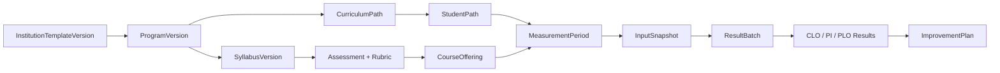
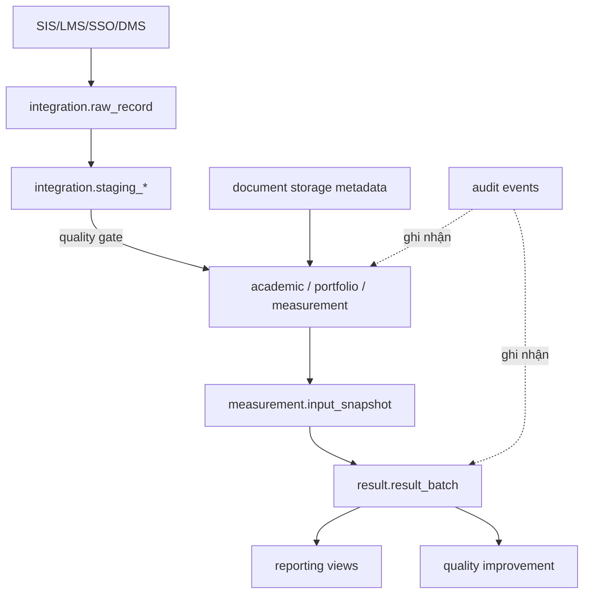
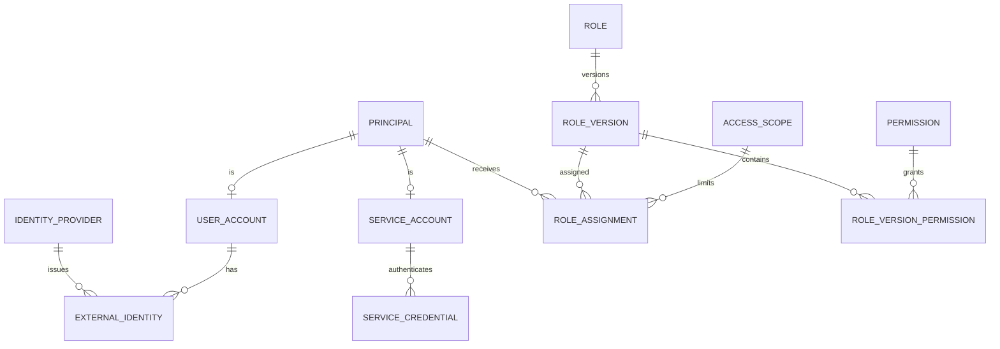
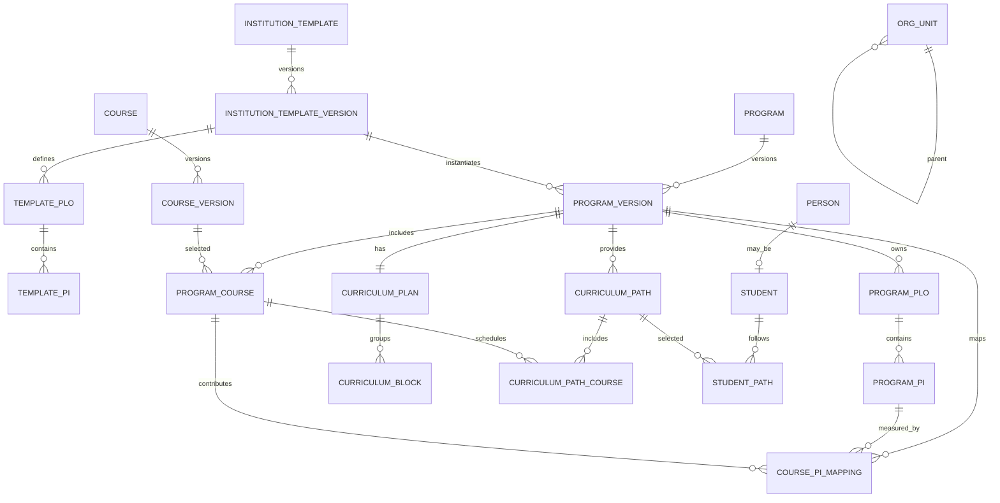
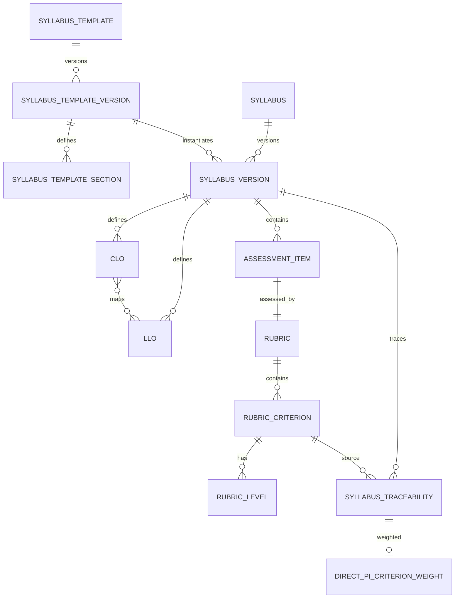
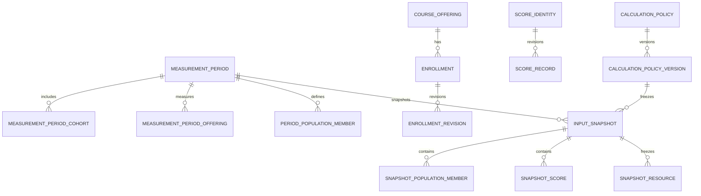
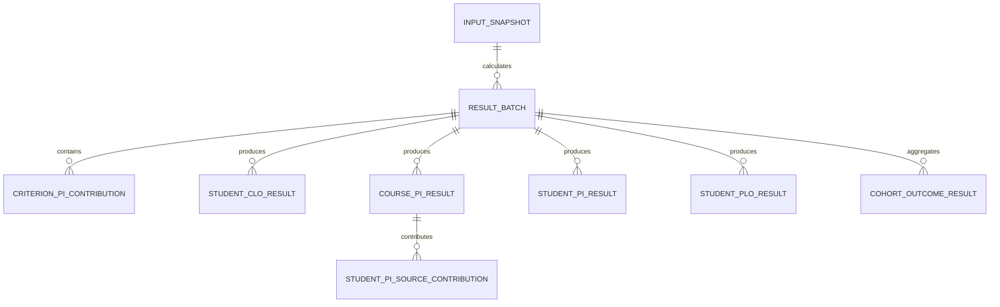

# OutcomeHub

## Tài liệu thiết kế cơ sở dữ liệu (Database Design Document)

**Hệ thống quản trị, đo lường, đánh giá và cải tiến chuẩn đầu ra theo OBE**

| Thuộc tính | Giá trị |
|---|---|
| Mã tài liệu | DBD-OBE-01 |
| Phiên bản | 0.3 |
| Trạng thái | Dự thảo kỹ thuật để rà soát |
| Ngày lập | 19/08/2026 |
| Cập nhật gần nhất | 21/08/2026 |
| Nguồn yêu cầu | [BRD OutcomeHub v1.2](./BRD_OutcomeHub_He_thong_do_luong_chuan_dau_ra_OBE.md) |
| Hệ quản trị CSDL | PostgreSQL 18 hoặc phiên bản PostgreSQL còn được đơn vị vận hành hỗ trợ |
| Backend tham chiếu | .NET 10 LTS, ASP.NET Core 10, C# 14, EF Core 10, Npgsql 10 |
| Phương pháp | Code First có kiểm soát; SQL migration là lịch sử triển khai bất biến |

> **Baseline phiên bản.** Dự án target `net10.0` và luôn nâng lên servicing patch .NET 10 mới nhất đã qua kiểm thử; tại ngày cập nhật tài liệu là 10.0.11. .NET 10 là bản LTS được hỗ trợ đến 14/11/2028 theo [chính sách hỗ trợ .NET](https://dotnet.microsoft.com/en-us/platform/support/policy); Npgsql 10 hỗ trợ EF Core 10 và PostgreSQL 18 theo [release notes của Npgsql](https://www.npgsql.org/efcore/release-notes/10.0.html).

> **Nguyên tắc trung tâm.** Cơ sở dữ liệu phải bảo đảm một kết quả đã công bố luôn truy ngược được tới đúng phiên bản khung, CTĐT, đề cương, rubric, kế hoạch đo, policy, quần thể và điểm nguồn. Không suy lại lịch sử bằng cấu hình hiện hành và không sửa đè dữ liệu đã tham gia `ResultBatch`.

---

# 1. Mục đích và phạm vi

Tài liệu này chuyển các yêu cầu dữ liệu trong BRD thành thiết kế logical và physical cho PostgreSQL. Đây là baseline để:

- xây dựng EF Core entity mapping và SQL migration;
- triển khai repository, transaction và calculation worker;
- lập OpenAPI/data contract cho SIS, LMS, SSO, DMS và BI;
- viết kiểm thử constraint, RLS, snapshot và khả năng tái lập kết quả;
- thẩm định bảo mật, hiệu năng, backup/restore và lưu trữ dữ liệu.

Phạm vi bao gồm toàn bộ vòng đời dữ liệu:

```text
Khung cấp Trường
→ ProgramVersion và các StudentPath
→ SyllabusVersion, assessment, rubric, bảng 8.3.1/8.3.2
→ CourseOffering và MeasurementPeriod
→ Enrollment, điểm nguồn, InputSnapshot
→ ResultBatch, CLO–PI–PLO
→ Báo cáo, minh chứng và CQI
```

Thiết kế AI được mô tả ở mức dữ liệu để sẵn sàng cho MVP 3; AI không tham gia công thức tính chính thức.

## 1.1. Mục tiêu chất lượng dữ liệu

| Mục tiêu | Kiểm soát thiết kế |
|---|---|
| Version first | Tách thực thể logic và bảng version; bản đã duyệt không sửa tại chỗ. |
| Single binding | Mọi ĐCCT, lớp học phần, snapshot và batch tham chiếu ID phiên bản cụ thể. |
| Traceability | Khóa ngoại và bảng đóng góp nối kết quả tới điểm, criterion, assessment, học phần và sinh viên. |
| Reproducibility | `InputSnapshot` bất biến, manifest checksum, policy version và engine build được lưu cùng batch. |
| Exact calculation | Điểm và trọng số dùng PostgreSQL `numeric` và C# `decimal`; không dùng `double`/`float` trong đường tính toán. |
| Least privilege | RBAC theo scope ở ứng dụng, RLS ở PostgreSQL và database role không có `BYPASSRLS`. |
| Immutable audit | `audit_event` append-only, ứng dụng không có quyền `UPDATE`/`DELETE`. |
| Integration safety | Dữ liệu nguồn đi qua raw/staging/quality gate; không ghi trực tiếp vào bảng lõi. |

## 1.2. Ngoài phạm vi

- Thiết kế vật lý của SIS, LMS, HRM hoặc IdP bên ngoài.
- Kho dữ liệu doanh nghiệp/BI ở quy mô toàn Trường; tài liệu chỉ định nghĩa read model và hợp đồng xuất.
- Chi tiết model AI cụ thể; database chỉ lưu metadata đủ để kiểm toán và tái lập.
- Chính sách retention theo số năm cố định khi cơ quan có thẩm quyền chưa ban hành; thời hạn được cấu hình bằng policy.

---

# 2. Quyết định kiến trúc dữ liệu

## 2.1. Mô hình triển khai

- Một PostgreSQL cluster logic cho modular monolith trong MVP.
- Baseline phục vụ một Trường; không thêm `tenant_id` hình thức vào mọi bảng. Nếu sản phẩm chuyển thành SaaS nhiều Trường, phải bổ sung tenant root, composite FK `(tenant_id, id)` và tenant RLS trên toàn mô hình trước khi nhận tenant thứ hai; `org_unit_id` không được xem là tenant boundary.
- Tách namespace bằng PostgreSQL schema; không tách database theo module ở MVP.
- API và worker dùng chung database nhưng dùng database role và connection pool riêng.
- Reporting dùng view/materialized view hoặc read replica; không để công cụ BI truy cập tùy ý vào OLTP.
- Object storage giữ nội dung tệp; PostgreSQL chỉ giữ metadata, version, quyền, checksum và liên kết.
- Dữ liệu demo chạy ở database/environment tách biệt với dữ liệu chính thức; không trộn `DEMO` và `OFFICIAL` trong cùng fact table hoặc báo cáo production.

Việc dùng chung một transaction boundary là cần thiết cho các thao tác như phê duyệt phiên bản, khóa snapshot, tạo batch và ghi audit/outbox.

## 2.2. Baseline backend ASP.NET Core

| Thành phần | Baseline | Quy tắc áp dụng |
|---|---|---|
| Runtime | `.NET 10 LTS` (`net10.0`), ASP.NET Core 10, C# 14 | Pin cùng một dòng servicing patch cho API, worker, migrator và CI. |
| API | ASP.NET Core Web API, OpenAPI 3.1, `System.Text.Json` | API versioned `/api/v1`; DTO tách khỏi entity persistence. |
| Truy cập dữ liệu | EF Core 10 + `Npgsql.EntityFrameworkCore.PostgreSQL` 10 | Một `OutcomeHubDbContext` vật lý; Fluent configuration tách theo module/schema. Dùng Npgsql/raw SQL cho `COPY`, RLS context, lock và tính năng PostgreSQL nâng cao. |
| Xác thực/phân quyền | ASP.NET Core JwtBearer/OpenID Connect và policy/resource authorization | IdP chịu trách nhiệm xác thực; không tạo schema ASP.NET Core Identity thay thế mô hình `iam` của OutcomeHub. |
| Job nền | .NET Worker Service (`BackgroundService`) + durable queue trong PostgreSQL | Worker claim bằng lease/`FOR UPDATE SKIP LOCKED`; `ops.operation_job`, inbox/outbox và domain aggregate là trạng thái bền vững. Không dùng queue runtime ngoài làm nguồn sự thật thứ hai. |
| Realtime/cache | SignalR cho thông báo tiến độ; Redis chỉ là cache/backplane tùy tải | API đọc trạng thái job từ PostgreSQL; mất cache/backplane không được làm mất trạng thái nghiệp vụ. |
| AI | `Microsoft.Extensions.AI` làm provider abstraction; `pgvector` chỉ khi bật RAG | AI worker chỉ tạo artifact/review proposal, không ghi trực tiếp vào aggregate học thuật. |
| Quan sát | `ILogger` + OpenTelemetry | Log/trace/metric phải mang correlation ID và tuân thủ classification/redaction. |
| Kiểm thử | xUnit + `WebApplicationFactory` + Testcontainers PostgreSQL 18 | Constraint, transaction, RLS và migration phải chạy trên PostgreSQL thật; không dùng EF InMemory để chứng minh hành vi database. |

Backend vẫn là modular monolith: một deployable API, một hoặc nhiều worker cùng mã domain và một migrator độc lập. Các module được chia theo boundary/schema, nhưng dùng chung transaction và một physical `DbContext` để giữ FK cross-schema. Calculation engine là thư viện domain thuần C# và không phụ thuộc HTTP, EF Core hoặc queue runtime.

Lazy loading bị tắt; aggregate phải nạp quan hệ tường minh. EF relationship mặc định cấu hình `DeleteBehavior.Restrict`; cascade chỉ được bật tại quan hệ draft-child đã được mục 17.3 cho phép. Bulk `COPY` qua Npgsql chỉ được ghi vào raw/staging rồi đi qua quality gate, không ghi thẳng vào bảng lõi. Nếu startup model trở thành nút thắt do số lượng entity lớn, chỉ bật EF compiled model sau khi benchmark.

## 2.3. Phương pháp Code First có kiểm soát

EF Core model (`DbContext`, entity và `IEntityTypeConfiguration<T>`) cung cấp mapping/type cho C#, nhưng database không được tự đồng bộ từ runtime. Quy trình chuẩn:

```text
Thiết kế aggregate/ERD
→ cập nhật entity và Fluent configuration
→ scaffold/diff EF Core migration làm bản nháp
→ sinh và chuẩn hóa SQL migration bất biến
→ review và bổ sung constraint/index/RLS/partition bằng SQL
→ chạy migration trên PostgreSQL tạm trong CI
→ chạy integration/constraint/RLS test
→ migration job triển khai một lần
→ triển khai API và worker
```

Quy định:

- Không dùng `EnsureCreated()`, `Database.Migrate()`/`MigrateAsync()` hoặc `dotnet ef database update` để thay đổi staging/production hay trong startup của API/worker.
- EF Core migration scaffold chỉ là đầu vào cho review/diff; artifact triển khai là SQL đã duyệt trong manifest và được migrator độc lập thực thi.
- Không sửa file migration đã chạy ở môi trường dùng chung; tạo migration mới.
- Không thay đổi production schema bằng tay ngoài runbook sự cố được phê duyệt.
- Migration phá hủy dữ liệu phải dùng quy trình `expand → backfill → switch → contract`.

## 2.4. Phân chia PostgreSQL schema

| Schema | Trách nhiệm | Giai đoạn |
|---|---|---|
| `iam` | Principal, người dùng, service account, role, permission và scope | MVP 1 |
| `workflow` | Workflow definition, instance, task, transition và nhận xét | MVP 1 |
| `academic` | Cơ cấu, CTĐT, phiên bản, CĐR, chương trình học, lộ trình, con người và lớp học phần | MVP 1 |
| `portfolio` | Khung ĐCCT, đề cương, CLO/LLO, assessment, rubric, bảng 8.3.1/8.3.2 | MVP 1 |
| `document` | File object, document/rendition version và evidence | MVP 1 |
| `governance` | Classification, security scope projection, retention binding, legal hold, privacy request và disposition | MVP 1–2 |
| `measurement` | Đợt đo, quần thể, điểm, policy và snapshot | MVP 1 |
| `result` | Calculation run, đóng góp, kết quả CLO/PI/PLO và công bố | MVP 1 |
| `quality` | Phát hiện, kế hoạch cải tiến, hành động, minh chứng và xác minh | MVP 2 |
| `integration` | Source system, import, staging, idempotency, inbox/outbox và webhook | MVP 1–2 |
| `ops` | Trạng thái job dài, attempt, lease và tiến độ vận hành | MVP 1 |
| `audit` | Nhật ký nghiệp vụ/bảo mật bất biến và archive manifest | MVP 1 |
| `ai` | AI job, artifact, citation, field suggestion, review và ground truth | MVP 3 |
| `reporting` | View/materialized view và trạng thái refresh | MVP 1–2 |

## 2.5. PostgreSQL extension

| Extension | Mục đích | Bắt buộc |
|---|---|---|
| `btree_gist` | Exclusion constraint cho khoảng hiệu lực/StudentPath | Có |
| `citext` | So sánh email không phân biệt hoa thường | Có |
| `pg_trgm` | Tìm gần đúng theo mã/tên | Nên dùng |
| `unaccent` | Tìm kiếm tiếng Việt không dấu khi nghiệp vụ yêu cầu | Tùy chọn |
| `vector` | Embedding cho RAG | Chỉ MVP 3 |
| `pg_stat_statements` | Quan sát truy vấn chậm | Môi trường vận hành |

UUID được sinh tại ứng dụng bằng `Guid.CreateVersion7()` và truyền tường minh khi insert; không phụ thuộc default/hàm sinh ID của database. Mọi API, worker và migrator dùng chung quy tắc UUIDv7 này.

---

# 3. Quy ước vật lý

## 3.1. Đặt tên

- Schema, bảng, cột, index và constraint dùng `snake_case` tiếng Anh.
- Bảng dùng danh từ số ít, ví dụ `program_version`, `score_record`.
- Khóa chính là `id`; khóa ngoại là `<entity>_id`.
- Mã nghiệp vụ là `code`; không dùng mã nghiệp vụ làm khóa chính.
- Tên constraint có dạng `pk_`, `fk_`, `uq_`, `ck_`, `ex_`; index có dạng `ix_`.
- Timestamp luôn là `timestamptz` và được ghi theo UTC.
- Ký hiệu rút gọn như `created_by/at` trong phần mô tả nghĩa là hai cột thật `created_by`, `created_at`; EF Core entity configuration/data dictionary phải khai báo tách từng cột, không dùng dấu `/` trong identifier.

## 3.2. Kiểu dữ liệu chuẩn

| Dữ liệu | Kiểu PostgreSQL | Quy tắc |
|---|---|---|
| Khóa kỹ thuật | `uuid` | UUIDv7 do ứng dụng sinh; không tái sử dụng. |
| Mã nghiệp vụ | `varchar(64)` | Trim, không rỗng; unique trong đúng phạm vi version. |
| Tên | `varchar(255)` | Nội dung dài dùng `text`. |
| Điểm gốc/tối đa/chuẩn hóa | `numeric(20,10)` | Ánh xạ C# `decimal`; không chuyển qua `double`/`float`. |
| Trọng số | `numeric(12,10)` | Lưu tỷ lệ từ `0` đến `1`; UI nhân `100` để hiện phần trăm. |
| Ngưỡng | `numeric(20,10)` | Chuẩn hóa về thang `0–100`. |
| Tiền/tín chỉ | `numeric(10,2)` | Tín chỉ cho phép phần thập phân nếu chính sách có. |
| Số đếm | `integer`/`bigint` | Dùng `bigint` cho số lượng có thể vượt giới hạn 32-bit. |
| Ngày hiệu lực | `date` | Khoảng nửa mở `[effective_from, effective_to)`. |
| Thời điểm sự kiện | `timestamptz` | UTC. |
| Cấu hình linh hoạt | `jsonb` | Chỉ cho template/policy/payload/metadata; không thay bảng quan hệ cốt lõi. |
| Checksum | `char(64)` | SHA-256 chữ thường dạng hexadecimal. |
| Địa chỉ IP | `inet` | Audit/bảo mật. |

`null` mang nghĩa chưa có/chưa đủ dữ liệu. Không tự thay `null` bằng `0`, tỷ trọng mặc định hoặc ngưỡng phổ biến.

Mọi `numeric` nghiệp vụ phải hữu hạn: domain/named `CHECK` từ chối rõ `NaN`, `Infinity` và `-Infinity` trước khi kiểm min/max. Quy tắc này áp dụng cho raw/max/normalized score, trọng số, ngưỡng, rate, count ratio, confidence AI và result; không dựa vào thứ tự so sánh đặc biệt của PostgreSQL.

Mã học thuật được trim và canonicalize uppercase/Unicode NFC trước khi ghi; constraint kiểm canonical form và unique trên cột canonical. Không dựa vào collation mặc định để quyết định mã `clo1` có trùng `CLO1` hay không.

## 3.3. Cột kỹ thuật chuẩn

Bảng mutable ở trạng thái nháp dùng:

```text
id              uuid primary key
created_at      timestamptz not null
created_by      uuid not null
updated_at      timestamptz not null
updated_by      uuid not null
row_version     bigint not null default 1
```

`row_version` được tăng trong cùng câu `UPDATE` và ánh xạ thành ETag/`If-Match`. Trong EF Core, cột `bigint` này được map thành `long` với `.IsConcurrencyToken()`; SaveChanges interceptor/repository bắt buộc gán `row_version = original + 1` để câu lệnh có cả `SET row_version = @new` và `WHERE row_version = @original`. Stored function/raw SQL cũng phải tăng version trong chính câu update. Không dùng `[Timestamp]`, PostgreSQL `xmin` hoặc kiểu SQL Server `rowversion` để thay thế; test hai writer phải chứng minh writer thứ hai nhận `DbUpdateConcurrencyException`. Bảng event hoặc dữ liệu bất biến chỉ có `created_at/created_by`, không có `updated_*`.

Không áp dụng một cột `deleted_at` cho toàn hệ thống. Dữ liệu học thuật dùng trạng thái/hết hiệu lực; staging hoặc draft chưa được tham chiếu mới được xóa theo policy.

## 3.4. Trạng thái

Không dùng PostgreSQL native enum để tránh migration khó mở rộng. Trạng thái lưu `varchar(32)` kèm `CHECK`, hoặc tham chiếu bảng mã khi danh mục được cấu hình.

Các nhóm trạng thái chuẩn:

- Cấu hình học thuật: `DRAFT`, `IN_REVIEW`, `APPROVED`, `ACTIVE`, `EXPIRED`, `REJECTED`.
- Đợt đo: `DRAFT`, `OPEN`, `COLLECTING`, `RECONCILING`, `CALCULATED`, `APPROVED`, `PUBLISHED`, `CLOSED`, `REOPENED`.
- Tài liệu: `DRAFT`, `IN_REVIEW`, `APPROVED`, `ACTIVE`, `SUPERSEDED`, `ARCHIVED`.
- AI job: `QUEUED`, `RUNNING`, `NEEDS_REVIEW`, `PARTIAL`, `ACCEPTED`, `REJECTED`, `APPLIED`, `FAILED`, `CANCELLED`.

## 3.5. Phân loại dữ liệu

`PUBLIC`, `INTERNAL`, `CONFIDENTIAL`, `RESTRICTED` là bốn mức chuẩn. Điểm cá nhân, hồ sơ sinh viên, identity/session, artifact AI chứa tài liệu nội bộ và audit chi tiết mặc định là `RESTRICTED`; kết quả tổng hợp chưa công bố là `CONFIDENTIAL`. Classification được kế thừa sang file, export, outbox/webhook và log; hạ mức phải có workflow/audit.

---

# 4. Mô hình dữ liệu tổng thể



## 4.1. Ranh giới dữ liệu



Không nguồn bên ngoài nào được ghi trực tiếp vào `academic`, `portfolio`, `measurement` hoặc `result`.

---

# 5. Thiết kế schema `iam`

## 5.1. ERD



## 5.2. Bảng

### `iam.principal`

| Cột | Kiểu | Ràng buộc/ý nghĩa |
|---|---|---|
| `id` | `uuid` | PK |
| `principal_type` | `varchar(20)` | `USER`, `SERVICE_ACCOUNT` hoặc `SYSTEM` |
| `status` | `varchar(20)` | `ACTIVE`, `LOCKED`, `DISABLED`, `EXPIRED` |
| `display_name` | `varchar(255)` | Tên dùng cho audit/UI |
| `created_at` | `timestamptz` | Bắt buộc |

### `iam.user_account`

| Cột | Kiểu | Ràng buộc/ý nghĩa |
|---|---|---|
| `principal_id` | `uuid` | PK, FK `principal`; type phải là `USER` |
| `person_id` | `uuid` | FK `academic.person`, unique khi đã liên kết |
| `username` | `citext` | Unique, có thể null nếu IdP không cung cấp |
| `email_ciphertext` | `bytea` | PII mã hóa bằng application/KMS |
| `email_lookup_hash` | `char(64)` | Hash có key để tìm chính xác/unique khi policy yêu cầu |
| `last_login_at` | `timestamptz` | Không dùng làm audit login duy nhất |

### `iam.identity_provider`

`id`, `code`, `protocol`, `issuer_or_entity_id`, `client_id`, `metadata_url`, `claims_mapping jsonb`, `claims_mapping_version`, `secret_reference`, `status`, `effective_from/to`. `protocol` nhận `OIDC` hoặc `SAML`; secret/private key chỉ lưu tham chiếu secret manager. Unique `(protocol, issuer_or_entity_id)`.

### `iam.external_identity`

| Cột | Kiểu | Ràng buộc/ý nghĩa |
|---|---|---|
| `id` | `uuid` | PK |
| `user_principal_id` | `uuid` | FK `user_account` |
| `identity_provider_id` | `uuid` | FK `identity_provider` |
| `subject` | `varchar(255)` | Định danh bất biến từ IdP |
| `claims_snapshot` | `jsonb` | Chỉ claim được phép lưu; không lưu token |
| `claims_hash` | `char(64)` | Phát hiện claim mapping thay đổi |
| `first_seen_at`, `last_seen_at` | `timestamptz` | Theo dõi vòng đời identity |

Unique `(identity_provider_id, subject)`. Không lưu access token/refresh token dài hạn trong bảng này.

### `iam.idp_group_role_mapping`

`id`, `identity_provider_id`, `external_group_id`, `role_id`, `role_version_id`, `access_scope_id`, `version_no`, `effective_from/to`, `status`, `workflow_instance_id`, `supersedes_id`, `checksum`. Composite FK `(role_version_id, role_id)` khóa đúng phiên bản quyền đã duyệt. Đồng bộ nhóm chỉ tạo/revoke role assignment có lineage, không tự cấp role ngoài allow-list hoặc tự chuyển sang RoleVersion mới.

### `iam.service_account`

| Cột | Kiểu | Ràng buộc/ý nghĩa |
|---|---|---|
| `principal_id` | `uuid` | PK, FK `principal`; type `SERVICE_ACCOUNT` |
| `client_id` | `varchar(128)` | Unique |
| `owner_org_unit_id` | `uuid` | FK `academic.org_unit` |
| `purpose` | `text` | Bắt buộc |
| `expires_at` | `timestamptz` | Null nếu policy cho phép |
| `technical_contact` | `varchar(255)` | Đầu mối chịu trách nhiệm |

### `iam.service_credential`

`id`, `service_principal_id`, `credential_type`, `key_prefix`, `secret_hash`, `secret_reference`, `certificate_thumbprint`, `public_jwk jsonb`, `effective_from/to`, `revoked_at/by`, `revoke_reason`, `last_used_at`.

`credential_type`: `CLIENT_SECRET`, `API_KEY`, `MTLS`, `JWK`. `CHECK` bảo đảm đúng loại vật liệu credential; không lưu secret thô. Cho phép hai credential cùng hiệu lực trong cửa sổ rotation có kiểm soát.

### `iam.role`, `iam.role_version`, `iam.permission`, `iam.role_version_permission`

- `role(id, code, name, is_system, status, created_at)` là định danh logic; unique `code`.
- `role_version(id, role_id, version_no, status, effective_from/to, workflow_instance_id, decision_id, permission_set_checksum, checksum, created_by/at)` là tập quyền bất biến sau khi được duyệt; unique `(role_id, version_no)` và `(id, role_id)`.
- `permission(id, resource_type, action, field_scope, description)`; unique `(resource_type, action, field_scope)`.
- `role_version_permission(role_version_id, permission_id, granted_at, granted_by)`; PK theo hai cột.

`permission` là catalog append-only: runtime không có `UPDATE/DELETE`, trigger bảo vệ row đã được tham chiếu; sửa resource/action/field scope phải tạo permission ID mới. `permission_set_checksum` hash tập semantic tuple của permission đã sắp xếp, không chỉ hash các UUID.

Thêm/bỏ permission luôn tạo RoleVersion mới và chạy lại workflow/SoD; không sửa `role_version_permission` của version `APPROVED/ACTIVE`. Assignment hiện hữu tiếp tục trỏ version cũ cho đến khi một command được duyệt tạo assignment kế tiếp. Vì vậy thay đổi role không thể âm thầm tăng quyền của mọi người đang được gán.

### `iam.access_scope`

Một scope có đúng một anchor nghiệp vụ:

`id`, `scope_type`, `org_unit_id`, `program_id`, `program_version_id`, `cohort_id`, `curriculum_path_id`, `course_id`, `course_offering_id`, `measurement_period_id`, `subject_principal_id`, `include_descendants`, `checksum`, `created_at`.

`scope_type`: `SYSTEM`, `ORG_UNIT`, `PROGRAM`, `PROGRAM_VERSION`, `COHORT`, `CURRICULUM_PATH`, `COURSE`, `OFFERING`, `MEASUREMENT_PERIOD`, `SELF`. `CHECK` dùng `num_nonnulls(...)` bảo đảm `SYSTEM` không có anchor và mỗi loại còn lại có đúng cột FK tương ứng. Unique với `NULLS NOT DISTINCT` ngăn tạo scope trùng. AccessScope là append-only, bị revoke `UPDATE/DELETE` và có trigger bảo vệ; đổi anchor/include-descendants tạo ID mới. Nếu truy vấn cây tổ chức trở thành đường nóng, dùng `academic.org_unit_path` để giải quyết `include_descendants`.

### `iam.database_principal_binding`

`database_role_name`, `service_principal_id`, `access_scope_id`, `effective_from/to`, `status`, `checksum`; PK theo database role/effective-from và exclusion ngăn hai binding `ACTIVE` chồng nhau cho cùng role. Bảng append-only này chỉ dành cho login BI được quản trị, ánh xạ `session_user` bất biến sang service principal/scope. Login BI không được tự tạo role, đổi membership hoặc dựa vào custom GUC để nhận danh tính khác.

### `iam.role_assignment`

| Cột | Kiểu | Ràng buộc/ý nghĩa |
|---|---|---|
| `id` | `uuid` | PK |
| `principal_id` | `uuid` | FK `principal` |
| `role_id` | `uuid` | FK `role`, dùng để chống hai version của cùng role chồng hiệu lực |
| `role_version_id` | `uuid` | FK phiên bản quyền chính xác; composite FK `(role_version_id, role_id)` |
| `access_scope_id` | `uuid` | FK `access_scope` |
| `effective_from` | `timestamptz` | Bắt buộc |
| `effective_to` | `timestamptz` | Bắt buộc; gia hạn tạo audit/workflow, không cấp vô thời hạn |
| `status` | `varchar(20)` | `PENDING`, `ACTIVE`, `SUSPENDED`, `REVOKED` |
| `source`, `source_reference` | | `MANUAL`, `IDP_GROUP`, `IMPORT` và lineage |
| `granted_by` | `uuid` | Người cấp |
| `approved_by` | `uuid` | Bắt buộc với role nhạy cảm theo policy |
| `workflow_instance_id` | `uuid` | FK unique cho yêu cầu/cấp/duyệt/thu hồi |
| `sod_policy_version_id` | `uuid` | Policy SoD được dùng khi duyệt |
| `authorization_snapshot_checksum` | `char(64)` | Hash RoleVersion semantic permissions + AccessScope tại lúc duyệt |
| `requested_by`, `requested_at`, `approved_at`, `revoked_at` | | Vòng đời assignment |
| `reason`, `revoke_reason` | `text` | Căn cứ cấp/thu hồi |

Exclusion constraint với `btree_gist` ngăn các khoảng `ACTIVE` chồng nhau cho cùng `(principal_id, role_id, access_scope_id)`. RoleVersion phải `APPROVED/ACTIVE` tại thời điểm cấp; quy tắc người cấp khác người duyệt với role nhạy cảm được kiểm ở workflow và audit.

### `iam.sod_policy_version`, `iam.sod_rule`, `iam.sod_exception`

- `sod_policy_version(id, version_no, status, effective_from/to, workflow_instance_id, checksum)`;
- `sod_rule(id, policy_version_id, resource_type, permission_a_id, permission_b_id, conflict_mode, severity)`;
- `sod_exception(id, rule_id, principal_id, access_scope_id, reason, effective_from/to, decision_id, approved_by)`.

`conflict_mode` hỗ trợ `SAME_RESOURCE` và `SAME_WORKFLOW_INSTANCE`. Validator role/publish lưu đúng SoD policy version đã áp dụng; ngoại lệ luôn có thời hạn và quyết định.

### `iam.auth_session`

`id`, `principal_id`, `session_token_hash`, `idp_session_hash`, `issued_at`, `last_seen_at`, `expires_at`, `revoked_at`, `ip_address`, `user_agent_hash`, `auth_strength`, `mfa_used`. Chỉ lưu hash/metadata để revoke và điều tra; cookie/token nguyên bản không nằm trong database.

---

# 6. Thiết kế schema `workflow`

## 6.1. Mục đích

Workflow dùng chung cho template, CTĐT, ĐCCT, đợt đo, ResultBatch và CQI. Trạng thái nghiệp vụ cuối cùng vẫn được kiểm tra tại aggregate; workflow không thay thế constraint dữ liệu.

## 6.2. Bảng

### `workflow.definition`

`id`, `code`, `version_no`, `subject_type`, `configuration jsonb`, `effective_from`, `effective_to`, `status`, `checksum`; unique `(code, version_no)`.

### `workflow.instance`

`id`, `definition_id`, `current_state`, `started_by`, `started_at`, `completed_at`, `row_version`. Mỗi bảng version có workflow lưu `workflow_instance_id UNIQUE NOT NULL`, tạo quan hệ FK rõ ràng mà không cần khóa ngoại đa hình ngược lại.

### `workflow.task`

`id`, `instance_id`, `step_code`, `assignee_principal_id`, `assignee_role_id`, `status`, `due_at`, `decision`, `decision_reason`, `completed_at`. Ít nhất một trong hai assignee phải có giá trị.

### `workflow.transition`

`id`, `instance_id`, `from_state`, `to_state`, `event_code`, `actor_principal_id`, `reason`, `occurred_at`, `request_id`. Bảng append-only.

### `workflow.comment`

`id`, `instance_id`, `author_principal_id`, `target_locator jsonb`, `body`, `created_at`, `resolved_at`. `target_locator` chỉ dùng để định vị section/field/cell nhận xét, không chứa dữ liệu học thuật chính thức.

---

# 7. Thiết kế schema `academic`

## 7.1. ERD rút gọn



## 7.2. Cơ cấu tổ chức

### `academic.org_unit`

`id`, `parent_id`, `code`, `name`, `unit_type`, `effective_from`, `effective_to`, `status`, audit columns. Unique `code`; mã đơn vị là định danh ổn định và không tái sử dụng cho đơn vị khác.

`unit_type`: `UNIVERSITY`, `CAMPUS`, `FACULTY`, `INSTITUTE`, `DEPARTMENT`, `CENTER`.

Không dùng nested set cố định. Cây được truy vấn bằng recursive CTE; nếu tải thực tế yêu cầu, bổ sung closure table `academic.org_unit_path(ancestor_id, descendant_id, depth)` được duy trì bằng transaction.

### `academic.decision_record`

`id`, `decision_number`, `issued_on`, `issuer_org_unit_id`, `title`, `document_version_id`, `status`, `created_at`; unique `(issuer_org_unit_id, decision_number)`. Template, version, mapping và ngoại lệ chính thức tham chiếu `decision_id`, không sao chép số quyết định rời rạc.

## 7.3. Khung cấp Trường

### `academic.institution_template`

Thực thể logic: `id`, `code`, `name`, `owner_org_unit_id`, `description`, `created_at`.

### `academic.institution_template_version`

| Cột | Kiểu | Ý nghĩa |
|---|---|---|
| `id` | `uuid` | PK |
| `institution_template_id` | `uuid` | FK |
| `version_no` | `integer` | `> 0`, unique trong template |
| `decision_id` | `uuid` | FK `decision_record`; chứa số/ngày ban hành |
| `effective_from/to` | `date` | Khoảng hiệu lực |
| `status` | `varchar(20)` | Trạng thái cấu hình học thuật |
| `layout_configuration` | `jsonb` | Cấu hình hiển thị không thay thế section/field quan hệ |
| `policy_configuration` | `jsonb` | Quy tắc khung không phù hợp chuẩn hóa thành cột |
| `workflow_instance_id` | `uuid` | FK unique |
| `checksum` | `char(64)` | Canonical content checksum |
| `supersedes_id` | `uuid` | FK self nullable |

Unique `(institution_template_id, version_no)`. Bản `APPROVED/ACTIVE/EXPIRED` không được cập nhật nội dung.

### `academic.program_template_section`, `academic.program_template_field`

- `program_template_section(id, institution_template_version_id, section_code, title, sort_order, required, lock_mode)`;
- `program_template_field(id, program_template_section_id, field_code, label, data_type, required, lock_mode, default_value jsonb, validation_schema jsonb, sort_order)`.

Unique mã trong phạm vi cha. Hai bảng này tạo khung biểu mẫu CTĐT có version; các aggregate cốt lõi như PO/PLO/PI/curriculum vẫn lưu ở bảng typed, không nhúng JSON.

### `academic.template_plo`, `academic.template_pi`

- `template_plo`: `id`, `institution_template_version_id`, `code`, `name`, `description`, `domain`, `bloom_level`, `sort_order`, `is_locked`.
- `template_pi`: `id`, `institution_template_version_id`, `template_plo_id`, `code`, `description`, `sort_order`, `is_locked`, `is_core`.

Unique mã trong một template version. Composite FK `(template_plo_id, institution_template_version_id)` ngăn PI nối sang PLO của version khác. PLO1–PLO4 và PI chung có `is_locked=true`; khi sinh `ProgramVersion`, lưu `source_template_plo_id/source_template_pi_id` để giữ lineage.

## 7.4. Chương trình và phiên bản CTĐT

### `academic.program`

`id`, `code`, `name`, `degree_level`, `education_mode`, `owner_org_unit_id`, `status`, audit columns. Unique `code`.

### `academic.program_version`

| Cột | Kiểu | Ý nghĩa |
|---|---|---|
| `id` | `uuid` | PK |
| `program_id` | `uuid` | FK |
| `institution_template_version_id` | `uuid` | FK bắt buộc, đúng một nguồn khung |
| `version_no` | `integer` | Unique trong program |
| `code` | `varchar(64)` | Mã version/khóa áp dụng |
| `decision_id` | `uuid` | FK `decision_record`, căn cứ ban hành |
| `effective_from/to` | `date` | Khoảng hiệu lực |
| `status` | `varchar(20)` | Trạng thái cấu hình học thuật |
| `total_credits` | `numeric(10,2)` | `> 0` |
| `workflow_instance_id` | `uuid` | FK unique |
| `supersedes_id` | `uuid` | FK self nullable |
| `checksum` | `char(64)` | Checksum nội dung chuẩn hóa |
| `row_version` | `bigint` | Optimistic concurrency khi còn draft |

Không unique tuyệt đối `code` giữa các program; unique `(program_id, code)` và `(id, institution_template_version_id)`. Một version đã được CourseOffering/MeasurementPeriod sử dụng không được xóa.

### `academic.program_version_crosswalk`

Header `program_version_crosswalk(id, from_program_version_id, to_program_version_id, status, decision_id, rationale)` cùng các bảng typed `plo_crosswalk`, `pi_crosswalk`, `course_crosswalk`. Mỗi dòng lưu `relation_type` (`EQUIVALENT`, `REPLACED_BY`, `SPLIT_TO`, `MERGED_INTO`, `NO_EQUIVALENT`) và `allocation_ratio` khi tách/gộp. Báo cáo chỉ so sánh qua version khi crosswalk/policy cho phép; không ghép theo mã chữ.

### `academic.cohort`, `academic.program_version_cohort`

- `cohort`: `id`, `program_id`, `code`, `name`, `admission_year`, `start_date`, `end_date`; unique `(program_id, code)`.
- `program_version_cohort`: PK `(program_version_id, cohort_id)`, `effective_from/to`, `is_default`.

Composite FK/trigger bảo đảm cohort và ProgramVersion cùng `program_id`; exclusion ngăn hai version mặc định có khoảng hiệu lực chồng nhau cho cùng cohort.

## 7.5. PO, khung năng lực và CĐR

- `program_objective(id, program_version_id, code, description, sort_order)`.
- `competency(id, program_version_id, parent_id, level_no, code, description, sort_order)`; `level_no` từ 1 đến 3.
- `program_plo(id, program_version_id, code, description, domain, bloom_level, source_template_plo_id, is_locked, sort_order)`.
- `program_pi(id, program_version_id, program_plo_id, code, description, source_template_pi_id, is_locked, is_core, weight_ratio, sort_order)`.
- `po_plo_mapping(program_objective_id, program_plo_id, mapping_level, rationale)`; level `L/M/H`.
- `po_competency_mapping(program_objective_id, competency_id, mapping_level, rationale)`.
- `competency_plo_mapping(competency_id, program_plo_id, mapping_level, rationale)`.

Unique mã trong đúng `program_version`. Composite FK trên các bảng outcome/mapping bảo đảm hai đầu thuộc cùng version. Với outcome kế thừa, composite FK/trigger buộc `source_template_plo_id/source_template_pi_id` thuộc đúng `program_version.institution_template_version_id`; source bắt buộc kéo theo `is_locked=true`. `program_pi.weight_ratio` là nguồn chuẩn duy nhất cho PI→PLO, có thể null khi nháp; khi phê duyệt tổng PI của từng PLO bằng `1` nếu policy dùng trọng số.

## 7.6. Học phần và chương trình học

### `academic.course`, `academic.course_version`

- `course`: `id`, `code`, `name`, `owner_org_unit_id`, `status`; unique `code`.
- `course_version`: `id`, `course_id`, `version_no`, `name`, `credit_value`, `course_type`, `effective_from/to`, `shared_core_flag`, `status`, `decision_id`, `workflow_instance_id`, `supersedes_id`, `checksum`.

`course_type`: `STANDARD`, `PRACTICE`, `INTERNSHIP`, `PROJECT`, `THESIS`, `CLINICAL`.

### `academic.course_version_relation`

`id`, `from_course_version_id`, `to_course_version_id`, `program_version_id`, `relation_type`, `decision_id`, `effective_from/to`, `status`, `rationale`. `relation_type`: `EQUIVALENT`, `SUBSTITUTE`, `REPLACES`, `RECOGNIZED_AS`; không cho self-reference và unique theo hai đầu/phạm vi/loại.

### `academic.curriculum_plan`

`id`, `program_version_id`, `code`, `name`, `declared_total_credits`, `status`, `checksum`. Unique `(program_version_id)`; baseline dùng đúng một plan cho mỗi ProgramVersion, còn các phương án nằm ở `curriculum_path`.

### `academic.curriculum_block`

`id`, `curriculum_plan_id`, `parent_id`, `code`, `name`, `block_type`, `required_credits`, `maximum_credits`, `sort_order`. Composite self-FK bảo đảm block cha cùng plan và trigger chặn chu trình.

### `academic.program_course`

Danh mục học phần chính thức của ProgramVersion: `id`, `program_version_id`, `course_version_id`, `curriculum_block_id`, `catalog_role`, `credit_override`, `is_locked`, `status`.

Unique `(program_version_id, course_version_id)` và `(id, program_version_id, course_version_id)`. `catalog_role`: `REQUIRED`, `ELECTIVE`, `ORIENTATION`, `GRADUATION`. Composite FK/validator bảo đảm block thuộc plan của cùng ProgramVersion; học phần dùng chung bị khóa trừ khi có phụ lục được duyệt.

### `academic.curriculum_path`

`id`, `program_version_id`, `code`, `name`, `path_type`, `effective_from/to`, `is_default`, `workflow_instance_id`.

`path_type`: `COMMON`, `MAJOR`, `SPECIALIZATION`, `ELECTIVE_ROUTE`, `GRADUATION_OPTION`.

### `academic.curriculum_path_course`

`id`, `curriculum_path_id`, `program_course_id`, `planned_term`, `requirement_type`, `elective_group_id`, `sort_order`.

Unique `NULLS NOT DISTINCT` `(curriculum_path_id, program_course_id, elective_group_id)`. `requirement_type`: `REQUIRED`, `ELECTIVE`, `OPTIONAL`, `SUBSTITUTE`. Composite FK/validator bảo đảm path và program course thuộc cùng ProgramVersion.

### `academic.curriculum_elective_group`

`id`, `curriculum_path_id`, `curriculum_block_id`, `code`, `name`, `minimum_course_count`, `maximum_course_count`, `minimum_credits`, `maximum_credits`. Validator kiểm min/max và mọi thành viên nhóm cùng path/block.

### `academic.course_prerequisite_group`, `academic.course_prerequisite_item`

- `course_prerequisite_group(id, program_version_id, target_program_course_id, group_no, minimum_items_satisfied, relation_type)`;
- `course_prerequisite_item(group_id, required_program_course_id, minimum_grade, allow_concurrent, rationale)`.

Unique group number theo target; PK item theo group/required course. Mô hình biểu diễn được “A và (B hoặc C)” mà không lặp `minimum_items_satisfied`; không cho self-reference và kiểm tra chu trình ở domain service/integration test.

## 7.7. Ma trận học phần–PI và kế hoạch đo trực tiếp

### `academic.course_pi_mapping`

| Cột | Kiểu | Ý nghĩa |
|---|---|---|
| `id` | `uuid` | PK |
| `program_version_id` | `uuid` | FK |
| `program_course_id` | `uuid` | FK, suy ra CourseVersion |
| `program_pi_id` | `uuid` | FK, phải thuộc cùng ProgramVersion |
| `contribution_level` | `char(1)` | `I`, `R`, `M` |
| `is_direct_assessment` | `boolean` | Cờ A độc lập I/R/M |
| `rationale` | `text` | Căn cứ mapping |
| `source_type` | `varchar(20)` | `TEMPLATE`, `PROGRAM`, `APPENDIX` |
| `source_shared_mapping_id` | `uuid` | FK nullable tới mapping học phần dùng chung |
| `is_locked` | `boolean` | Mapping kế thừa bị khóa |
| `exception_decision_id` | `uuid` | FK `decision_record`, bắt buộc cho ngoại lệ cấp chương trình |

Unique `(program_version_id, program_course_id, program_pi_id)`, `(id, program_course_id, program_version_id)` và `(id, program_version_id, program_pi_id)`. `assessmentCode A1/A2/A3` không tồn tại trong bảng này.

### `academic.shared_course_pi_mapping`

`id`, `course_version_id`, `institution_template_version_id`, `template_pi_id`, `version_no`, `contribution_level`, `is_direct_assessment`, `status`, `decision_id`, `workflow_instance_id`, `checksum`. Khi copy vào ProgramVersion, lưu `source_shared_mapping_id` và `is_locked=true`; khác biệt chỉ qua appendix/decision được duyệt.
Unique `(course_version_id, template_pi_id, version_no)` và composite FK khóa PI cùng institution template version.

### `academic.course_pi_path_override`

`id`, `program_version_id`, `course_pi_mapping_id`, `curriculum_path_id`, `contribution_level`, `direct_assessment_enabled`, `exception_decision_id`, `rationale`; unique `(course_pi_mapping_id, curriculum_path_id)`. Composite FK khóa mapping và path cùng ProgramVersion. Resolver dùng override của path nếu có, nếu không dùng mapping nền.

Override chỉ được **thu hẹp** cờ A: `direct_assessment_enabled=false` có thể tắt A cho một path, nhưng không được bật A khi mapping nền có `is_direct_assessment=false`. Nếu bất kỳ path nào cần A thì mapping nền phải là A; các path không dùng direct sẽ tắt bằng override. Nhờ đó Syllabus traceability vẫn tham chiếu mapping nền ổn định, trong khi validator kế hoạch nguồn kiểm giá trị A hiệu lực trên đúng path và không xuất hiện trường hợp base không A nhưng 8.3.2 lại cần A.

### `academic.direct_measurement_plan`

`id`, `program_version_id`, `curriculum_path_id`, `program_pi_id`, `version_no`, `status`, `workflow_instance_id`, `effective_from/to`, `supersedes_id`, `checksum`.

Unique `(program_version_id, curriculum_path_id, program_pi_id, version_no)` và `(id, program_version_id, curriculum_path_id, program_pi_id)`; active intervals của cùng PI/path không chồng nhau.

### `academic.direct_measurement_source`

`id`, `direct_measurement_plan_id`, `program_version_id`, `curriculum_path_id`, `program_pi_id`, `course_pi_mapping_id`, `planned_term`, `owner_org_unit_id`, `source_weight_ratio`, `source_role`, `sort_order`.

Composite FK `(direct_measurement_plan_id, program_version_id, curriculum_path_id, program_pi_id)` tới plan và `(course_pi_mapping_id, program_version_id, program_pi_id)` tới mapping. Vì vậy plan của PI9.1 không thể lấy nhầm nguồn mapped tới PI9.2.

`source_role`: `OFFICIAL`, `COMPARISON`. Khi phê duyệt:

- mỗi PI/path có từ 1 đến 2 source theo policy hiện hành;
- tổng `source_weight_ratio = 1`;
- một source thì weight phải bằng `1`;
- mapping nền và giá trị hiệu lực trên đúng path đều phải có A (`is_direct_assessment=true`, không bị override tắt);
- program course phải thuộc đúng CurriculumPath hoặc được quyết định tương đương;
- không tự gán 40/60 hoặc bất kỳ tỷ lệ mặc định nào.

### `academic.anchor_assessment`

`id`, `direct_measurement_source_id`, `syllabus_version_id`, `assessment_item_id`, `anchor_role`, `evidence_requirement`, `approved_at`. Rubric suy ra từ assessment. Composite FK/validator bắt buộc assessment thuộc đúng SyllabusVersion của program course nguồn.
Unique `(direct_measurement_source_id, assessment_item_id, anchor_role)`.

`academic.anchor_criterion(anchor_assessment_id, syllabus_traceability_id)` có PK ghép để chỉ rõ các traceability direct chính thức. Composite FK/constraint trigger buộc traceability thuộc assessment/SyllabusVersion của anchor, có `data_role='DIRECT_PI'` và `course_pi_mapping_id` đúng bằng mapping/PI của `direct_measurement_source`. Criterion được suy ra từ traceability nên anchor không thể lấy criterion mapped sang PI khác.

## 7.8. Con người, lộ trình và lớp học phần

### `academic.person`

`id`, `source_system_id`, `source_person_id`, `full_name`, `contact_ciphertext`, `contact_lookup_hash`, `status`, `effective_from/to`. Unique `NULLS NOT DISTINCT` `(source_system_id, source_person_id)` khi có nguồn. PII được tối thiểu hóa; email/điện thoại mã hóa bằng application/KMS và chỉ tra cứu chính xác qua keyed hash khi cần. Khóa mã hóa không nằm trong PostgreSQL.

### `academic.student`, `academic.staff`

- `student`: `person_id` PK/FK, `student_code` unique, `admission_cohort_id`, `current_status`; unique `(person_id, admission_cohort_id)` hỗ trợ composite FK của population.
- `staff`: `person_id` PK/FK, `staff_code` unique, `home_org_unit_id`, `staff_type`, `current_status`.

### `academic.student_path`

`id`, `student_id`, `program_id`, `program_version_id`, `curriculum_path_id`, `path_status`, `effective_from`, `effective_to`, `decision_id`, `is_primary`.

Dùng `daterange(effective_from, effective_to, '[)')` và exclusion constraint để một sinh viên không có hai primary path chồng thời gian trong cùng chương trình.

Composite FK buộc `curriculum_path_id` thuộc `program_version_id`, ProgramVersion thuộc `program_id`; unique `(id, student_id)` và `(id, student_id, program_version_id, curriculum_path_id)` hỗ trợ population khóa đúng sinh viên/CTĐT/path.

### `academic.course_offering`

`id`, `code`, `program_course_id`, `course_version_id`, `program_version_id`, `syllabus_version_id`, `academic_year_start`, `term_code`, `org_unit_id`, `status`, `start_date`, `end_date`, `source_system_id`, `source_record_id`.

Mọi lớp phải gắn đúng một `ProgramVersion`, `ProgramCourse`, `CourseVersion` và `SyllabusVersion`. External identity unique `(source_system_id, source_record_id)` khi có nguồn.

Composite FK từ offering tới `program_course(id, program_version_id, course_version_id)` và `syllabus_version(id, program_course_id, program_version_id, course_version_id)` khóa toàn bộ ID cùng aggregate. Unique `(id, academic_year_start)`, `(id, program_version_id)`, `(id, program_version_id, academic_year_start)` và `(id, program_version_id, syllabus_version_id, academic_year_start)` hỗ trợ các FK của period/score partition. Nếu mã lớp chỉ duy nhất trong từng nguồn, unique thứ hai là `(source_system_id, academic_year_start, term_code, code)`; bản ghi thủ công dùng partial unique riêng.

### `academic.course_offering_instructor`

`id`, `course_offering_id`, `staff_id`, `assignment_role`, `effective_from/to`, `is_primary`.

---

# 8. Thiết kế schema `portfolio`

## 8.1. ERD rút gọn



## 8.2. Khung và phiên bản đề cương

### `portfolio.syllabus_template`, `portfolio.syllabus_template_version`

- `syllabus_template`: `id`, `code`, `name`, `owner_org_unit_id`, `description`.
- `syllabus_template_version`: `id`, `syllabus_template_id`, `institution_template_version_id`, `version_no`, `decision_id`, `effective_from/to`, `status`, `workflow_instance_id`, `supersedes_id`, `checksum`; unique `(id, institution_template_version_id)`.

### `portfolio.syllabus_template_section`

`id`, `syllabus_template_version_id`, `section_code`, `title`, `sort_order`, `required`, `content_type`, `locked`; unique `(id, syllabus_template_version_id)`.

### `portfolio.syllabus_template_field`

`id`, `syllabus_template_section_id`, `syllabus_template_version_id`, `field_code`, `label`, `data_type`, `required`, `lock_mode`, `default_value jsonb`, `validation_schema jsonb`, `sort_order`; unique `(syllabus_template_section_id, field_code)`, `(id, syllabus_template_version_id)`. Composite FK khóa field vào section của cùng template version. `lock_mode`: `LOCKED`, `OVERRIDABLE`, `OPEN`.

Đây là **khung tạo ĐCCT**: UI dựng mục/field từ hai bảng trên, copy giá trị mặc định/khóa sang SyllabusVersion và chạy validation theo đúng template version. CLO, LLO, assessment, rubric, 8.3.1 và 8.3.2 luôn lưu ở bảng quan hệ chuyên biệt, không nhúng toàn bộ vào JSON.

### `portfolio.syllabus_template_rubric_scale`, `portfolio.syllabus_template_rubric_scale_level`

- `syllabus_template_rubric_scale(id, syllabus_template_version_id, code, name)`; unique `(id, syllabus_template_version_id)`;
- `syllabus_template_rubric_scale_level(id, rubric_scale_id, level_code, label, level_order, score_from, score_to, numeric_value)`.

Unique code theo template version; range level không chồng nhau. Rubric tham chiếu scale bằng FK typed, không tham chiếu mã bên trong JSON.

## 8.3. Đề cương học phần

### `portfolio.syllabus`

Thực thể logic: `id`, `program_course_id`, `code`, `owner_org_unit_id`, `created_at`; unique `(program_course_id)` và `(id, program_course_id)`. Program/Course/Version được suy ra qua ProgramCourse và khóa bằng FK thật. Sang ProgramVersion mới tạo syllabus root mới, không tái sử dụng root mơ hồ.

### `portfolio.shared_syllabus_core`, `portfolio.shared_syllabus_core_version`

- `shared_syllabus_core(id, course_id, owner_org_unit_id, code)`;
- `shared_syllabus_core_version(id, shared_syllabus_core_id, course_version_id, version_no, status, decision_id, workflow_instance_id, supersedes_id, checksum)`.

Phần lõi dùng chung được version hóa độc lập. Syllabus theo CTĐT chỉ tham chiếu version lõi tương thích rồi thêm mapping/ngoại lệ của ProgramVersion; không dùng self-FK giữa các SyllabusVersion.

### `portfolio.syllabus_version`

| Cột | Kiểu | Ý nghĩa |
|---|---|---|
| `id` | `uuid` | PK |
| `syllabus_id` | `uuid` | FK |
| `program_course_id` | `uuid` | FK bắt buộc; phải khớp syllabus root |
| `program_version_id` | `uuid` | FK bắt buộc |
| `institution_template_version_id` | `uuid` | Khung Trường chung của ProgramVersion và template ĐCCT |
| `course_version_id` | `uuid` | FK bắt buộc |
| `syllabus_template_version_id` | `uuid` | FK bắt buộc |
| `version_no` | `integer` | Unique trong syllabus + binding |
| `applicable_from/to` | `date` | Hiệu lực |
| `status` | `varchar(20)` | Trạng thái cấu hình học thuật |
| `shared_syllabus_core_version_id` | `uuid` | FK nullable cho học phần dùng chung, phải cùng CourseVersion |
| `workflow_instance_id` | `uuid` | FK unique |
| `supersedes_id` | `uuid` | FK self nullable |
| `content_checksum` | `char(64)` | Canonical checksum |
| `row_version` | `bigint` | Chỉ phục vụ draft concurrency |

Unique `(syllabus_id, version_no)`, `(program_version_id, program_course_id, version_no)`, `(id, program_course_id, program_version_id)`, `(id, syllabus_template_version_id)` và `(id, program_course_id, program_version_id, course_version_id)`. FK `(syllabus_id, program_course_id)` tới `syllabus`; composite FK `(program_course_id, program_version_id, course_version_id)` tới `academic.program_course`; FK `(program_version_id, institution_template_version_id)` và `(syllabus_template_version_id, institution_template_version_id)` buộc CTĐT/khung ĐCCT cùng một khung Trường. Đây là các FK trực tiếp có thể tạo bằng PostgreSQL, không dựa vào phép join xuyên bảng. Học phần dùng chung/tương đương vẫn phải có một `ProgramCourse` đích và quyết định hợp lệ trong ProgramVersion.

### `portfolio.syllabus_section_content`

`id`, `syllabus_version_id`, `syllabus_template_version_id`, `template_field_id`, `content_text`, `content_jsonb jsonb`, `source_kind`, `is_inherited`, `last_edited_by`, audit columns. Unique `(syllabus_version_id, template_field_id)`; composite FK `(syllabus_version_id, syllabus_template_version_id)` và `(template_field_id, syllabus_template_version_id)` ngăn dùng field của template khác. `CHECK(num_nonnulls(content_text, content_jsonb)=1)`. Kiểu phải khớp template field. Giá trị khóa được copy thành snapshot, không đọc live từ template.

## 8.4. Mục tiêu, CLO, LLO, học liệu và kế hoạch buổi học

- `course_objective(id, syllabus_version_id, code, description, sort_order)`.
- `clo(id, syllabus_version_id, code, description, domain, bloom_level, is_core, sort_order)`.
- `llo(id, syllabus_version_id, code, description, sort_order)`.
- `course_objective_clo(course_objective_id, clo_id)`.
- `llo_clo_mapping(llo_id, clo_id, contribution_ratio, rationale)`.
- `learning_material(id, syllabus_version_id, material_type, citation, url, required, sort_order)`.
- `teaching_session(id, syllabus_version_id, session_no, title, planned_hours, teaching_method, assessment_method, self_study_task, sort_order)`.
- `teaching_session_llo(teaching_session_id, llo_id)`.
- `teaching_session_clo(teaching_session_id, clo_id)`.
- `teaching_session_material(teaching_session_id, learning_material_id)`.
- `teaching_session_assessment(teaching_session_id, assessment_item_id)`.

Unique mã CLO/LLO trong một `SyllabusVersion`; các bảng CLO/LLO có thêm unique `(id, syllabus_version_id)` để làm đích composite FK. Mọi bridge mang thêm `syllabus_version_id` và dùng composite FK để hai đầu cùng version; assessment `parent_id` cũng dùng composite self-FK và trigger chống chu trình.

## 8.5. Assessment và rubric

### `portfolio.assessment_item`

`id`, `syllabus_version_id`, `parent_id`, `assessment_code`, `name`, `assessment_type`, `course_weight_ratio`, `individual_component_ratio`, `is_group_assessment`, `counts_toward_course_grade`, `max_score`, `sort_order`. Unique `(id, syllabus_version_id)`; parent dùng composite self-FK nên không thể nối assessment của SyllabusVersion khác.

`assessment_code` chứa A1/A2/A3 và hoàn toàn độc lập với `academic.course_pi_mapping.is_direct_assessment`. Khi phê duyệt, tổng `course_weight_ratio` của các assessment lá có `counts_toward_course_grade=true` bằng `1`, trừ ngoại lệ có policy và phê duyệt.

### `portfolio.assessment_question`, `portfolio.question_criterion_mapping`

- `assessment_question(id, syllabus_version_id, assessment_item_id, question_code, max_score, sort_order)`; unique `(assessment_item_id, question_code)`, `(id, syllabus_version_id)` và `(id, assessment_item_id, syllabus_version_id)`.
- `question_criterion_mapping(question_id, rubric_criterion_id, syllabus_version_id, criterion_weight_ratio)`; PK theo question/criterion, composite FK khóa hai đầu vào cùng SyllabusVersion.

Khi dùng điểm cấp câu hỏi để đo OBE, tổng `criterion_weight_ratio` của các question mapped vào từng criterion bằng `1`. Một criterion chọn đúng một `score_source_mode`: `CRITERION` hoặc `QUESTION`; không trộn hai mode trong cùng snapshot. Bản ghi `ASSESSMENT` chỉ phục vụ điểm học phần/CLO theo policy và không được phân rã ngược thành criterion nếu nguồn không cung cấp breakdown typed.

### `portfolio.rubric`

`id`, `syllabus_version_id`, `syllabus_template_version_id`, `assessment_item_id`, `code`, `name`, `max_score`, `rubric_scale_id`, `checksum`. Unique `(assessment_item_id)`, `(id, assessment_item_id, syllabus_version_id)`; composite FK khóa assessment vào cùng SyllabusVersion, `(syllabus_version_id, syllabus_template_version_id)` khóa template của ĐCCT và `(rubric_scale_id, syllabus_template_version_id)` khóa scale vào đúng template version. Một AssessmentItem có đúng một rubric; thay đổi rubric tạo SyllabusVersion mới sau khi đã duyệt.

### `portfolio.rubric_criterion`

| Cột | Kiểu | Ý nghĩa |
|---|---|---|
| `id` | `uuid` | PK |
| `rubric_id` | `uuid` | FK |
| `assessment_item_id` | `uuid` | Khóa dư có kiểm soát để tạo composite FK |
| `syllabus_version_id` | `uuid` | Khóa dư có kiểm soát để cô lập version |
| `criterion_code` | `varchar(64)` | Unique trong rubric |
| `description` | `text` | Bắt buộc |
| `max_score` | `numeric(20,10)` | `> 0` |
| `rubric_weight_ratio` | `numeric(12,10)` | Trọng số trong bài, không mặc nhiên là PI weight |
| `score_source_mode` | `varchar(16)` | `CRITERION` hoặc `QUESTION`; đơn trị trong version |
| `is_core` | `boolean` | Cổng không bù trừ khi policy áp dụng |
| `individual_evidence` | `boolean` | Hỗ trợ kiểm soát điểm nhóm |
| `sort_order` | `integer` | Bắt buộc |

Unique `(id, syllabus_version_id)` và `(id, assessment_item_id, syllabus_version_id)`; composite FK `(rubric_id, assessment_item_id, syllabus_version_id)` tới `rubric`. Trigger/FK bảo đảm các khóa dư khớp rubric, không cho criterion của đề cương khác đi vào điểm hoặc traceability.

### `portfolio.rubric_level`

`id`, `rubric_criterion_id`, `level_code`, `level_order`, `label`, `description`, `score_from`, `score_to`, `numeric_value`, `score_range numrange GENERATED ALWAYS AS (numrange(score_from, score_to, '[)')) STORED`. GiST exclusion `(rubric_criterion_id WITH =, score_range WITH &&)` ngăn range chồng nhau; `CHECK(score_from < score_to)`. Giá trị đúng `rubric.max_score` được gán level cao nhất bằng quy tắc policy đã test, vì cận trên của range là mở.

## 8.6. Bảng 8.3.1 và 8.3.2

### `portfolio.syllabus_traceability`

Đây là biểu diễn chuẩn của bảng 8.3.1:

`id`, `syllabus_version_id`, `program_course_id`, `program_version_id`, `clo_id`, `course_pi_mapping_id`, `rubric_criterion_id`, `data_role`, `evidence_requirement`, `allocation_ratio`, `exception_decision_id`, `rationale`.

`data_role`: `DIRECT_PI`, `SUPPORT_PI`, `CLO_ONLY`. Quy tắc:

- composite FK khóa criterion và CLO vào cùng SyllabusVersion;
- composite FK `(syllabus_version_id, program_course_id, program_version_id)` và `(course_pi_mapping_id, program_course_id, program_version_id)` khóa mapping vào đúng ProgramVersion/học phần của đề cương;
- `CLO_ONLY` có `course_pi_mapping_id IS NULL`; hai vai trò PI bắt buộc có mapping;
- PI direct phải là tập con của `course_pi_mapping` có A;
- criterion gắn nhiều PI direct bị chặn; ngoại lệ phải có `allocation_ratio`, lý do và phê duyệt;
- học phần không A không có dòng `DIRECT_PI`.

Tạo partial unique index trên `(syllabus_version_id, rubric_criterion_id, course_pi_mapping_id) WHERE course_pi_mapping_id IS NOT NULL`. Một criterion chỉ đóng góp một lần cho cùng PI mapping dù được liên hệ với nhiều CLO; ngoại lệ phân bổ nhiều PI dùng các `course_pi_mapping_id` khác nhau và tổng `allocation_ratio=1`. Các dòng `CLO_ONLY` không bị unique này gộp nhầm.

### `portfolio.direct_pi_criterion_weight`

Biểu diễn chuẩn của bảng 8.3.2:

`id`, `syllabus_traceability_id`, `direct_weight_ratio`, `is_core_gate`, `approved_at`; unique `(syllabus_traceability_id)`.

Chỉ traceability có `data_role=DIRECT_PI` được tham chiếu. Khi phê duyệt, join về traceability và tổng `direct_weight_ratio` theo `(syllabus_version_id, course_pi_mapping_id)` bằng `1`; tiêu chí support/CLO-only không được xuất hiện.

### `portfolio.traceability_evidence`

`syllabus_traceability_id`, `evidence_version_id`, `link_role`; PK theo ba cột và FK thật tới `document.evidence_version`. Bảng này là liên kết minh chứng chính thức cho 8.3.1, không phụ thuộc generic evidence link.

`portfolio.syllabus_evidence(syllabus_version_id, evidence_version_id, link_role)` lưu minh chứng chung của ĐCCT; PK theo ba cột.

---

# 9. Thiết kế schema `document` và `governance`

## 9.1. Bảng

### `document.file_object`

`id`, `governed_resource_id`, `storage_provider`, `bucket`, `object_key`, `storage_version`, `original_filename`, `declared_media_type`, `detected_media_type`, `size_bytes`, `sha256`, `classification`, `malware_scan_status`, `malware_scan_engine/version`, `malware_scan_at`, `encryption_key_reference`, `purged_at`, `created_by`, `created_at`.

`storage_version NOT NULL`. Unique `(storage_provider, bucket, object_key, storage_version)` và `sha256` không thay thế quyền truy cập. Chỉ file `CLEAN` mới được preview, xử lý hoặc liên kết vào tài liệu chính thức.

### `document.document`

`id`, `governed_resource_id`, `document_type`, `title`, `owner_org_unit_id`, `classification`, `status`, `created_at`.

### `document.document_version`

`id`, `governed_resource_id`, `document_id`, `version_no`, `file_object_id`, `source_document_version_id`, `generation_provenance jsonb`, `structured_content jsonb`, `content_schema_version`, `metadata jsonb`, `checksum`, `status`, `workflow_instance_id`, `supersedes_id`, `approved_by/at`, `created_by`, `created_at`; unique `(governed_resource_id)`, `(document_id, version_no)` và unique workflow instance. `generation_provenance` chỉ là metadata chẩn đoán, không được dùng để cấp quyền hoặc thay FK nghiệp vụ. Bản `APPROVED/ACTIVE` không đổi file, structured content hoặc checksum.

### `document.document_rendition`

`id`, `document_version_id`, `rendition_type`, `file_object_id`, `renderer_name`, `renderer_version`, `template_checksum`, `checksum`, `created_at`; unique `(document_version_id, rendition_type)`. `rendition_type`: `SOURCE`, `DOCX`, `PDF`, `XLSX`, `PREVIEW`; mọi rendition truy về cùng structured version.

### `document.evidence`

Thực thể logic: `id`, `code`, `evidence_type`, `title`, `owner_principal_id`, `owner_org_unit_id`, `classification`, `status`, `created_at`.

### `document.evidence_version`

`id`, `governed_resource_id`, `evidence_id`, `version_no`, `document_version_id`, `external_url`, `url_snapshot_file_object_id`, `system_record_reference jsonb`, `description`, `collected_at`, `checksum`, `metadata jsonb`, `approved_by/at`, `created_by/at`.

`CHECK` bảo đảm đúng một trong ba nhóm nguồn: (1) document version; (2) `external_url` với snapshot file tùy chọn; hoặc (3) system record. `url_snapshot_file_object_id` chỉ có khi `external_url` có giá trị. Unique `(evidence_id, version_no)`. Result/CQI luôn tham chiếu `evidence_version_id`, nên upload bản mới không thay minh chứng lịch sử.

### `document.evidence_link`

`evidence_version_id`, `resource_type`, `resource_id`, `link_role`, `created_at`; unique `(evidence_version_id, resource_type, resource_id, link_role)`. Đây là một trong số ít bảng cho phép liên kết đa hình; application phải xác thực resource tồn tại. Với đường nghiệp vụ chính dùng các bảng có FK thật như `portfolio.traceability_evidence`, `result.result_batch_evidence`, `quality.improvement_evidence`; link đa hình chỉ phục vụ extension. Minh chứng trong batch chính thức còn phải xuất hiện trong snapshot manifest.

### Binding tài liệu có FK thật

Các đường nghiệp vụ chính không dùng cặp `resource_type/resource_id` đa hình:

- `portfolio.syllabus_document(syllabus_version_id, document_version_id, document_role)`;
- `academic.decision_document(decision_record_id, document_version_id, document_role)`;
- `result.result_report_document(batch_id, document_version_id, report_type, filter_checksum)`;
- `quality.improvement_document(improvement_plan_id, document_version_id, document_role)`.

Mỗi bảng có PK/unique theo hai đầu và FK thật. Một DocumentVersion có thể có nhiều binding hợp lệ; scope hiệu lực là hợp của các scope typed đó, không lấy từ `generation_provenance` do client gửi.

## 9.2. Vòng đời trong schema `governance`

### `governance.resource_security_scope`

`id`, `governed_resource_id`, `org_unit_id`, `program_id`, `program_version_id`, `cohort_id`, `curriculum_path_id`, `course_id`, `course_offering_id`, `measurement_period_id`, `student_id`, `classification`, `derivation_checksum`, `created_at`; unique theo resource/scope.

Đây là projection bảo mật chung cho document, evidence, export, result, CQI và nguồn AI. Projection chỉ được sinh trong transaction từ các binding typed có FK thật; không lưu source ID đa hình và client không được truyền scope tùy ý. `derivation_checksum` chứng minh đúng tập binding đầu vào, còn lineage chi tiết nằm ở các bảng typed/audit. Mỗi resource `CONFIDENTIAL/RESTRICTED` phải có ít nhất một scope row trước khi chuyển `ACTIVE` hoặc được AI/retrieval sử dụng. File chỉ được tải qua `governed_resource_id` và scope đã authorize, không qua `file_object_id` trần.

### `governance.retention_policy_version`

`id`, `code`, `version_no`, `name`, `resource_type`, `trigger_event`, `retention_days`, `disposition_action`, `legal_basis`, `effective_from/to`, `status`, `approved_by/at`; unique `(code, version_no)`. Version đã active là bất biến.

### `governance.governed_resource`, `governance.retention_binding`

- `governed_resource(id, resource_type, classification, disposition_status, created_at)` là registry có PK thật;
- `retention_binding(id, governed_resource_id, retention_policy_version_id, trigger_event_at, calculated_until, status, source_reason)`.

Các aggregate sau có `governed_resource_id UNIQUE NOT NULL`: file object; document/document version/evidence version; ingestion batch; score dataset; input snapshot; result batch; CQI plan; AI job/source snapshot/artifact/chat session; AI ground-truth suite version/evaluation policy/evaluation run; audit archive/export. Thay policy không sửa binding lịch sử; tạo/recalculate binding có audit.

Child kế thừa policy/hold từ aggregate bằng FK rõ ràng: raw/staging/quarantine từ ingestion batch; score identity/revision từ score dataset; snapshot child từ input snapshot; result detail/publication/delta từ result batch; AI input/citation/review/safety/chat turn/evaluation case/result/activation decision từ job/source/artifact/session/suite/run tương ứng. Nếu input và output AI có thời hạn khác nhau thì `ai_source_snapshot` và `ai_artifact` dùng governed resource riêng, không chỉ kế thừa job.

Constraint trigger/command factory bảo đảm mỗi registry row có đúng một owner typed phù hợp `resource_type`, mỗi owner bắt buộc có registry row và runtime không được tự insert orphan. `governance.resource_dependency(parent_governed_resource_id, child_governed_resource_id, dependency_role)` lưu graph tham chiếu; purge lấy thời hạn/hold bảo thủ nhất trên toàn closure và bị từ chối nếu còn snapshot, publication, evidence hoặc legal hold sống.

### `governance.object_reference`

`governed_resource_id`, `file_object_id`, `reference_role`, `effective_from/to`; PK theo resource/file/role/from. Một object chỉ được purge khi mọi reference đã hết hạn, không có hold và thời hạn hiệu lực là giá trị lớn nhất của các binding còn sống.

### `governance.legal_hold`, `governance.legal_hold_item`

- `legal_hold(id, code, title, reason, status, effective_from, released_at, created_by, approved_by)`;
- `legal_hold_item(legal_hold_id, governed_resource_id, added_at, added_by)`, PK theo hold/resource và FK thật tới registry.

### `governance.disposition_case`, `governance.disposition_item`

Lưu policy/binding, governed resource, hành động dự kiến, người duyệt, kết quả xóa object/ẩn danh database, lỗi, thời điểm và disposal certificate checksum. Không purge khi còn hold, publication/reference hoặc retention chưa hết.

### `governance.privacy_request`

`id`, `subject_person_id`, `request_type`, `legal_basis`, `status`, `requested/verified/completed_at`, `approved_by`, `disposition_case_id`. PII định danh được tách/pseudonymize theo policy; fact score/snapshot/result và audit cần giữ cho tính toàn vẹn chỉ còn pseudonymous key, không phá checksum lịch sử.

---

# 10. Thiết kế schema `measurement`

## 10.1. ERD rút gọn



## 10.2. Đợt đo

### `measurement.measurement_period`

| Cột | Kiểu | Ý nghĩa |
|---|---|---|
| `id` | `uuid` | PK |
| `code`, `name` | | Mã/tên đợt |
| `org_unit_id` | `uuid` | Đơn vị chủ trì |
| `program_version_id` | `uuid` | FK bắt buộc, không trộn CTĐT |
| `academic_year_start` | `smallint` | Năm bắt đầu niên khóa, cũng là partition key dẫn xuất |
| `term_code` | `varchar(32)` | Học kỳ |
| `status` | `varchar(20)` | Trạng thái đợt đo chuẩn ở mục 3.4 |
| `program_policy_binding_id` | `uuid` | FK policy binding đã duyệt cho đúng ProgramVersion |
| `workflow_instance_id` | `uuid` | FK unique |
| `collection_open_at/close_at` | `timestamptz` | Cửa sổ thu thập |
| `data_cutoff_at` | `timestamptz` | Cutoff được chốt khi chuyển `RECONCILING` |
| `row_version` | `bigint` | ETag |

Unique `(org_unit_id, code)`, `(id, program_version_id)` và `(id, program_version_id, academic_year_start)`. Composite FK `(program_policy_binding_id, program_version_id)` khóa policy binding vào đúng ProgramVersion. Sau khi chuyển sang `OPEN/COLLECTING`, không thay trực tiếp `program_version_id`; mở lại có duyệt hoặc tạo đợt mới. Con trỏ công bố nằm ở `result.current_publication` để tránh vòng FK và không phải sửa batch lịch sử.

### Bảng phạm vi đợt

- `measurement_period_cohort(measurement_period_id, program_version_id, cohort_id)`; PK `(measurement_period_id, cohort_id)`, unique `(measurement_period_id, program_version_id, cohort_id)`, composite FK tới period và `academic.program_version_cohort` khóa cohort vào cùng ProgramVersion.
- `measurement_period_offering(measurement_period_id, program_version_id, academic_year_start, course_offering_id, planned_source_role, collection_status, due_at)`; PK `(measurement_period_id, course_offering_id)`, composite FK tới `measurement_period(id, program_version_id, academic_year_start)` và `course_offering(id, program_version_id, academic_year_start)`.
- `measurement_period_target(id, measurement_period_id, program_version_id, outcome_level, course_offering_id, syllabus_version_id, clo_id, program_pi_id, program_plo_id, target_role)`.
- `measurement_threshold_override(id, measurement_period_id, program_version_id, outcome_level, course_offering_id, syllabus_version_id, clo_id, program_pi_id, program_plo_id, theta_ind, theta_coh, near_threshold, min_sample_size, reason, workflow_instance_id)`.

`CHECK num_nonnulls(clo_id, program_pi_id, program_plo_id)=1` và `outcome_level` phải khớp cột được chọn. Target mang `program_version_id`; composite FK khóa period, outcome và cohort/offering vào cùng ProgramVersion. Với CLO, `course_offering_id/syllabus_version_id` bắt buộc và composite FK khóa đúng offering trong bridge của period; với PI/PLO hai cột này null. Target và override đều có unique `NULLS NOT DISTINCT` theo `(measurement_period_id, outcome_level, course_offering_id, syllabus_version_id, clo_id, program_pi_id, program_plo_id)` nên không có hai cấu hình cạnh tranh cho cùng outcome. Chỉ override đã duyệt mới được đưa vào snapshot. `theta_ind` và `theta_coh` là hai cột độc lập; không đặt mặc định 50/70 trong schema.

### `measurement.grader_assignment`

`id`, `measurement_period_id`, `course_offering_id`, `syllabus_version_id`, `assessment_item_id`, `rubric_criterion_id`, `principal_id`, `assignment_role`, `effective_from/to`, `assigned_by`.

`assignment_role`: `SCORER`, `CHECKER`, `APPROVER`. FK `(measurement_period_id, course_offering_id)` tới bridge period–offering và các composite FK syllabus–assessment–criterion bảo đảm toàn bộ aggregate khớp nhau. Constraint/permission test bảo đảm người nhập/chấm không tự duyệt cuối khi policy bật dual control.

## 10.3. Enrollment và quyết định quần thể

### `measurement.enrollment`

Định danh logic: `id`, `course_offering_id`, `student_id`, `attempt_no`, `source_system_id`, `source_record_id`; unique `(course_offering_id, student_id, attempt_no)`, `(id, student_id, course_offering_id, attempt_no)` và `(source_system_id, source_record_id)`.

### `measurement.enrollment_revision`

`id`, `enrollment_id`, `revision_no`, `enrollment_status`, `repeat_flag`, `improvement_flag`, `effective_from/to`, `source_updated_at`, `ingestion_batch_id`, `supersedes_id`, `recorded_at`, `checksum`.

Mỗi thay đổi từ nguồn tạo revision mới; không sửa revision đã được snapshot. Unique `(enrollment_id, id)`, `(enrollment_id, revision_no)`; composite self-FK ngăn supersede revision của enrollment khác và exclusion ngăn hai khoảng hiệu lực chồng nhau.

`enrollment_status`: `ENROLLED`, `COMPLETED`, `ABSENT`, `DEFERRED`, `WITHDRAWN`, `CANCELLED`, `RECOGNIZED`.

### `measurement.period_population_member`

`measurement_period_id`, `program_version_id`, `cohort_id`, `student_id`, `student_path_id`, `curriculum_path_id`, `decision`, `exclusion_reason_code`, `decision_source`, `decided_by`, `decided_at`; PK `(measurement_period_id, student_id)`. Composite FK `(measurement_period_id, program_version_id, cohort_id)` khóa cohort vào period, `(student_id, cohort_id)` khóa cohort tuyển sinh và `(student_path_id, student_id, program_version_id, curriculum_path_id)` khóa đúng path của sinh viên. Validator tại cùng transaction kiểm khoảng hiệu lực StudentPath bao phủ `data_cutoff_at`; đổi path sau cutoff không sửa population đã snapshot.

`decision`: `PENDING`, `INCLUDED`, `EXCLUDED`. Vắng/rút/hoãn không được biểu diễn bằng điểm 0.

### `measurement.period_population_enrollment`

`measurement_period_id`, `student_id`, `enrollment_revision_id`, `selection_role`; unique `(measurement_period_id, student_id, enrollment_revision_id)`. Composite FK tới population member; validator buộc revision → enrollment → offering nằm trong period và thuộc đúng sinh viên. Bảng này giải thích chính xác lần học nào tham gia quần thể.

## 10.4. Điểm nguồn append-only

### `measurement.score_dataset`

Aggregate retention cho điểm nguồn: `id`, `governed_resource_id`, `source_system_id`, `academic_year_start`, `course_offering_id`, `classification`, `created_at`; unique `(governed_resource_id)` và `(id, course_offering_id, academic_year_start)`. Score identity/revision là child của dataset này; legal hold và retention áp vào dataset, rồi kế thừa xuống mọi revision và object nguồn.

### `measurement.score_identity`

Giữ khóa logic của một điểm:

| Cột | Kiểu | Ý nghĩa |
|---|---|---|
| `id` | `uuid` | PK |
| `score_dataset_id` | `uuid` | FK aggregate retention, cùng offering/năm học |
| `academic_year_start` | `smallint` | Khóa dẫn xuất từ offering, dùng cho composite FK tới score partition |
| `student_id` | `uuid` | FK |
| `course_offering_id` | `uuid` | FK |
| `program_version_id` | `uuid` | Khóa dư có kiểm soát từ offering |
| `syllabus_version_id` | `uuid` | Phiên bản ĐCCT chính xác của offering |
| `attempt_no` | `smallint` | `> 0` |
| `enrollment_id` | `uuid` | FK; student/offering/attempt phải khớp khóa logic enrollment |
| `assessment_item_id` | `uuid` | FK |
| `rubric_criterion_id` | `uuid` | FK nullable nếu nguồn ở cấp assessment |
| `assessment_question_id` | `uuid` | FK nullable; bắt buộc cho điểm cấp câu hỏi |
| `score_level` | `varchar(20)` | `ASSESSMENT`, `CRITERION`, `QUESTION` |

Unique `(academic_year_start, id)` hỗ trợ FK tới partition. Unique logic dùng partial unique index để xử lý cột nullable; ứng dụng không được suy criterion/question từ mã văn bản. Composite FK `(score_dataset_id, course_offering_id, academic_year_start)` khóa aggregate retention; `(enrollment_id, student_id, course_offering_id, attempt_no)` khóa đúng enrollment; `(course_offering_id, program_version_id, syllabus_version_id, academic_year_start)` khóa đúng offering/ĐCCT; `(assessment_item_id, syllabus_version_id)` khóa assessment. Khi có criterion, `(rubric_criterion_id, assessment_item_id, syllabus_version_id)` khóa criterion; khi có question, `(assessment_question_id, assessment_item_id, syllabus_version_id)` khóa question. `CHECK` ba shape: `ASSESSMENT` không có criterion/question, `CRITERION` có criterion nhưng không question, `QUESTION` có question nhưng không criterion; mapping question→criterion được lấy từ version typed, không ghi lặp trên score identity.

### `measurement.score_record`

| Cột | Kiểu | Ý nghĩa |
|---|---|---|
| `academic_year_start` | `smallint` | Partition key |
| `id` | `uuid` | ID revision; PK cùng partition key |
| `score_identity_id` | `uuid` | Cùng `academic_year_start` tạo composite FK tới score identity |
| `student_id`, `course_offering_id` | `uuid` | Khóa scope dư, phải khớp score identity |
| `org_unit_id`, `program_id`, `program_version_id`, `course_id` | `uuid` | Khóa RLS dư, phải khớp CourseOffering/ProgramCourse |
| `revision_no` | `integer` | `> 0` |
| `raw_score` | `numeric(20,10)` | Nullable theo trạng thái |
| `max_score` | `numeric(20,10)` | `> 0` |
| `score_status` | `varchar(20)` | `SCORED`, `ABSENT`, `EXCUSED`, `NOT_SUBMITTED`, `DEFERRED`, `WITHDRAWN`, `MISSING` |
| `source_system_id` | `uuid` | FK |
| `source_record_id/revision` | | Định danh nguồn |
| `ingestion_batch_id` | `uuid` | FK |
| `supersedes_id` | `uuid` | Revision trước |
| `correction_reason` | `text` | Bắt buộc nếu supersede |
| `recorded_by/at` | | Người/thời điểm ghi |
| `checksum` | `char(64)` | Checksum canonical row |

Ràng buộc:

- `raw_score`/`max_score` dùng `public.score_value`; `NaN` và `±Infinity` bị từ chối trước mọi phép so sánh.
- Khi `score_status='SCORED'`: `raw_score IS NOT NULL` và `0 <= raw_score <= max_score`.
- Với trạng thái vắng/miễn/chưa nộp/rút/thiếu: `raw_score IS NULL`.
- PK `(academic_year_start, id)`; unique `(academic_year_start, score_identity_id, id)`, `(academic_year_start, score_identity_id, revision_no)` và `(academic_year_start, source_system_id, source_record_id, source_revision)`. Mọi FK tới score revision mang cả `academic_year_start`.
- Composite self-FK của revision trước mang `(academic_year_start, score_identity_id, supersedes_id)`, ngăn supersede điểm logic khác. `source_revision` là bắt buộc với nguồn có version; nguồn không version dùng partial unique riêng.
- Không có cột `normalized_score` mutable; giá trị chuẩn hóa được materialize trong snapshot/result.
- Correction tạo record mới; không update record cũ.

### `measurement.score_source_map`

Unpartitioned dedupe index: `source_system_id`, `source_record_id`, `source_revision`, `academic_year_start`, `score_record_id`, `payload_checksum`; PK `(source_system_id, source_record_id, source_revision)` và composite FK tới score partition. Nguồn không có revision dùng canonical revision từ checksum/sequence ingestion, không để null. Bảng này giữ uniqueness toàn cục theo nguồn, điều mà unique index trên bảng partition không thể tự bảo đảm nếu không chứa partition key.

## 10.5. CalculationPolicy có phiên bản

### `measurement.calculation_policy`

`id`, `code`, `name`, `owner_org_unit_id`, `description`, `created_at`; đây là thực thể logic.

### `measurement.calculation_policy_version`

`id`, `policy_id`, `version_no`, `effective_from/to`, `status`, `formula_family`, `engine_contract_version`, `direct_source_min`, `direct_source_max`, `missing_data_rule`, `repeat_attempt_rule`, `withdrawal_rule`, `recognition_rule`, `direct_indirect_mode`, `alpha`, `core_gate_mode`, `default_min_sample_size`, `definition jsonb`, `schema_version`, `workflow_instance_id`, `checksum`, `supersedes_id`.

Unique `(policy_id, version_no)`. `alpha` là tỷ lệ 0–1 và chỉ có giá trị khi `direct_indirect_mode='COMBINED'`. Không cho nhập SQL/expression tùy ý trong `definition`; chỉ nhận DSL theo JSON Schema allow-list.

Các bảng typed đi kèm:

- `policy_threshold(policy_version_id, outcome_level, theta_ind, theta_coh, near_threshold, min_sample_size)`; PK/unique `(policy_version_id, outcome_level)`, là default theo cấp CLO/PI/PLO và không chứa ID outcome của một CTĐT cụ thể.
- `policy_population_rule(policy_version_id, enrollment_status, denominator_action)`.
- `policy_rounding_rule(policy_version_id, result_level, scale, rounding_mode)`.
- `policy_course_limit(policy_version_id, course_type, max_m_count, max_direct_pi_count, exception_required)`.

### `measurement.program_policy_binding`, `measurement.program_policy_threshold`

- `program_policy_binding(id, program_version_id, policy_version_id, effective_from/to, status, decision_id, workflow_instance_id, checksum)`; unique `(id, program_version_id)`, `(id, program_version_id, policy_version_id)` và exclusion không cho hai binding `ACTIVE` chồng thời gian trong cùng ProgramVersion;
- `program_policy_threshold(id, program_policy_binding_id, outcome_level, syllabus_version_id, clo_id, program_pi_id, program_plo_id, theta_ind, theta_coh, near_threshold, min_sample_size)` với đúng một outcome FK; `syllabus_version_id` bắt buộc cho CLO và phải thuộc ProgramVersion của binding. Unique `NULLS NOT DISTINCT (program_policy_binding_id, outcome_level, syllabus_version_id, clo_id, program_pi_id, program_plo_id)` bảo đảm resolver chỉ có một threshold cụ thể.

Binding khóa policy dùng cho đúng ProgramVersion; threshold cụ thể nằm ở binding hoặc override của MeasurementPeriod. `program_pi.weight_ratio` là nguồn duy nhất của PI→PLO và được snapshot, policy không có bản sao cạnh tranh. Actual criterion weight và nguồn A vẫn nằm trong ĐCCT/kế hoạch đo; policy chỉ định công thức/giới hạn.

## 10.6. Nguồn đo gián tiếp

Dữ liệu gián tiếp không dùng chung bảng rubric score:

- `indirect_instrument(id, code, name, owner_org_unit_id)`.
- `indirect_instrument_version(id, instrument_id, version_no, scale_min/max, workflow_instance_id, checksum)`.
- `indirect_item(id, instrument_version_id, program_version_id, code, prompt, program_pi_id, program_plo_id, weight_ratio)`; unique `(id, instrument_version_id, program_version_id)`.
- `indirect_response_batch(id, instrument_version_id, measurement_period_id, program_version_id, status, checksum)`; unique `(id, instrument_version_id, program_version_id)` và composite FK `(measurement_period_id, program_version_id)` tới period.
- `indirect_observation(id, response_batch_id, instrument_version_id, program_version_id, item_id, respondent_key, student_id nullable, raw_value, max_value, group_dimension jsonb, recorded_at)`; composite FK tới cả batch và item bằng `(instrument_version_id, program_version_id)`, nên không thể nối item của biểu mẫu/CTĐT khác.

`respondent_key` được pseudonym hóa khi không cần định danh người học.
Mỗi `indirect_item` tham chiếu đúng một trong `program_pi_id/program_plo_id`; composite FK khóa outcome cùng `program_version_id`; tổng item weight theo outcome/instrument version bằng `1` tại cổng phê duyệt.

## 10.7. InputSnapshot

### `measurement.input_snapshot`

| Cột | Kiểu | Ý nghĩa |
|---|---|---|
| `id` | `uuid` | PK |
| `governed_resource_id` | `uuid` | FK unique cho retention/hold của snapshot aggregate |
| `measurement_period_id` | `uuid` | FK |
| `org_unit_id` | `uuid` | Khóa RLS dư, phải khớp MeasurementPeriod |
| `snapshot_no` | `integer` | Unique trong period |
| `policy_version_id` | `uuid` | FK chính xác |
| `program_policy_binding_id` | `uuid` | FK chính xác, phải khớp period/ProgramVersion/policy |
| `institution_template_version_id` | `uuid` | FK chính xác |
| `program_version_id` | `uuid` | FK chính xác |
| `academic_year_start` | `smallint` | Phải khớp MeasurementPeriod; dùng composite FK batch |
| `status` | `varchar(20)` | `BUILDING`, `SEALED`, `VOID` |
| `schema_version` | `varchar(32)` | Phiên bản cấu trúc snapshot |
| `hash_algorithm` | `varchar(16)` | Mặc định `SHA-256` |
| `manifest_checksum` | `char(64)` | Có khi sealed |
| `population_count`, `score_count` | `bigint` | Đối soát |
| `parent_snapshot_id` | `uuid` | Nullable, liên kết lần mở lại |
| `created_by/at`, `sealed_by/at` | | Audit |

Ngoài PK, tạo unique `(id, measurement_period_id)` cho parent snapshot và unique composite trên toàn bộ khóa binding `(id, measurement_period_id, policy_version_id, program_policy_binding_id, org_unit_id, program_version_id, academic_year_start)` để `ResultBatch` tham chiếu bằng một FK kiểm soát nhất quán.

### Bảng con snapshot

| Bảng | Khóa và nội dung đóng băng |
|---|---|
| `snapshot_resource` | PK `(input_snapshot_id, resource_type, resource_id, version_id)`; checksum, canonical payload cho template, syllabus, rubric, plan, anchor, policy. |
| `snapshot_offering` | PK `(input_snapshot_id, course_offering_id)`; ProgramCourse, CourseVersion, SyllabusVersion, path/source role. |
| `snapshot_population_member` | PK `(input_snapshot_id, student_id)`; `cohort_id`, StudentPath, CurriculumPath, quyết định include/exclude và lý do tại thời điểm seal. |
| `snapshot_enrollment` | PK `(input_snapshot_id, enrollment_revision_id)`; student, offering, attempt và revision được chọn. |
| `snapshot_score` | Có cột `input_snapshot_id`, `academic_year_start`, `score_record_id`, `student_id`, `course_offering_id`, raw/max/status/normalized; PK `(input_snapshot_id, academic_year_start, score_record_id)` và exact `UNIQUE (input_snapshot_id, academic_year_start, score_record_id, student_id, course_offering_id)`. Composite FK/trigger khóa student/offering khớp score record/identity. |
| `snapshot_direct_pi_weight` | PK `(input_snapshot_id, syllabus_traceability_id)`; PI–offering–criterion và tỷ trọng `T`. |
| `snapshot_question_criterion_weight` | PK `(input_snapshot_id, assessment_question_id, rubric_criterion_id)`; source mode và trọng số question→criterion đã duyệt. |
| `snapshot_pi_source_weight` | PK `(input_snapshot_id, student_path_id, program_pi_id, course_offering_id)`; trọng số `ω`, source role và anchor. |
| `snapshot_pi_plo_weight` | PK `(input_snapshot_id, program_pi_id, program_plo_id)`; trọng số `V`, cờ core và nguồn `program_pi`. |
| `snapshot_threshold` | PK `(input_snapshot_id, outcome_level, outcome_key)`; typed outcome FK, θind, θcoh, cỡ mẫu và nguồn default/binding/period override. |
| `snapshot_indirect_observation` | PK `(input_snapshot_id, indirect_observation_id)`; value/scale/item/outcome checksum. |
| `snapshot_manifest_chunk` | PK `(input_snapshot_id, entity_type, chunk_no)`; row count, first/last key và checksum. |

Mọi child có FK `input_snapshot_id`, `created_at` và không có `updated_*`. `parent_snapshot_id` dùng composite self-FK `(parent_snapshot_id, measurement_period_id)` nên không thể nối lần mở lại của period khác.

Quy trình seal:

1. Khóa `MeasurementPeriod` bằng `SELECT ... FOR UPDATE`, chuyển sang `RECONCILING` và ghi `data_cutoff_at`.
2. Kiểm tra mọi cấu hình ở trạng thái đã duyệt và toàn bộ tổng trọng số.
3. Materialize dữ liệu trong transaction `REPEATABLE READ` hoặc `SERIALIZABLE`.
4. Sắp canonical theo khóa ổn định, hash từng chunk rồi hash manifest.
5. Chuyển `SEALED`; trigger và database grant chặn `UPDATE/DELETE` trên snapshot và bảng con.

Promote score/import cho offering thuộc period đang mở phải lấy shared lock trên cùng period trước khi ghi. Seal lấy exclusive lock, chờ các promote đang chạy commit rồi chặn promote mới sau cutoff. Vì snapshot lưu từng revision ID, dữ liệu commit sau cutoff chỉ vào snapshot lần mở lại, không thể “lọt” vào batch hiện tại.

---

# 11. Thiết kế schema `result`

## 11.1. ERD rút gọn



## 11.2. Calculation run và ResultBatch

### `result.calculation_run`

Theo dõi từng lần worker thực thi: `id`, `batch_id`, `attempt_no`, `worker_id`, `status`, `started_at`, `heartbeat_at`, `completed_at`, `progress_ratio`, `error_code`, `error_detail`, `log_reference`; unique `(batch_id, attempt_no)`. Có thể retry mà không thay batch identity.

Mỗi attempt ghi vào các bảng `result.calculation_*_staging` có `calculation_run_id`, chunk number và unique key tương ứng. Sau khi đủ count/checksum, transaction finalize khóa batch, kiểm staging, ghi final result một lần rồi chuyển `CALCULATED`. Attempt lỗi không để partial row trong final tables; staging lỗi được giữ ngắn hạn để điều tra rồi purge theo policy.

### `result.result_batch`

| Cột | Kiểu | Ý nghĩa |
|---|---|---|
| `id` | `uuid` | PK |
| `governed_resource_id` | `uuid` | FK unique cho retention/hold của batch và result child |
| `measurement_period_id` | `uuid` | FK |
| `input_snapshot_id` | `uuid` | FK đúng một snapshot |
| `policy_version_id` | `uuid` | Phải khớp snapshot |
| `program_policy_binding_id` | `uuid` | Phải khớp snapshot |
| `org_unit_id`, `program_version_id`, `academic_year_start` | | Khóa scope/partition dư có kiểm soát, phải khớp period và snapshot |
| `batch_no` | `integer` | Unique trong period |
| `engine_version` | `varchar(64)` | Version calculation package |
| `source_commit` | `varchar(64)` | Git commit |
| `container_digest` | `varchar(255)` | Image digest nếu có |
| `status` | `varchar(24)` | `QUEUED`, `RUNNING`, `CALCULATED`, `VALIDATED`, `IN_REVIEW`, `APPROVED`, `PUBLISHED`, `FAILED`, `CANCELLED` |
| `idempotency_key` | `varchar(128)` | Unique trong period |
| `request_checksum` | `char(64)` | Cùng key nhưng snapshot/policy/engine khác trả conflict |
| `recalculates_batch_id` | `uuid` | Batch nguồn của yêu cầu tái tính; không tự thay công bố |
| `recalculation_reason` | `text` | Bắt buộc khi mở lại |
| `workflow_instance_id` | `uuid` | FK unique |
| `sod_policy_version_id` | `uuid` | Policy SoD dùng cho duyệt/công bố |
| `result_checksum` | `char(64)` | Hash kết quả canonical |
| `started/completed/published_at` | | Mốc thời gian |

Kết quả của batch `CALCULATED` trở lên là bất biến. Phê duyệt/công bố chỉ thay workflow và metadata công bố, không update dòng kết quả. Người chạy không được duyệt cuối nếu policy yêu cầu dual control.

Composite FK từ batch tới snapshot mang `(input_snapshot_id, measurement_period_id, policy_version_id, program_policy_binding_id, org_unit_id, program_version_id, academic_year_start)`, không chỉ kiểm từng FK đơn. Nhờ đó batch không thể khai báo scope/policy khác snapshot.
Unique `(id, measurement_period_id)` hỗ trợ publication/current pointer; unique `(id, academic_year_start)` và `(id, input_snapshot_id, academic_year_start)` hỗ trợ mọi result/lineage tham chiếu đúng batch, snapshot và năm.

## 11.3. Kết quả chi tiết và đóng góp

Mọi bảng result detail vật lý đều mang `org_unit_id`, `program_id`, `program_version_id` và `measurement_period_id` làm khóa RLS dư có kiểm soát, cộng cohort/path/course/offering/student khi grain có các dimension đó, ngoài các cột được liệt kê dưới đây. Bảng partition có ID dùng PK `(academic_year_start, id)`; composite FK `(batch_id, academic_year_start)` khóa đúng batch/năm và mọi FK con mang partition key. Mỗi parent result có covering unique `(academic_year_start, id, <semantic tuple>)`; bridge lặp semantic tuple và dùng composite FK tới **cả hai** parent, không chỉ hai FK ID độc lập. Trigger/FK đối chiếu scope với `result_batch`/snapshot; ứng dụng không được tự truyền giá trị tùy ý.

Các công thức chuẩn hóa dưới đây xác định ý nghĩa cột; calculation policy có thể chọn nhánh hợp lệ nhưng không được thay tên gọi một cách mơ hồ:

```text
question_score_100  = 100 × raw_score / max_score
criterion_score_100 = direct criterion score, hoặc Σ(question_score_100 × Wquestion_to_criterion)
course_pi_score     = Σ(criterion_score_100 × Tcriterion × allocation)
student_pi_direct   = Σ(course_pi_score × ωsource)
student_plo_direct  = Σ(student_pi_direct × Vpi_to_plo)
cohort_rate         = 100 × attained_count / denominator_count
combined_score      = α × direct_score + (1 - α) × indirect_score
```

Trong đó tổng `Wquestion_to_criterion` theo criterion, `Tcriterion`, `ωsource` và `Vpi_to_plo` bằng `1` trong đúng scope đã duyệt; `allocation=1` nếu criterion không có ngoại lệ tách nhiều PI. Mỗi criterion dùng đúng một source mode nên không cộng đồng thời điểm criterion và các question con. `combined_score` chỉ tồn tại khi policy bật combined và có `alpha`. Core gate có thể làm trạng thái không đạt dù trung bình số học đạt; vì vậy luôn lưu riêng `score`, `attainment_status` và `core_gate_status`. Missing/excluded/repeat không tự biến mất khỏi công thức mà phải đi qua population/missing-data rule của policy.

### `result.student_criterion_result`, `result.student_criterion_score_lineage`

`student_criterion_result`: `id`, `academic_year_start`, `batch_id`, `student_id`, `student_path_id`, `course_offering_id`, `assessment_item_id`, `rubric_criterion_id`, `source_mode`, `score`, `max_score`, `normalized_score`, `data_status`, `numerator`, `denominator`; unique `(academic_year_start, batch_id, student_id, course_offering_id, rubric_criterion_id)`. `source_mode`: `CRITERION` hoặc `QUESTION` và phải khớp snapshot.

`student_criterion_score_lineage(academic_year_start, batch_id, input_snapshot_id, student_id, course_offering_id, rubric_criterion_id, student_criterion_result_id, score_record_id, assessment_question_id nullable, source_weight_ratio, weighted_contribution)` có PK theo criterion result/score revision. Composite FK tới criterion result lặp batch/student/offering/criterion; FK `(batch_id, input_snapshot_id, academic_year_start)` khóa snapshot; FK tới `snapshot_score(input_snapshot_id, academic_year_start, score_record_id, student_id, course_offering_id)` khóa score đúng snapshot/người học/lớp. Với mode `CRITERION` có đúng một score revision và weight `1`; với `QUESTION`, nhiều revision được tổng hợp đúng `snapshot_question_criterion_weight`. Tổng lineage weight bằng `1`; score cấp `ASSESSMENT` không được tham chiếu ở đây.

### `result.criterion_pi_contribution`

Một dòng cho mỗi sinh viên–học phần–PI–criterion:

`id`, `academic_year_start`, `batch_id`, `input_snapshot_id`, `student_id`, `student_path_id`, `course_offering_id`, `assessment_item_id`, `rubric_criterion_id`, `program_pi_id`, `syllabus_traceability_id`, `student_criterion_result_id`, `normalized_score`, `direct_weight_ratio`, `allocation_ratio`, `weighted_contribution`, `is_core`, `included`, `exclusion_reason`. Unique `(academic_year_start, batch_id, student_id, course_offering_id, program_pi_id, rubric_criterion_id)`.

Tiêu chí support/CLO-only không thể được insert. FK batch→snapshot và composite FK `(input_snapshot_id, syllabus_traceability_id)` buộc criterion–PI–weight tồn tại trong `snapshot_direct_pi_weight`; composite FK tới `student_criterion_result` lặp batch/student/offering/criterion, bảo đảm chỉ một normalized criterion score nhận `Tcriterion` đúng một lần. Lineage về một hoặc nhiều score revision nằm ở bảng riêng, nên nhiều question không làm nhân lặp toàn bộ PiWeight.

### `result.student_clo_result`

`id`, `academic_year_start`, `batch_id`, `student_id`, `course_offering_id`, `clo_id`, `score`, `theta_ind`, `attainment_status`, `data_status`, `numerator`, `denominator`; unique `(academic_year_start, batch_id, student_id, course_offering_id, clo_id)`.

### `result.course_pi_result`

`id`, `academic_year_start`, `batch_id`, `student_id`, `student_path_id`, `course_offering_id`, `program_pi_id`, `course_pi_score`, `theta_ind`, `attainment_status`, `core_gate_status`, `data_status`, `numerator`, `denominator`; unique `(academic_year_start, batch_id, student_id, course_offering_id, program_pi_id)`.

### `result.student_pi_result`

`id`, `academic_year_start`, `batch_id`, `student_id`, `student_path_id`, `program_pi_id`, `method`, `score`, `theta_ind`, `attainment_status`, `core_gate_status`, `data_status`, `alpha`.

`method`: `DIRECT`, `INDIRECT`, `COMBINED`; unique `(academic_year_start, batch_id, student_id, student_path_id, program_pi_id, method)`.

### `result.student_pi_source_contribution`

`academic_year_start`, `batch_id`, `input_snapshot_id`, `student_id`, `student_path_id`, `program_pi_id`, `method`, `student_pi_result_id`, `course_pi_result_id`, `course_offering_id`, `source_weight_ratio`, `weighted_contribution`, `source_role`, `anchor_assessment_id`; PK `(academic_year_start, student_pi_result_id, course_pi_result_id)`. Hai composite FK lặp batch/student/path/PI (và method ở parent PI) nên không nối được course result của sinh viên/batch/PI khác. FK `(input_snapshot_id, student_path_id, program_pi_id, course_offering_id)` tới `snapshot_pi_source_weight`, cùng FK batch→snapshot, khóa đúng source weight; không tự bình quân.

### `result.student_plo_result`

`id`, `academic_year_start`, `batch_id`, `student_id`, `student_path_id`, `program_plo_id`, `method`, `score`, `theta_ind`, `attainment_status`, `core_gate_status`, `data_status`, `alpha`; unique `(academic_year_start, batch_id, student_id, student_path_id, program_plo_id, method)`.

### `result.student_plo_pi_contribution`

`academic_year_start`, `batch_id`, `input_snapshot_id`, `student_id`, `student_path_id`, `method`, `program_plo_id`, `program_pi_id`, `student_plo_result_id`, `student_pi_result_id`, `pi_weight_ratio`, `weighted_contribution`, `is_core`, `gate_failure_reason`; PK `(academic_year_start, student_plo_result_id, student_pi_result_id)`. Composite FK tới hai parent lặp batch/student/path/method/outcome; FK `(input_snapshot_id, program_pi_id, program_plo_id)` tới `snapshot_pi_plo_weight` khóa đúng cặp PI→PLO và weight. Không thể ghép PLO của sinh viên/batch/method này với PI của row khác.

### `result.cohort_outcome_result`

`id`, `academic_year_start`, `batch_id`, `cohort_id`, `curriculum_path_id`, `outcome_level`, `clo_id`, `program_pi_id`, `program_plo_id`, `method`, `population_count`, `denominator_count`, `attained_count`, `not_attained_observed_count`, `missing_in_denominator_count`, `not_attained_count`, `missing_excluded_count`, `policy_excluded_count`, `attainment_rate`, `theta_coh`, `outcome_status`, `privacy_suppressed`. Đúng một trong ba outcome FK có giá trị và phải khớp `outcome_level`; unique `NULLS NOT DISTINCT` theo academic year/batch/cohort/path/outcome/method.

`result.cohort_population_decision` lưu fact giải thích cho từng student/outcome: `academic_year_start`, `batch_id`, `cohort_id`, `curriculum_path_id`, typed outcome IDs, `method`, `student_id`, `decision_bucket`, `reason_code`; unique `NULLS NOT DISTINCT (academic_year_start, batch_id, cohort_id, curriculum_path_id, outcome_level, clo_id, program_pi_id, program_plo_id, method, student_id)`. Partition key luôn nằm trong unique/FK tham chiếu. `decision_bucket`: `ATTAINED`, `NOT_ATTAINED_OBSERVED`, `MISSING_IN_DENOMINATOR`, `MISSING_EXCLUDED`, `POLICY_EXCLUDED`. Các bucket loại trừ nhau; aggregate được dẫn xuất/đối soát từ fact này.

Ràng buộc:

- Mọi count không âm; `not_attained_count = not_attained_observed_count + missing_in_denominator_count`.
- `denominator_count = attained_count + not_attained_observed_count + missing_in_denominator_count`.
- `population_count = denominator_count + missing_excluded_count + policy_excluded_count`; batch final không còn bucket pending.
- Một giá trị missing nằm **hoặc** trong `missing_in_denominator_count` **hoặc** `missing_excluded_count` theo policy, không nằm cả hai. Vì thế vẫn báo cáo được độ thiếu mà không đếm đôi population.
- Khi denominator bằng 0, `attainment_rate IS NULL` và trạng thái `INSUFFICIENT_DATA`.
- Khi có dữ liệu, rate phải bằng `100 × attained_count / denominator_count` theo precision policy.
- Không đủ dữ liệu trả `null`, không trả 0.

## 11.4. Công bố, delta và cảnh báo

- `result.publication(id, measurement_period_id, batch_id, publication_type, published_by/at, watermark_template, document_version_id)`; append-only, unique `(id, batch_id, measurement_period_id)`.
- `result.publication_audience(publication_id, access_scope_id, audience_role, allow_student_detail)`; PK theo publication/scope/role và FK thật tới `iam.access_scope`. Không lưu audience dưới dạng chuỗi/JSON do client tự khai báo.
- `result.publication_revocation(id, publication_id UNIQUE, reason, revoked_by/at, decision_id)`; append-only.
- `result.current_publication(measurement_period_id PK, publication_id UNIQUE, batch_id UNIQUE, updated_by/at, row_version)`; composite FK bảo đảm publication/batch cùng period.
- `result.batch_supersession(old_batch_id UNIQUE, new_batch_id, reason, created_by/at)`; append-only, không update batch cũ.
- `result.result_batch_evidence(batch_id, evidence_version_id, link_role)`, PK theo ba cột.
- `result.batch_delta(id, old_batch_id, new_batch_id, entity_type, entity_key jsonb, old_value, new_value, delta, reason)`.
- `result.result_alert(academic_year_start, id, batch_id, outcome_level, clo_id, program_pi_id, program_plo_id, student_id nullable, severity, reason_code, gap_value, status, created_at)`; PK `(academic_year_start, id)`, đúng một outcome FK có giá trị và composite FK tới batch/năm.

`result.current_publication` được đổi trong cùng transaction tạo publication, audience, supersession và audit event. Khi thu hồi publication hiện hành, transaction xóa/chuyển con trỏ sang một publication còn hiệu lực đã được duyệt rồi ghi audit; không để con trỏ âm thầm trỏ bản đã revoke. Batch cũ luôn bất biến và tra cứu được.
Constraint/trigger cấm self-reference, cycle và buộc hai batch cùng MeasurementPeriod; một batch mới có thể thay nhiều batch cũ chỉ khi workflow nêu rõ consolidation.

---

# 12. Thiết kế schema `quality`

## 12.1. Bảng

### `quality.improvement_plan`

`id`, `governed_resource_id`, `code`, `org_unit_id`, `program_version_id`, `title`, `problem_statement`, `root_cause_summary`, `baseline_value`, `target_value`, `kpi_definition`, `owner_principal_id`, `due_date`, `workflow_instance_id`, `status`, `created_by/at`, `row_version`. `governed_resource_id` unique và là gốc retention/security scope cho plan, action, finding và evidence liên quan.

### `quality.improvement_finding`

`id`, `improvement_plan_id`, `finding_type`, `academic_year_start`, `cohort_outcome_result_id`, `result_alert_id`, `description`, `source_checksum`, `created_at`. Khi finding tham chiếu kết quả/cảnh báo partitioned, `academic_year_start` bắt buộc và composite FK `(academic_year_start, source_id)` trỏ đúng partition; không dùng FK một cột tới `id`. Ít nhất một nguồn kết quả/cảnh báo hoặc mô tả định tính phải có, và source phải thuộc cùng ProgramVersion của plan.

### `quality.improvement_action`

`id`, `improvement_plan_id`, `action_no`, `description`, `owner_principal_id`, `owner_org_unit_id`, `start_date`, `due_date`, `status`, `completion_ratio`, `completed_at`, `row_version`.

### `quality.improvement_evidence`

`id`, `improvement_plan_id`, `improvement_action_id nullable`, `evidence_version_id`, `link_role`, `verified_by/at`.

### `quality.remeasurement_evaluation`

`id`, `improvement_plan_id`, `before_batch_id`, `after_batch_id`, `comparability_status`, `baseline_value`, `after_value`, `delta_value`, `conclusion`, `verified_by`, `verified_at`.

### `quality.plan_waiver`

`id`, `finding_id`, `reason`, `requested_by`, `workflow_instance_id`, `expires_at`.

Kế hoạch chỉ được đóng khi có minh chứng và xác minh tác động/không tác động. Nếu policy yêu cầu, verifier phải khác owner của action.

---

# 13. Thiết kế schema `integration` và `ops`

## 13.1. Source system và đồng bộ

### `integration.source_system`

`id`, `code`, `name`, `system_type`, `base_url`, `owner_org_unit_id`, `service_principal_id`, `status`, `data_classification`, `created_at`. Không lưu credential; chỉ tham chiếu service account/secret manager.

### `integration.sync_job`

`id`, `source_system_id`, `data_type`, `mode`, `cursor_from/to`, `updated_since`, `status`, `started/completed_at`, `read_count`, `accepted_count`, `rejected_count`, `error_summary`, `request_id`.

### `integration.sync_cursor`

`source_system_id`, `resource_type`, `cursor_value_ciphertext`, `last_source_updated_at`, `last_successful_job_id`, `updated_at`; PK `(source_system_id, resource_type)`. Cursor có thể chứa opaque token nên được mã hóa.

### `integration.source_record_map`

`source_system_id`, `entity_type`, `source_record_id`, `target_id`, `source_updated_at`, `last_payload_checksum`, `status`, `updated_at`; unique `(source_system_id, entity_type, source_record_id)` và index `(entity_type, target_id)`. Bảng giữ lineage ổn định khi canonical table không nên mang nhiều cặp external ID.

## 13.2. Ingestion và staging

### `integration.ingestion_batch`

`id`, `governed_resource_id`, `source_system_id`, `data_type`, `source_batch_id`, `idempotency_key NOT NULL`, `schema_version`, `payload_checksum`, `file_object_id`, `classification`, `status`, `received_at`, `completed_at`, `total_count`, `accepted_count`, `rejected_count`. Unique `(source_system_id, idempotency_key)`; cùng key nhưng checksum khác trả conflict.

### `integration.raw_record`

`id bigint`, `ingestion_batch_id`, `row_no`, `source_record_id`, `source_updated_at`, `payload jsonb`, `payload_checksum`, `received_at`; unique `(ingestion_batch_id, row_no)`.

### Typed staging

- `staging_student`
- `staging_course_offering`
- `staging_enrollment`
- `staging_score`
- `staging_course_pi_mapping`
- `staging_direct_measurement_plan`
- `staging_rubric_criterion`

Mỗi bảng có khóa batch/row, các cột data contract đã parse, `resolved_*_id`, `validation_status`, `row_checksum` và `raw_record_id`. Dùng typed staging cho đối soát; `jsonb` chỉ giữ payload gốc.

### `integration.validation_issue`

`id`, `ingestion_batch_id`, `raw_record_id`, `staging_table`, `staging_row_id`, `field_name`, `error_code`, `severity`, `message`, `suggested_action`, `status`, `resolved_by/at`.

Chỉ bản ghi không còn lỗi chặn mới được promote vào canonical tables bằng transaction; quá trình promote ghi lineage và audit.

### `integration.quarantine_record`

`id`, `ingestion_batch_id`, `raw_record_id`, `reason_code`, `status`, `owner_principal_id`, `current_correction_id`, `resolution_reason`, `resolved_by/at`, `reprocess_batch_id`, `row_version`. Raw payload không sửa; mọi correction có revision/audit và được validate lại trước promote.

`integration.quarantine_correction(id, quarantine_record_id, revision_no, normalized_payload jsonb, reason, corrected_by/at, checksum)` là append-only và unique theo record/revision; `quarantine_record` chỉ giữ con trỏ revision hiện hành bằng optimistic lock.

## 13.3. Idempotency, inbox và outbox

### `integration.idempotency_record`

`id`, `principal_id`, `operation_code`, `idempotency_key`, `request_hash`, `status`, `locked_by`, `locked_until`, `response_status`, `response_headers jsonb`, `response_body jsonb`, `resource_id`, `created_at`, `completed_at`, `expires_at`; unique `(principal_id, operation_code, idempotency_key)`. `status`: `IN_PROGRESS`, `SUCCEEDED`, `FAILED_FINAL`.

Cùng key + cùng hash đang `IN_PROGRESS` trả trạng thái đang xử lý/Retry-After; cùng key nhưng khác request hash trả conflict, không tái sử dụng response cũ. Claim/steal chỉ khi `locked_until` hết hạn.
Response lớn/nhạy cảm chỉ lưu `resource_id` hoặc file reference, không giữ body vô thời hạn; cleanup theo retention binding.

### `integration.inbox_message`

`id`, `source_system_id`, `message_id`, `message_type`, `event_schema_version`, `payload jsonb`, `payload_checksum`, `classification`, `signature_key_version`, `signature_valid`, `nonce`, `source_timestamp`, `received_at`, `processed_at`, `status`, `attempt_count`, `locked_by/until`, `error_code`; unique `(source_system_id, message_id)` và unique nonce trong replay window.

### `integration.outbox_message`

`id`, `aggregate_type`, `aggregate_id`, `aggregate_version`, `event_type`, `event_schema_version`, `payload jsonb`, `headers jsonb`, `classification`, `correlation_id`, `causation_id`, `trace_id`, `occurred_at`, `available_at`, `published_at`, `attempt_count`, `locked_by`, `locked_until`, `status`, `last_error_code`.

Outbox được ghi cùng transaction với thay đổi domain; publisher gửi sau commit. Payload nhạy cảm phải tối thiểu hóa và không chứa token.
Cam kết là at-least-once với consumer idempotent qua inbox; không tuyên bố exactly-once. Worker claim bằng `FOR UPDATE SKIP LOCKED` và lease có hạn.

### Webhook

- `webhook_subscription(id, principal_id, access_scope_id, endpoint_url, secret_reference, signing_algorithm, key_version, status, verified_at, created_at, expires_at)`.
- `webhook_subscription_event(subscription_id, event_type)`, PK theo subscription/event.
- `webhook_delivery(id, subscription_id, outbox_message_id, payload_checksum, status, attempt_count, next_retry_at, delivered_at)`; unique `(subscription_id, outbox_message_id)`.
- `webhook_attempt(delivery_id, attempt_no, nonce, signature, requested_at, response_status, response_at, error_code, response_excerpt)`.

Nonce/timestamp/delivery ID nằm trong chữ ký để chống replay; secret nằm trong secret manager. Endpoint phải qua allow-list/SSRF validation; không lưu Authorization header hoặc full response.

## 13.4. Trạng thái job dài trong schema `ops`

### `ops.operation_job`

`id`, `job_type`, `subject_type/id`, `status`, `progress_current/total`, `queue_name`, `transport_message_id NULL`, `available_at`, `priority`, `attempt_count`, `max_attempts`, `requested_by`, `access_scope_id`, `leased_by_principal_id`, `lease_until`, `request_id`, `correlation_id`, `cancel_requested_by/at`, `created_at`, `started_at`, `heartbeat_at`, `completed_at`, `error_code`, `error_detail_redacted`, `row_version`.

`job_type`: `IMPORT`, `EXPORT`, `CALCULATION`, `OCR`, `AI`, `WEBHOOK`, `REPORT_REFRESH`. `status`: `QUEUED`, `RETRY_WAIT`, `RUNNING`, `SUCCEEDED`, `FAILED`, `CANCEL_REQUESTED`, `CANCELLED`. `available_at NOT NULL` điều khiển delayed retry; `priority` mặc định `0`, `attempt_count` mặc định `0`, `max_attempts > 0` và `attempt_count <= max_attempts`. Job ở `QUEUED/RETRY_WAIT` bắt buộc còn `attempt_count < max_attempts`; `RUNNING` bắt buộc có principal/lease; trạng thái kết thúc bắt buộc có `completed_at`. `FAILED` là trạng thái kết thúc, không dùng làm hàng đợi chờ retry. `transport_message_id` chỉ có giá trị nếu sau này nối broker ngoài.

.NET Worker Service claim các row `QUEUED/RETRY_WAIT` đã đến `available_at` bằng `FOR UPDATE SKIP LOCKED`, tăng attempt và đặt principal/lease trong cùng transaction. Worker gia hạn heartbeat/lease; reaper chỉ đưa job hết lease về `RETRY_WAIT` khi còn attempt, ngược lại chuyển `FAILED`, đồng thời áp dụng backoff và idempotency trước khi chạy lại. Domain record như `calculation_run` hoặc `ai_job` vẫn là nguồn sự thật nghiệp vụ; `operation_job` là nguồn sự thật cho điều phối/progress thống nhất.

### `ops.job_attempt`

`operation_job_id`, `attempt_no`, `worker_id`, `started_at`, `heartbeat_at`, `finished_at`, `outcome`, `error_code`, `log_reference`; PK `(operation_job_id, attempt_no)`. Worker runtime chỉ điều phối thực thi; job, attempt, lease và trạng thái nghiệp vụ bền vững đều nằm trong PostgreSQL. Redis nếu được triển khai chỉ dùng cho cache hoặc SignalR backplane.

---

# 14. Thiết kế schema `audit`

## 14.1. Nhật ký bất biến

### `audit.audit_event`

Bảng được phân vùng theo `occurred_at` và chỉ cho phép ghi nối tiếp:

| Cột | Kiểu/ý nghĩa |
|---|---|
| `occurred_at`, `id` | Khóa chính ghép của bảng phân vùng; `id` là UUIDv7. |
| `request_id`, `correlation_id`, `trace_id` | Nối sự kiện với request, job và distributed trace. |
| `actor_principal_id`, `actor_kind` | Người dùng, service account hoặc actor hệ thống. |
| `impersonator_principal_id` | Người thực hiện impersonation nếu có. |
| `action`, `category`, `outcome` | Hành động, nhóm sự kiện và kết quả `SUCCESS/DENIED/FAILED`. |
| `resource_type`, `resource_id`, `resource_version` | Tài nguyên chịu tác động. |
| `org_unit_id`, `program_id`, `program_version_id`, `cohort_id`, `curriculum_path_id`, `course_id`, `course_offering_id`, `measurement_period_id`, `student_id` | Các dimension scope ổn định, nullable theo loại sự kiện, phục vụ RLS và tra cứu lịch sử. |
| `purpose`, `reason` | Mục đích xử lý dữ liệu và lý do nghiệp vụ. |
| `classification` | Mức dữ liệu cao nhất của resource/payload audit. |
| `ip_address`, `user_agent_hash`, `auth_method` | Ngữ cảnh bảo mật đã tối thiểu hóa. |
| `before_data`, `after_data`, `metadata` | `jsonb` đã mask secret/PII; file lớn chỉ lưu object reference và checksum. |
| `chain_id`, `chain_sequence`, `previous_hash`, `event_hash` | Chuỗi hash chống sửa lén theo shard thời gian/actor hệ thống để tránh một global write lock. |

Index trên từng partition:

- `(occurred_at DESC)` và BRIN trên `occurred_at` khi partition lớn;
- `(actor_principal_id, occurred_at DESC)`;
- `(resource_type, resource_id, occurred_at DESC)`;
- `(request_id)` và `(program_version_id, occurred_at DESC)`.

Database role runtime không có quyền `UPDATE`, `DELETE` hoặc `TRUNCATE` bảng này. Trigger `audit.reject_mutation()` từ chối cập nhật/xóa kể cả khi quyền bị cấp nhầm. Truy cập đọc hoặc xuất dữ liệu nhạy cảm được ghi tại API middleware vì PostgreSQL không có `SELECT` trigger.

### `audit.chain_head`

`partition_start`, `chain_id`, `last_sequence`, `last_hash`, `row_version`; PK `(partition_start, chain_id)`. `chain_id` chỉ sống trong một time partition. Hàm append khóa head bằng `FOR UPDATE`, tăng sequence và insert event; unique local `(chain_id, chain_sequence)` cùng unique `event_hash` chặn fork/duplicate. Event lưu thêm `hash_algorithm` và `canonicalization_version`.

### `audit.append_event(...)`

Hàm `SECURITY DEFINER` có fixed `search_path`, validate actor/request/scope, khóa chain head và insert `audit_event`. `outcomehub_app/worker` chỉ có `EXECUTE` hàm này, không có `INSERT` bảng; owner hàm là role `NOLOGIN` có quyền insert. Vì hàm được gọi trong chính transaction domain, domain change + audit + outbox commit/rollback nguyên tử, không dùng connection audit riêng.

### `audit.archive_manifest`

`id`, `governed_resource_id`, `period_from/to`, `first_event_id`, `last_event_id`, `event_count`, `root_hash`, `signature`, `object_uri`, `object_checksum`, `archived_at`, `verified_at`.

Cuối mỗi kỳ, worker canonicalize sự kiện, ký manifest và đẩy bản archive sang object storage có versioning/Object Lock. Việc này bổ sung bằng chứng bất biến ngoài database; hash chain không thay thế backup.

### `audit.export_manifest`

`id`, `governed_resource_id`, `requested_by`, `purpose`, `canonical_filter jsonb`, `filter_checksum`, `report_definition_version`, `access_scope_id`, `permission_snapshot_checksum`, `data_as_of`, `row_count`, `file_object_id`, `watermark`, `generator_version`, `checksum`, `classification`, `expires_at`, `created_at`. `audit.export_manifest_batch(export_manifest_id, result_batch_id)` lưu các batch nguồn bằng FK. Mọi lần xuất điểm, kết quả, dữ liệu cá nhân hoặc audit đều tạo manifest và audit event tương ứng.

## 14.2. Sự kiện bắt buộc

- đăng nhập, đăng xuất, thất bại xác thực, đổi quyền, cấp/revoke service credential;
- tạo/sửa/gửi duyệt/phê duyệt/thu hồi các version học thuật;
- import, sửa dữ liệu quarantine, chấm/sửa điểm và khóa sổ;
- seal snapshot, chạy/tái chạy calculation, công bố/thu hồi batch;
- xem chi tiết hoặc xuất dữ liệu nhạy cảm;
- chấp nhận/chỉnh/từ chối gợi ý AI;
- thay retention policy, legal hold, archive và purge.

---

# 15. Thiết kế schema `ai`

AI chỉ tạo đề xuất có trích dẫn; không được tự phê duyệt ĐCCT, tự sửa dữ liệu nguồn hoặc tham gia calculation engine.

Với chức năng tạo ĐCCT, hệ thống dựng form từ `syllabus_template_section/field`; AI tạo các `ai_artifact` theo từng field/CLO/LLO/session/assessment trên một SyllabusVersion `DRAFT`. Người dùng xem nguồn, confidence và chấp nhận/chỉnh/từ chối từng gợi ý; thao tác apply đi qua validator/versioning như nhập tay.

## 15.1. Cấu hình model, prompt và output schema

### `ai.model_deployment`, `ai.model_deployment_version`

- `model_deployment(id, code, name, owner_org_unit_id)` là định danh logic;
- `model_deployment_version(id, model_deployment_id, version_no, provider, provider_model_id, provider_model_revision, deployment_name, region, capability, secret_reference, configuration jsonb, checksum, status, effective_from/to, approved_by/at)` là bản bất biến.

Không lưu API key trong PostgreSQL. Job luôn giữ exact deployment version, không trỏ bản ghi cấu hình mutable.
Unique `(model_deployment_id, version_no)`; version `ACTIVE` không được sửa provider/model revision/config/checksum.

### `ai.prompt` và `ai.prompt_version`

- `prompt(id, code, name, purpose, owner_org_unit_id)`;
- `prompt_version(id, prompt_id, version_no, system_template, input_contract jsonb, output_schema_version_id, checksum, status, approved_by/at, effective_from/to)`.

Prompt version đã `ACTIVE` là bất biến. Mỗi lần chạy lưu đúng version ID, không chỉ tên prompt.

### `ai.output_schema_version`

`id`, `code`, `version_no`, `json_schema`, `checksum`, `status`, `approved_by/at`. Schema kiểm soát kiểu và danh sách trường AI được phép đề xuất.

### `ai.data_handling_policy_version`, `ai.tool_policy_version`

- `data_handling_policy_version`: provider/region được phép, retention input/output, provider-training opt-out, classification tối đa, redaction rule, checksum và phê duyệt;
- `tool_policy_version`: danh sách tool/API, timeout, network/file sandbox, rate/cost limit, checksum và phê duyệt.

## 15.2. Job, artifact và nguồn trích dẫn

### `ai.ai_job`

`id`, `governed_resource_id`, `job_type`, `status`, `classification`, `requested_by`, `access_scope_id`, `model_deployment_version_id`, `prompt_version_id`, `output_schema_version_id`, `data_handling_policy_version_id`, `tool_policy_version_id`, `generation_parameters jsonb`, `input_checksum`, `request_id`, `correlation_id`, `queued/started/completed_at`, `input/output_tokens`, `estimated_cost`, `error_code`, `error_detail_redacted`, `target_resource_type/id`, `target_resource_version`, `target_content_checksum`, `target_row_version`.

`job_type` gồm `EXTRACT`, `GENERATE`, `CHAT`, `DETECT_ANOMALY`; `status` gồm `QUEUED`, `RUNNING`, `NEEDS_REVIEW`, `PARTIAL`, `ACCEPTED`, `REJECTED`, `APPLIED`, `FAILED`, `CANCELLED`.

### `ai.ai_job_input`

`ai_job_id`, `sequence_no`, `source_snapshot_id`, `input_role`, `source_checksum`; PK `(ai_job_id, sequence_no)`. Job luôn đọc nguồn version/snapshot cụ thể, không đọc con trỏ “current”.

### `ai.ai_source_snapshot`

`id`, `governed_resource_id`, `source_kind`, `source_governed_resource_id`, `document_version_id`, `result_batch_id`, `export_manifest_id`, `improvement_plan_id`, `source_checksum`, `data_as_of`, `scope_snapshot_checksum`, `permission_snapshot_checksum`, `snapshot_payload_reference`. Đúng một nguồn typed có giá trị; constraint trigger buộc `source_governed_resource_id` chính là governed resource của document/result/export/CQI row đó. Bản này khóa dữ liệu và quyền mà AI đã thấy; chính snapshot cũng có governed resource riêng để áp retention input.

`ai.ai_source_scope(ai_source_snapshot_id, resource_security_scope_id, scope_checksum)` có PK theo hai ID và FK tới `governance.resource_security_scope`. Mỗi source snapshot phải có ít nhất một scope hợp lệ trước khi job chạy; source nhiều scope lưu đủ tập, không chọn một row tùy ý.

### `ai.ai_artifact`

`id`, `governed_resource_id`, `ai_job_id`, `artifact_type`, `target_resource_type/id`, `field_path`, `proposed_value jsonb`, `confidence numeric(5,4)`, `is_inferred`, `review_status`, `reviewed_by/at`, `applied_resource_version`, `created_at`. Artifact có governed resource riêng để policy output/hold có thể khác input và job.

Ràng buộc `confidence BETWEEN 0 AND 1`. `review_status` gồm `PENDING`, `ACCEPTED`, `EDITED`, `REJECTED`, `APPLIED`.
Apply dùng target version/checksum/row version từ job như `If-Match`; nếu draft đã đổi thì trả conflict và yêu cầu review lại. Apply luôn đi qua domain command tạo version/draft hợp lệ.

### `ai.ai_citation`

`id`, `artifact_id`, `source_snapshot_id`, `page_no`, `region_polygon jsonb`, `row_locator jsonb`, `source_text_excerpt`, `source_checksum`. Citation có thể trỏ trang tài liệu hoặc row/cell của báo cáo/result snapshot. Mỗi artifact phải có ít nhất một citation hoặc được đánh dấu `is_inferred=true` để người duyệt nhận biết.

### `ai.ai_review_event`

`id`, `artifact_id`, `decision`, `proposed_before`, `final_value`, `reason`, `reviewer_principal_id`, `occurred_at`. Bảng append-only; thao tác apply phải gọi domain command, tạo bản nháp/version mới và ghi audit.

### `ai.safety_event`

`id`, `ai_job_id`, `event_type`, `severity`, `detector_version`, `blocked`, `details_redacted jsonb`, `occurred_at`. Ghi nhận prompt injection, malware, tool/API bị chặn, yêu cầu vượt scope hoặc output chứa dữ liệu nhạy cảm; không lưu lại secret/prompt độc hại nguyên văn nếu không cần điều tra.

### `ai.document_chunk` (chỉ khi triển khai RAG)

`id`, `document_version_id`, `resource_security_scope_id`, `page_no`, `region_polygon`, `chunk_order`, `content`, `content_checksum`, `embedding`, `embedding_model_deployment_version_id`, `classification`. `resource_security_scope_id` là FK tới `governance.resource_security_scope`; unique theo document version/chunk order/scope. Truy vấn phải lọc security scope/classification bằng RLS trước khi xếp hạng vector; index vector không cấp quyền truy cập.

### `ai.chat_session`, `ai.chat_turn`

- `chat_session(id, governed_resource_id, owner_principal_id, access_scope_id, title, status, created_at, last_activity_at)`;
- `chat_turn(id, chat_session_id, turn_no, user_message_ciphertext, ai_job_id, assistant_artifact_id, data_as_of, created_at)`; unique `(chat_session_id, turn_no)`.

Nguồn của từng câu trả lời nằm trong `ai_source_snapshot/ai_citation`; session không cấp thêm quyền. Mỗi lượt tái kiểm tra quyền hiện tại và không dùng lại chunk ngoài scope chỉ vì đã xuất hiện ở lượt trước.

## 15.3. Đánh giá AI trước khi kích hoạt

- `ai.ground_truth_suite(id, code, name)` là định danh logic.
- `ai.ground_truth_suite_version(id, governed_resource_id, suite_id, version_no, job_type, classification, status, workflow_instance_id, decision_id, checksum, effective_from/to)`; unique `(suite_id, version_no)`. Bản `APPROVED/ACTIVE` bất biến.
- `ai.ground_truth_case(id, suite_version_id, case_code, input_source_snapshot_id, expected_output jsonb, acceptance_rule jsonb, classification, checksum)`; unique `(suite_version_id, case_code)`. Input là `ai_source_snapshot` đã khóa scope/checksum; case kế thừa retention/hold/RLS từ suite version và source. Không sửa case sau khi suite được duyệt.
- `ai.evaluation_policy_version(id, governed_resource_id, code, version_no, metric_definition jsonb, threshold_definition jsonb, aggregation_rule jsonb, sampling_rule jsonb, classification, status, workflow_instance_id, decision_id, checksum)`; unique `(code, version_no)`, bản duyệt bất biến.
- `ai.evaluation_run(id, governed_resource_id, suite_version_id, suite_checksum, evaluation_policy_version_id, evaluation_policy_checksum, model_deployment_version_id, prompt_version_id, output_schema_version_id, data_handling_policy_version_id, tool_policy_version_id, config_bundle_checksum, status, result_checksum, started/completed_at)`; mọi version/checksum là bắt buộc.
- `ai.evaluation_result(id, run_id, case_id, actual_output jsonb, field_precision, field_recall, citation_accuracy, schema_valid, passed, classification, checksum, created_at)`; append-only, unique `(run_id, case_id)` và thuộc governed evaluation run.
- `ai.activation_decision(id, evaluation_run_id, model_deployment_version_id, prompt_version_id, output_schema_version_id, data_handling_policy_version_id, tool_policy_version_id, decision_record_id, approved_by/at, checksum)`; unique theo exact config bundle/evaluation run.

Ground-truth, evaluation policy/run/result và activation decision đều nằm trong governance registry/security scope; JSON nhạy cảm không được đứng ngoài retention, legal hold hoặc RLS. Khi run hoàn tất, trigger/grant cấm sửa suite/case/policy/result/checksum đã dùng.

Model deployment, prompt, output schema, data-handling policy và tool policy chỉ chuyển `ACTIVE` khi có `activation_decision_id` trỏ run `PASSED`, suite/policy checksum khớp và bundle version đúng tuyệt đối; việc kích hoạt diễn ra trong một transaction có workflow/audit. RLS được áp dụng trước retrieval; vector similarity không phải cơ chế phân quyền.

---

# 16. Thiết kế schema `reporting`

Reporting là read model, không phải nguồn sự thật và không được dùng ngược để tính kết quả chính thức.

## 16.1. View/materialized view chính

| Read model | Grain | Mục đích |
|---|---|---|
| `reporting.v_version_compliance` | Program/Syllabus version | Thiếu mapping, rubric, nguồn A hoặc validation gate. |
| `reporting.mv_measurement_progress` | Period × scope × offering | Tiến độ enrollment, điểm, khóa snapshot, calculation và công bố. |
| `reporting.mv_course_clo_summary` | Batch × offering × CLO | Số đo, trung bình, tỷ lệ đạt và phân bố. |
| `reporting.mv_program_pi_summary` | Batch × path × PI | Kết quả direct/indirect, số nguồn và mức đạt. |
| `reporting.mv_program_plo_summary` | Batch × path × PLO | Tổng hợp PLO theo policy version. |
| `reporting.mv_pi_source_compliance` | Program version × path × PI | Kiểm tra 1–2 nguồn A và tổng `AWeight = 1`. |
| `reporting.mv_data_quality_summary` | Batch/import × error code | Lỗi dữ liệu, quarantine và độ đầy đủ. |
| `reporting.mv_cqi_status` | Program version × finding | Tiến độ kế hoạch cải tiến và lần đo lại. |
| `reporting.v_result_comparability` | Cặp batch/outcome | So policy, ngưỡng, quần thể, version/crosswalk và nêu lý do có/không thể so sánh. |
| `reporting.mv_student_outcome_progress` | Published batch × student × outcome | Tiến độ cá nhân, thiếu dữ liệu và lịch sử công bố. |
| `reporting.mv_early_warning` | Batch × alert × owner | Cảnh báo đỏ/vàng, chủ trì, hạn và trạng thái xử lý. |
| `reporting.v_accreditation_package` | Package/version | Danh mục CTĐT, mapping, syllabus/rubric, snapshot, result, evidence, CQI và checksum. |
| `reporting.mv_operations_summary` | Thời gian × job/API/source | SLA job, sync/webhook, lỗi và freshness; không chứa request log thô. |

Dashboard chính thức chỉ đọc batch được trỏ bởi `result.current_publication`, join đúng `result.publication`, loại mọi `publication_revocation` và áp `publication_audience`; không lọc đơn thuần theo `ResultBatch.status='PUBLISHED'` vì batch cũ vẫn bất biến sau khi bị thay thế/thu hồi. Màn hình nội bộ có thể đọc batch `VALIDATED` qua view riêng và phải gắn nhãn chưa công bố.

### `reporting.refresh_registry`

`view_name`, `last_started_at`, `last_completed_at`, `status`, `source_watermark`, `row_count`, `duration_ms`, `error`. Worker refresh sau sự kiện publish hoặc theo lịch. Materialized view dùng `REFRESH MATERIALIZED VIEW CONCURRENTLY` khi đã có unique index phù hợp.

## 16.2. Bảo vệ dữ liệu báo cáo

- Mọi row của materialized view mang `org_unit_id`, `program_version_id`, `cohort_id`, `curriculum_path_id`, `course_offering_id`, `measurement_period_id`, `student_id` khi grain cần, cùng `classification`.
- Không cấp `SELECT` trực tiếp lên materialized view cho consumer. Materialized view thuộc role `outcomehub_reporting_owner NOLOGIN`; wrapper view dùng `security_barrier=true` và không dùng `security_invoker=true`. API wrapper gọi predicate theo context transaction do API thiết lập. BI ad-hoc chỉ đọc bộ `reporting.v_bi_*` riêng, lấy identity/scope từ `session_user → iam.database_principal_binding`, tuyệt đối không tin `app.principal_id` do phiên SQL tự đặt. Consumer chỉ được `SELECT` wrapper tương ứng; owner không có `BYPASSRLS` và không dùng đăng nhập.
- Refresh chạy qua hàm `SECURITY DEFINER` do `outcomehub_report_builder NOLOGIN` sở hữu, revoke khỏi `PUBLIC` và chỉ cấp `EXECUTE` cho worker. Role builder có RLS policy đọc nguồn riêng, chỉ dùng bên trong hàm; hàm xác minh caller + `ops.operation_job` lease, refresh toàn bộ MV, ghi registry/audit rồi kết thúc. Nhờ đó MV không bị rỗng/thiếu do scope của một request và login BI không thể mượn quyền builder.
- View chi tiết sinh viên và view tổng hợp dùng quyền riêng; BI mặc định chỉ thấy dữ liệu tổng hợp.
- Báo cáo có nhóm nhỏ hơn ngưỡng policy phải ẩn/ghép nhóm tại service hoặc view bảo mật.
- Dữ liệu PII hiển thị qua security-barrier view đã mask; không cấp `SELECT` bảng gốc cho công cụ BI.
- Mỗi export lưu `result_batch_id`, `filter`, `generated_at`, checksum và `audit.export_manifest_id`.
- Cohort/path của báo cáo luôn đọc từ snapshot/result dimension, không join thuộc tính “hiện tại” của sinh viên.

---

# 17. Ràng buộc nghiệp vụ và cổng phê duyệt

## 17.1. Nguyên tắc thực thi

Ràng buộc trong một hàng dùng `NOT NULL`/`CHECK`; định danh dùng `UNIQUE`; quan hệ dùng FK; khoảng hiệu lực dùng `EXCLUDE`. Tổng trọng số và quy tắc liên bảng được kiểm bằng hàm validator trong cùng transaction chuyển trạng thái. API runtime không được cấp quyền cập nhật trực tiếp cột trạng thái version **hoặc DML trực tiếp vào child của aggregate versioned**.

Mọi command sửa child (CLO, assessment, criterion, rubric level, traceability, weight, template field...) phải gọi approved database function/repository transaction lấy `SELECT ... FOR UPDATE` trên cùng root `ProgramVersion`/`SyllabusVersion`/policy trước khi ghi và xác nhận root còn `DRAFT`. Approval lấy chính root lock đó, chạy ở `SERIALIZABLE` với retry, tính lại validation/content hash sau khi đã khóa và dùng deferred constraint trigger kiểm hash/trạng thái trước commit. Như vậy mutation child không thể commit “lọt” giữa validation và approve.

### `academic.validation_run` và `academic.validation_issue`

- `validation_run(id, aggregate_type, aggregate_id, ruleset_version, content_hash, passed, run_at, requested_by)`;
- `validation_issue(id, validation_run_id, rule_code, severity, entity_type, entity_id, field_path, message, details jsonb)`.

Một aggregate chỉ được duyệt khi lần validation mới nhất `passed=true` và `content_hash` khớp nội dung đang duyệt. Điều này ngăn sửa dữ liệu sau validation rồi dùng kết quả kiểm tra cũ.

## 17.2. Ma trận validation gate

| Cổng | Các kiểm tra chặn tối thiểu |
|---|---|
| Kích hoạt khung Trường | Mã duy nhất; PLO/PI lõi đầy đủ; PI thuộc đúng PLO; field bắt buộc và lock mode hợp lệ. |
| Duyệt `ProgramVersion` | Đúng một template version; PLO/PI kế thừa còn nguyên; tổng PI trong từng PLO bằng `1`; ma trận I/R/M/A hợp lệ; mỗi StudentPath đủ tín chỉ và không mồ côi học phần. |
| Duyệt `SyllabusVersion` | Bind đúng Program/Course/Template version; tổng assessment lá bằng `1`; rubric max khớp assessment và tổng criterion lá bằng `1`; range level phủ thang điểm không chồng; question→criterion weight/source mode đơn trị; CLO có assessment; mapping chỉ dùng PI đã giao; đánh giá nhóm direct có quy tắc cá nhân hóa được duyệt. |
| Duyệt kế hoạch đo | Mỗi PI trên mỗi path có 1–2 nguồn A; nguồn nằm trên path; tổng AWeight bằng `1`; anchor assessment/criterion thuộc đúng syllabus. |
| Seal `InputSnapshot` | Enrollment revision, population, syllabus, mapping, rubric, score revision và policy version đã cố định; không còn lỗi data quality chặn; checksum hợp lệ. |
| Validate `ResultBatch` | Tất cả phép tính dùng snapshot; không thiếu đóng góp bắt buộc; total contribution đúng `1`; oracle/rounding theo policy; đối soát count. |
| Publish `ResultBatch` | Batch đã validated, workflow đã duyệt, separation of duties đạt, không có batch published trùng scope/policy ngoài quy tắc supersede. |
| Đóng CQI | Finding có action, evidence và remeasurement/waiver hợp lệ; verifier đáp ứng policy độc lập. |

So sánh tổng trọng số dùng tolerance do policy quy định, mặc định `0.0000000001`; không so sánh kiểu dấu phẩy động.

## 17.3. Bất biến phiên bản

- `ProgramVersion`, `CourseVersion`, `SyllabusVersion`, calculation policy, rubric và mapping đã `APPROVED/ACTIVE` không sửa nội dung hoặc hard-delete.
- Thay đổi tạo version mới bằng thao tác clone, giữ `supersedes_id` và lineage.
- `CourseOffering` giữ FK tới version cụ thể; không tự chuyển theo “version hiện hành”.
- Template mới không ghi đè snapshot PLO/PI hoặc field đã copy vào CTĐT/ĐCCT cũ.
- `InputSnapshot` và `ResultBatch` bất biến; sửa điểm tạo `score_record` revision mới, snapshot/batch mới và delta report.
- FK từ dữ liệu lịch sử dùng `ON DELETE RESTRICT`; cascade chỉ được phép giữa child và aggregate còn `DRAFT` qua stored procedure được kiểm soát.

## 17.4. Các phân biệt bắt buộc

- `contribution_level` chỉ nhận `I/R/M`; cờ `is_direct_assessment` là A độc lập. Giá trị `RA`, `MA` chỉ là cách hiển thị.
- `assessment_code` như A1/A2/A3 là mã đầu điểm, không liên quan cờ A của ma trận học phần–PI.
- Course–PLO được suy ra qua PI; không lưu mapping trùng gây sai lệch.
- Trọng số direct criterion (`PiWeight`) độc lập với trọng số assessment trong điểm học phần.
- Điểm thiếu là `null` kèm trạng thái dữ liệu, không được ngầm coi là `0` hoặc bỏ qua khỏi mẫu số.

---

# 18. Bảo mật dữ liệu và Row-Level Security

## 18.1. Database role

| Role | Quyền |
|---|---|
| `outcomehub_owner` | `NOLOGIN`, sở hữu schema/object; không dùng runtime. |
| `outcomehub_migrator` | DDL trong migration job; không phục vụ request. |
| `outcomehub_app` | CRUD tối thiểu qua RLS và approved functions. |
| `outcomehub_worker` | Import, snapshot, calculation, report refresh theo scope job. |
| `outcomehub_audit_writer` | `NOLOGIN`, owner hàm append/chỉ `INSERT` audit; app/worker chỉ được `EXECUTE` hàm. |
| `outcomehub_reporting_owner` | `NOLOGIN`, sở hữu MV/wrapper bảo mật; không `BYPASSRLS`, không dùng runtime. |
| `outcomehub_report_builder` | `NOLOGIN`, đọc nguồn qua policy riêng và sở hữu hàm refresh đã khóa; worker chỉ `EXECUTE`. |
| `outcomehub_reporting` | `NOLOGIN` group; consumer chỉ đọc wrapper view được cấp, không đọc MV/OLTP tùy ý. |
| `outcomehub_backup` | Quyền backup/restore theo runbook, không dùng bởi ứng dụng. |

Runtime role không được là table owner và không có `SUPERUSER`, `BYPASSRLS`, `CREATEROLE` hoặc `CREATEDB`.

## 18.2. Request context và policy

Mỗi request/job chạy trong transaction và đặt context bằng `set_config(..., true)`:

```sql
select set_config('app.principal_id', cast(:principal_id as text), true);
select set_config('app.request_id', cast(:request_id as text), true);
select set_config('app.purpose', cast(:purpose as text), true);
select set_config('app.job_id', coalesce(cast(:job_id as text), ''), true);
```

Không dùng `SET` ở cấp session vì connection pool có thể làm rò ngữ cảnh giữa request. Custom GUC không phải credential: chỉ connection role của API/worker mới được dùng đường policy này, sau khi ứng dụng đã xác thực request; không cấp SQL tùy ý cho end user. Login BI dùng `session_user` và `iam.database_principal_binding`, không dùng giá trị GUC tự khai. Sau đó policy kiểm tra phạm vi tổ chức, permission và scope qua `iam.has_permission(...)`.

Trong ASP.NET Core, unit of work/transaction interceptor phải mở Npgsql transaction trước rồi mới gọi `set_config(..., true)` trên đúng connection/transaction đó. Mọi truy vấn nhạy cảm, kể cả read-only, phải nằm trong transaction có context; không đặt GUC ở session/connection interceptor trước transaction. EF Core global query filter chỉ có thể hỗ trợ truy vấn ứng dụng, không được xem là lớp bảo mật thay cho PostgreSQL RLS.

Policy không cast trực tiếp `current_setting(...)` sang UUID. Hàm `iam.current_context_uuid(setting_name)` chỉ chấp nhận allow-list tên GUC của OutcomeHub và trả `NULL` khi context thiếu, rỗng hoặc sai định dạng; RLS xem `NULL` là deny. Phải có negative test cho cả ba trường hợp để request lỗi context không làm lộ dữ liệu hoặc phát sinh lỗi 500.

Các bảng nhạy cảm bật cả `ENABLE ROW LEVEL SECURITY` và `FORCE ROW LEVEL SECURITY`. Khi không có context hoặc không có policy phù hợp, kết quả mặc định là deny.

Hàm `SECURITY DEFINER` phải:

- có `SET search_path = pg_catalog, iam, pg_temp` cố định;
- `REVOKE EXECUTE FROM PUBLIC` và chỉ trả boolean;
- không dùng dynamic SQL từ input chưa kiểm soát;
- không nằm trong schema mà runtime được quyền tạo object.

## 18.3. Khóa scope trên bảng lớn

`score_record`, snapshot, result detail và audit denormalize có kiểm soát các khóa ổn định; document/evidence/export/result/CQI/AI dùng `governance.resource_security_scope`. Dimension chuẩn gồm `org_unit_id`, `program_id`, `program_version_id`, `cohort_id`, `curriculum_path_id`, `course_id`, `course_offering_id`, `measurement_period_id`, `student_id` và `classification`. Audit event lưu snapshot các dimension áp dụng tại thời điểm sự kiện, không join thuộc tính hiện hành. FK/trigger bảo đảm chúng khớp aggregate nguồn. Mục đích là tránh policy phải join 6–8 bảng trên từng hàng.

`iam.has_permission` nhận đầy đủ permission + các dimension trên, không chỉ org/program/offering. Policy của worker còn kiểm `app.job_id` đang được lease bởi đúng service principal và `ops.operation_job.access_scope_id` bao phủ row. Mỗi bảng nhạy cảm phải có cả `USING` (đọc/xóa) và `WITH CHECK` (insert/update) test riêng; không chỉ dựa vào filter của ORM.

RLS chỉ bảo vệ hàng. Masking email, số điện thoại, mã định danh và ghi chú nhạy cảm phải dùng view/DTO riêng. API chuẩn hóa lỗi 403/404/409, không trả nguyên lỗi constraint có thể làm lộ sự tồn tại của dữ liệu ngoài scope.

---

# 19. Index, phân vùng và hiệu năng

## 19.1. Chiến lược phân vùng

| Bảng | Partition key | Khuyến nghị |
|---|---|---|
| `measurement.score_record` | `academic_year_start` | Range theo năm học; khóa chính/FK con phải mang partition key. |
| Các bảng result detail lớn | `academic_year_start` | Range theo năm học, cùng batch key; chỉ subpartition hash khi load test chứng minh cần. |
| `audit.audit_event` | `occurred_at` | Range theo tháng hoặc quý tùy lưu lượng. |
| `integration.raw_record` | `received_at` | Chỉ partition theo tháng khi dữ liệu đủ lớn và retention cần drop theo kỳ. |
| Webhook/AI operational event | `created_at` | Chỉ sau khi đo được tăng trưởng. |

Không tạo một partition cho mỗi import job, course offering hoặc result batch. Dùng job định kỳ tạo trước partition tương lai và cảnh báo khi insert rơi vào default partition.

## 19.2. Index đường truy vấn chính

- `program_version(program_id, status, effective_from DESC)`;
- `program_version_cohort(cohort_id, effective_from, effective_to)`;
- `student_path(student_id, program_id, effective_from DESC)` cùng GiST cho exclusion;
- `course_offering(academic_year_start, term_code, program_version_id, course_version_id)`;
- `enrollment(course_offering_id, student_id, attempt_no)`;
- `enrollment_revision(enrollment_id, revision_no DESC)`;
- `score_identity(course_offering_id, assessment_item_id, student_id)`;
- `score_record(score_identity_id, revision_no DESC)` trên từng partition;
- `input_snapshot(measurement_period_id, program_version_id, status)`;
- `result_batch(measurement_period_id, program_version_id, status, published_at DESC)`;
- result detail theo `(academic_year_start, batch_id, student_id)` và `(academic_year_start, batch_id, program_pi_id)`;
- outbox partial index trên `(available_at, occurred_at) WHERE published_at IS NULL`;
- `operation_job(queue_name, status, available_at, priority DESC, created_at)` với partial predicate `status IN ('QUEUED','RETRY_WAIT')`;
- `operation_job(lease_until) WHERE status = 'RUNNING'` để reaper tìm lease hết hạn;
- validation issue trên `(validation_run_id, severity, rule_code)`.

PostgreSQL không tự tạo index cho FK; migration review phải kiểm tra mọi FK trên đường join/nạp/xóa. GIN cho `jsonb` và `pg_trgm` chỉ được tạo khi có truy vấn thực tế; không index toàn bộ payload theo mặc định.

## 19.3. Mục tiêu và đo hiệu năng

- Chạy `EXPLAIN (ANALYZE, BUFFERS)` với RLS bật và dữ liệu gần production.
- Theo dõi `pg_stat_statements`, slow query, lock wait, bloat, autovacuum lag và partition growth.
- Load test tối thiểu: import điểm song song, seal snapshot, calculation toàn cohort, dashboard và export.
- Không đánh đổi tính tái lập bằng cách cập nhật đè snapshot/result để giảm dung lượng.

---

# 20. Transaction, đồng thời và checksum

## 20.1. Transaction boundary

| Use case | Một transaction phải bao gồm |
|---|---|
| Promote import | Lock ingestion batch + shared lock các period liên quan → kiểm validation/cutoff → upsert identity/append revision → lineage → audit → outbox. |
| Phê duyệt version | `SERIALIZABLE` + lock root chung với mọi child mutation → chạy validator → tính lại content hash → deferred invariant check → workflow/status → audit → outbox. |
| Seal snapshot | Lock measurement scope → resolve toàn bộ version/revision → copy snapshot child → manifest checksum → status `SEALED` → audit. |
| Tạo calculation run | Unique idempotency key → giữ snapshot/policy/engine build → tạo job/outbox. |
| Finalize calculation | Lock batch → kiểm staging count/checksum/oracle → ghi final detail idempotent → result checksum → `CALCULATED` → audit/outbox. |
| Publish result | Kiểm `APPROVED`/SoD → publication + supersession append-only → đổi `current_publication` → audit/outbox. |
| Apply AI artifact | Lock draft + artifact → kiểm reviewer/scope → tạo thay đổi domain → review event → audit; không update từ AI worker trực tiếp. |

Read/CRUD thông thường dùng `READ COMMITTED`. Seal snapshot/publish dùng `REPEATABLE READ` hoặc `SERIALIZABLE` tùy đường truy vấn; **approval aggregate versioned luôn dùng `SERIALIZABLE`**, cùng root lock với child mutation và retry giới hạn cho serialization failure/deadlock.

API/worker chỉ retry transaction theo allow-list SQLSTATE PostgreSQL như `40001` (serialization failure) và `40P01` (deadlock), với số lần/backoff hữu hạn và command idempotency đã được ghi nhận. Không bọc mù toàn request không-idempotent bằng EF execution strategy.

## 20.2. Kiểm soát đồng thời

- Bảng mutable dùng `row_version`; update có điều kiện `WHERE id = ? AND row_version = ?` rồi tăng version.
- Runtime bị revoke DML trực tiếp trên child của aggregate versioned; approved mutation function luôn khóa root trước khi chạm child. Trigger từ chối ghi nếu root không còn `DRAFT`, còn deferred trigger của approval kiểm lại content hash trước commit.
- API dùng ETag/`If-Match`; xung đột trả 409/412 thay vì ghi đè.
- Worker queue claim bằng `FOR UPDATE SKIP LOCKED` và heartbeat/lease có hạn.
- Idempotency record ngăn cùng command chạy hai lần; unique constraint là chốt cuối, không chỉ kiểm trước ở ứng dụng.
- Advisory lock chỉ dùng cho migration/maintenance có khóa ổn định; không dùng thay row lock trong nghiệp vụ.

## 20.3. Canonical checksum

Checksum aggregate/snapshot/batch dùng SHA-256 trên canonical representation:

1. khóa object sắp xếp theo tên; collection sắp xếp theo khóa nghiệp vụ đã định nghĩa;
2. UUID chữ thường, timestamp UTC ISO-8601, Unicode NFC;
3. `numeric` xuất dạng thập phân chuẩn, không scientific notation/`-0`; bỏ trailing zero và dấu chấm thừa (`8.3600` → `8.36`, `0.00` → `0`), không qua binary floating point (`double`/`float`);
4. phân biệt rõ `null`, field không tồn tại và chuỗi rỗng;
5. không đưa timestamp vận hành, row ID ngẫu nhiên không thuộc nội dung hoặc display metadata không cần thiết vào content hash;
6. lưu `canonicalization_version` cùng checksum để thuật toán có thể nâng cấp.

Calculation worker dùng C# `decimal` (`System.Decimal`), rounding rule tường minh và formatter không phụ thuộc locale. Numeric cần giữ chính xác được serialize dưới dạng canonical decimal string trong message/API nội bộ để client không làm mất độ chính xác.

---

# 21. Migration, seed và triển khai schema

## 21.1. Cấu trúc mã nguồn đề xuất

```text
OutcomeHub.slnx
global.json
Directory.Build.props
Directory.Packages.props
src/
  OutcomeHub.Api/                  # ASP.NET Core Web API, auth, middleware, OpenAPI
  OutcomeHub.Worker/               # Worker Service cho import/calculate/export/outbox/AI
  OutcomeHub.BuildingBlocks/       # primitive dùng chung, không chứa nghiệp vụ module
  OutcomeHub.Domain/
    Modules/                       # Iam, Workflow, Academic, Portfolio, Document,
                                   # Governance, Measurement, Result, Quality,
                                   # Integration, Ai và Reporting
  OutcomeHub.CalculationEngine/    # công thức OBE thuần C#, không phụ thuộc EF/HTTP/queue
  OutcomeHub.Application/
    Modules/                       # use case/contract theo cùng module boundary
  OutcomeHub.Infrastructure/
    Persistence/
      OutcomeHubDbContext.cs       # một physical DbContext cho transaction/FK cross-schema
      Configurations/              # IEntityTypeConfiguration<T> theo module/schema
    Modules/                       # adapter/persistence theo module
    Operations/                    # ops job, lease, outbox
    Auditing/                      # audit writer và request context
  OutcomeHub.Migrations/
    EfCoreDrafts/                  # model snapshot/scaffold chỉ phục vụ diff và review
    Sql/
      transactional/               # SQL bất biến chạy trong transaction
      operational/                 # online DDL bắt buộc chạy ngoài transaction
      manifest.json                # thứ tự, checksum, transaction mode và post-check
    Runner/                         # console migrator dùng Npgsql; không auto-migrate runtime
    Seeds/
      Reference/                    # danh mục chính thức, ID ổn định
      Development/                  # dữ liệu giả, không chạy production
tests/
  OutcomeHub.UnitTests/
  OutcomeHub.IntegrationTests/
  OutcomeHub.DatabaseTests/
    Migration/
    Constraints/
    Rls/
    Reproducibility/
compose.yaml                       # PostgreSQL 18 + migrator one-shot + API + worker
```

Các module dùng folder/namespace trong ba project Domain/Application/Infrastructure ở giai đoạn đầu; không tạo ba project cho mỗi module. Architecture test phải chặn dependency ngược và cycle. `ops`/`audit` là technical concern trong Infrastructure; calculation engine là project độc lập để giữ công thức thuần C#.

EF Core Fluent configuration là mapping ứng dụng, không thay thế DDL PostgreSQL. Migration phức tạp như RLS, partition, exclusion constraint, trigger bất biến, materialized view và concurrent index được viết/review bằng SQL dù ORM chưa biểu diễn đầy đủ.

Các phụ thuộc FK cross-schema (`iam.user_account` → `academic.person`, `academic.anchor_assessment` → `portfolio`, decision → document) được triển khai hai bước: tạo bảng/khóa nội bộ trước, thêm FK cross-schema sau; không bỏ FK chỉ để tránh thứ tự migration.

## 21.2. Quy trình triển khai

1. CI tạo database trống, chạy toàn bộ migration từ đầu và seed reference.
2. Chạy schema lint, constraint/RLS/integration tests và kiểm drift với schema mong đợi.
3. Backup và kiểm tra dung lượng/lock trước migration production.
4. Một migration job duy nhất dùng custom runner, lấy advisory lock, kiểm manifest/checksum rồi ghi một migration ledger duy nhất.
5. Dùng expand–contract cho thay đổi không tương thích: thêm cột/bảng → dual read/write cần thiết → backfill có checkpoint → switch → xóa ở release sau.
6. API/worker chỉ khởi động khi schema version nằm trong khoảng tương thích công bố.

Không sửa migration đã áp dụng. Khi rollback DDL có nguy cơ mất dữ liệu, ưu tiên forward-fix; rollback release không đồng nghĩa tự động hạ schema.

`CREATE INDEX CONCURRENTLY`, `DROP INDEX CONCURRENTLY` và một số thao tác online không được chạy trong transaction block. `OutcomeHub.Migrations.Runner` đọc `transaction_mode`, dùng Npgsql chạy file `operational` trên connection không có transaction, kiểm pre/post-condition rồi mới commit trạng thái ledger. EF Core migration scaffold không được tự áp dụng các file này. Với bảng partitioned, tạo index concurrently trên từng partition và `ATTACH PARTITION` vào parent theo runbook; không giả định một lệnh concurrent trên parent giải quyết toàn bộ.

### Migration ledger và deployment event

`ops.schema_migration(id, migration_name, checksum, transaction_mode, status, started_at, applied_at, runner_version, error_code)` là source of truth duy nhất trong mọi môi trường dùng chung; EF runtime migrator và `__EFMigrationsHistory` không được vận hành song song. Bootstrap idempotent chỉ tạo schema/ledger/advisory-lock contract trước migration số 1. Runner claim từng migration dưới advisory lock, chỉ đánh dấu `APPLIED` sau post-check; retry đối chiếu checksum và trạng thái trước khi chạy lại. `ops.deployment_event(id, application_release, migration_version_from/to, started/completed_at, actor, status, duration_ms, log_reference)` chỉ ghi metadata triển khai và không thay ledger. Quyền migration chỉ thuộc migrator; API/worker không giữ quyền DDL.

## 21.3. Seed

Seed reference gồm permission, workflow/action code, loại đơn vị, thang Bloom/domain, status transition và ruleset version. Seed phải idempotent và có ID cố định. Seed development chứa dữ liệu giả hoàn toàn, tách file/lệnh và bị từ chối khi `environment=production`.

---

# 22. Vòng đời dữ liệu, backup và khôi phục

## 22.1. Retention và legal hold

- `governance.retention_policy_version` và từng `retention_binding` khóa policy/trigger bắt đầu tính hạn.
- `governance.legal_hold` và `legal_hold_item` chặn archive/purge governed resource cụ thể.
- Hold/retention trên aggregate lan theo `resource_dependency` và quan hệ child-inherits: ingestion→raw, score dataset→revision, snapshot→snapshot child, batch→result/publication, AI job/source/artifact→input/output/citation/review. Purge phải chứng minh toàn bộ closure không còn dependency sống.
- `deleted_at` nếu có chỉ là ẩn nghiệp vụ, không đồng nghĩa dữ liệu đã purge.
- Raw import, AI input/output, audit, score, result và evidence có thời hạn khác nhau; không dùng một con số chung.
- Purge worker kiểm tra policy version, dependency, legal hold, object storage và tạo disposal manifest/audit event.
- Không drop partition nếu bên trong còn hàng legal hold; cần tách/giữ các hàng đó trước.

## 22.2. Backup/restore

- Backup mã hóa, WAL archive/PITR và object storage versioning phải được cấu hình cùng nhau.
- Đề xuất ban đầu: `RPO ≤ 24 giờ`, `RTO ≤ 8 giờ`; thay bằng SLA chính thức của Trường trước go-live.
- Ít nhất hàng quý thực hiện restore drill vào môi trường cô lập, kiểm migration history, row count, checksum snapshot/result và khả năng tải evidence.
- Khóa mã hóa/secret manager có quy trình backup/escrow riêng; backup DB mà thiếu khóa không tạo thành bản khôi phục dùng được.
- Dữ liệu production đưa sang non-production phải được ẩn danh/tokenize và ghi nhận phê duyệt.

---

# 23. Chiến lược kiểm thử database

## 23.1. Bộ kiểm thử bắt buộc

| Nhóm | Nội dung |
|---|---|
| Migration | Chạy từ DB trống; nâng từ phiên bản đang vận hành; retry sau lỗi; drift; expand–contract. |
| Constraint | Unique/composite FK, version isolation, negative test bridge nối chéo batch/student/outcome, exclusion StudentPath, khoảng hiệu lực, numeric range/trường hợp `NaN`/`±Infinity` và trạng thái. |
| Approval validator | Tổng trọng số, nguồn A trên từng path, mapping 8.3.1/8.3.2, tín chỉ và version binding. |
| RLS | Positive và negative test cho từng role/scope; thiếu context; scope chéo khoa/CTĐT; worker/reporting role. |
| Immutability | Không update/delete audit, snapshot, batch và child của version đã duyệt. |
| Audit concurrency | Nhiều writer không fork chain/duplicate sequence; domain rollback kéo theo audit/outbox rollback. |
| Idempotency/concurrency | Request lặp, import lặp, hai người duyệt, hai worker claim cùng job, optimistic lock. |
| Reproducibility | Cùng snapshot + policy + engine build cho cùng checksum và kết quả; cấu hình hiện hành thay đổi không làm đổi batch cũ. |
| Backup | Restore DB + object storage, kiểm manifest/checksum và thời gian RTO. |
| Performance | Import, calculation, dashboard, export với RLS và dữ liệu mục tiêu. |
| Governance | Legal hold chặn purge; object nhiều reference lấy hạn lớn nhất; privacy request không phá checksum lịch sử. |

## 23.2. Oracle tính toán tối thiểu

Các test sau phải cố định trong repository và CI:

1. Điểm `8/10` chuẩn hóa thành `80/100`.
2. Ví dụ ACC4104: trọng số `9%, 16%, 12%, 38%, 25%` và điểm `8; 7.5; 8.5; 9; 8` cho kết quả `8.36/10`, tương đương `83.6/100` trước quy tắc làm tròn hiển thị.
3. Hai nguồn A có kết quả `70` và `80`, AWeight `0.4` và `0.6`, cho PI direct bằng `76`.
4. Ba question cùng criterion có normalized score `60`, `80`, `100` và weight `0.2`, `0.3`, `0.5` tạo đúng một `student_criterion_result=86`; PiWeight của criterion chỉ được áp một lần.
5. Một criterion được phân bổ nhiều PI phải có exception được duyệt và allocation tổng bằng `1`; thiếu một điều kiện thì approval thất bại.
6. Điểm `null`, `EXCUSED`, `NOT_SUBMITTED` và `0` tạo bốn hành vi khác nhau theo policy; không được silently skip.
7. Cùng một missing: policy `IN_DENOMINATOR_AS_NOT_ATTAINED` tăng đúng `missing_in_denominator_count` và denominator; policy `EXCLUDE` tăng đúng `missing_excluded_count`, không đếm đôi population.
8. Sau khi seal snapshot, thêm score revision hoặc sửa cấu hình mới không làm đổi checksum/kết quả của snapshot cũ.
9. Người dùng khoa A không đọc được điểm, batch hoặc evidence của khoa B dù đoán đúng UUID.
10. Đổi cohort/path hiện tại của sinh viên sau công bố không làm thay cohort/path hoặc aggregate của batch cũ.

Property-based tests sinh ngẫu nhiên vector trọng số hợp lệ để kiểm tổng, scale conversion, rounding và tính bất biến theo thứ tự collection.

---

# 24. Lộ trình hiện thực hóa database

| Giai đoạn | Phạm vi | Điều kiện hoàn thành |
|---|---|---|
| Nền tảng | Migration framework, extension, DB roles, IAM tối thiểu, audit/outbox, governance registry, test harness | DB trống dựng được tự động; RLS default-deny; audit bất biến. |
| MVP 1A | Khung Trường, Program/Course/StudentPath, syllabus/rubric/mapping, workflow/document | Duyệt version qua validator; truy vết đúng khung–CTĐT–ĐCCT. |
| MVP 1B | Offering, enrollment/score revision, period, policy, snapshot, calculation và result | Chạy đủ oracle; batch tái lập được; publish có SoD/audit. |
| MVP 1C | Dashboard/read model, import SIS/LMS, export và vận hành backup | RLS/load/restore test đạt; đối soát import và report hoàn chỉnh. |
| MVP 2 | Data quality nâng cao, CQI, indirect source, webhook/BI | CQI khép kín tới remeasurement; integration có inbox/outbox/idempotency. |
| MVP 3 | AI extraction/generation/chat/anomaly | Citation, human review, ground-truth gate, cost/safety audit; không ảnh hưởng calculation core. |

Không nên tạo toàn bộ bảng AI trước khi MVP 1 ổn định. Tuy nhiên khóa/version của document và syllabus phải được thiết kế ngay để MVP 3 không phải sửa lịch sử.

---

# 25. Ma trận truy vết BRD → thiết kế dữ liệu

| Nhóm yêu cầu BRD | Thành phần thiết kế | Bằng chứng kiểm thử |
|---|---|---|
| Khung Trường và kế thừa PLO/PI | `institution_template_version`, `template_plo/pi`, snapshot `program_plo/pi`, lock trigger | Template mới không làm đổi ProgramVersion cũ; PLO/PI lõi không sửa được. |
| Quản lý CTĐT có phiên bản | `program_version`, cohort/path/curriculum/mapping typed, validation run | Không mapping chéo version; path đủ tín chỉ; version approved bất biến. |
| Đề cương chi tiết theo khung | `syllabus_template_version`, `syllabus_version`, section, CLO/LLO, session, assessment/rubric | Bind đủ ba version; tổng weight; clone không ghi đè version cũ. |
| Bảng 8.3.1 và 8.3.2 | `syllabus_traceability`, `direct_pi_criterion_weight`, traceability view | Criterion direct chỉ vào PI A; tổng PiWeight bằng `1`. |
| Ma trận I/R/M/A và lộ trình | `course_pi_mapping`, `direct_measurement_plan/source`, StudentPath | A tách I/R/M; mỗi PI/path có 1–2 nguồn, tổng AWeight bằng `1`. |
| Thu thập điểm và tái lập | Enrollment/score revision, `input_snapshot` và manifest children | Revision append-only; seal bất biến; cùng snapshot ra cùng checksum. |
| Tính CLO–PI–PLO | Typed policy tables, contribution tables, `result_batch` | Oracle ACC4104, multi-source và missing-data policy. |
| Công bố, báo cáo và delta | Publication, supersede, delta, materialized views, export manifest | Chỉ published vào dashboard; batch cũ vẫn tra được. |
| CQI | Finding/plan/action/evidence/remeasurement/waiver | Không đóng plan thiếu evidence và verification. |
| IAM, scope, audit | Principal/RBAC/scope, PostgreSQL RLS, `audit_event` | Negative RLS, SoD, mutation audit bị từ chối. |
| Riêng tư, lưu trữ và chủ quyền | `governed_resource`, retention binding, legal hold, privacy/disposition case | Hold/purge/pseudonymization/restore test; checksum lịch sử giữ nguyên. |
| SIS/LMS/API | Raw/typed staging, lineage, idempotency, inbox/outbox/webhook | Import lặp không nhân đôi; row lỗi không promote. |
| AI có kiểm soát | Model/prompt/schema version, job/artifact/citation/review/eval | Không auto-apply; citation/scope/ground-truth gate. |

---

# 26. Tiêu chí chấp nhận thiết kế và quyết định triển khai

## 26.1. Definition of Done cho database baseline

- Có ERD chi tiết sinh từ schema thật và data dictionary cho mọi bảng/cột/index/constraint.
- Migration dựng được PostgreSQL mới từ số 0, không cần thao tác tay.
- Mọi FK version-sensitive là composite FK hoặc có constraint trigger tương đương.
- RLS policy và permission matrix có test deny lẫn allow.
- Approval validator bao phủ toàn bộ quy tắc chặn trong mục 17.2.
- Calculation dùng C# `decimal`, không dùng `double`/`float` cho điểm/trọng số; contract numeric chính xác là canonical decimal string.
- Snapshot/batch/audit bất biến ở DB role, privilege và trigger.
- Restore drill, oracle calculation, load test và traceability walkthrough đều đạt trước go-live.

## 26.2. Các quyết định cần khóa trong architecture spike

Các mục sau không thay đổi nghiệp vụ BRD nhưng phải được đo/khóa trước khi viết migration production:

| Quyết định | Baseline đề xuất | Cách chốt |
|---|---|---|
| Backend runtime | `.NET 10 LTS`/ASP.NET Core 10/C# 14; latest servicing patch | Build, container scan, compatibility và load test API/worker/migrator trên cùng patch. |
| PostgreSQL minor/hosting | PostgreSQL 18 do đơn vị vận hành hỗ trợ | Kiểm compatibility extension, HA, backup và monitoring. |
| UUID | `Guid.CreateVersion7()` sinh ở ứng dụng | Test uniqueness/order và khả năng dùng chung API/worker. |
| ORM | EF Core 10 + Npgsql 10; raw SQL cho tính năng PG nâng cao | Spike mapping/migration RLS, partition, composite FK, exclusion, `COPY` và compiled model. |
| Decimal contract | PostgreSQL `numeric` ↔ C# `decimal` ↔ canonical string | Test serialize bất biến locale cho REST, queue, export và oracle. |
| Job runtime | .NET Worker Service + PostgreSQL queue/lease | Soak test claim/retry/recovery/cancel với nhiều worker; chỉ thêm broker khi số đo chứng minh cần. |
| Migration runtime | .NET console migrator dùng Npgsql + `ops.schema_migration` | Test transactional/operational script, advisory lock, checksum, retry và drift. |
| Partition threshold | Theo năm học cho score/result; tháng/quý cho audit | Load test với dữ liệu dự báo ba năm, không chọn theo cảm tính. |
| Identity provider | OIDC ưu tiên, SAML adapter khi Trường yêu cầu | Xác nhận claims, group mapping, MFA và deprovisioning. |
| Retention/RPO/RTO | Policy version hóa; RPO 24h/RTO 8h là đề xuất | Quyết định chính thức của Trường và restore drill. |

---

# Phụ lục A. DDL minh họa cho các bất biến quan trọng

DDL dưới đây minh họa kỹ thuật, không thay thế migration đầy đủ.

## A.1. Miền trọng số và điểm

```sql
create domain public.weight_ratio as numeric(12,10)
  check (
    value not in ('NaN'::numeric, 'Infinity'::numeric, '-Infinity'::numeric)
    and value >= 0 and value <= 1
  );

create domain public.score_value as numeric(20,10)
  check (value not in ('NaN'::numeric, 'Infinity'::numeric, '-Infinity'::numeric));
```

Không dùng domain nếu team cần thay đổi constraint online thường xuyên; khi đó khai báo `numeric` và named `CHECK` trên từng bảng.

## A.2. Không cho hai StudentPath chính chồng thời gian

```sql
create extension if not exists btree_gist;

alter table academic.student_path
  add constraint ex_student_path_primary_overlap
  exclude using gist (
    student_id with =,
    program_id with =,
    daterange(effective_from, coalesce(effective_to, 'infinity'::date), '[)') with &&
  )
  where (is_primary and path_status = 'ACTIVE');
```

## A.3. Bảo vệ audit

```sql
create function audit.reject_mutation()
returns trigger
language plpgsql
set search_path = pg_catalog, audit
as $$
begin
  raise exception 'audit events are immutable' using errcode = '55000';
end;
$$;

create trigger trg_audit_event_immutable
before update or delete on audit.audit_event
for each row execute function audit.reject_mutation();

revoke update, delete, truncate on audit.audit_event
from outcomehub_app, outcomehub_worker, outcomehub_audit_writer;
revoke insert on audit.audit_event from outcomehub_app, outcomehub_worker;
grant insert on audit.audit_event to outcomehub_audit_writer;
grant execute on function audit.append_event(jsonb)
to outcomehub_app, outcomehub_worker;
```

## A.4. RLS mặc định từ chối

```sql
alter table measurement.score_record enable row level security;
alter table measurement.score_record force row level security;

create policy score_record_read_policy
on measurement.score_record
for select
to outcomehub_app
using (
  iam.has_score_permission(
    iam.current_context_uuid('app.principal_id'),
    'score:read',
    org_unit_id,
    program_version_id,
    course_offering_id,
    student_id
  )
);
```

Hàm resource-specific phải giải được scope cohort/path/period liên quan, xử lý `NULL`/context thiếu thành `false`, có fixed `search_path` và bị revoke khỏi `PUBLIC`.

## A.5. Một công bố hiện hành cho mỗi đợt

```sql
create table result.current_publication (
  measurement_period_id uuid primary key,
  publication_id uuid not null unique,
  batch_id uuid not null unique,
  updated_by uuid not null,
  updated_at timestamptz not null,
  row_version bigint not null default 1,
  foreign key (batch_id, measurement_period_id)
    references result.result_batch (id, measurement_period_id),
  foreign key (publication_id, batch_id, measurement_period_id)
    references result.publication (id, batch_id, measurement_period_id)
);
```

Nếu business cho phép nhiều loại công bố song song trong một MeasurementPeriod, thêm `publication_type` vào PK thay vì bỏ constraint.

---

# Phụ lục B. Quy tắc review migration

Mỗi pull request thay đổi database phải trả lời được:

1. Aggregate/version nào bị tác động và lịch sử cũ có còn đọc được không?
2. Migration có khóa bảng lâu, rewrite toàn bảng hoặc cần backfill không?
3. FK/index/RLS/privilege/audit/outbox đã đủ chưa?
4. Numeric có vô tình đi qua C# `double`/`float`, formatter phụ thuộc locale hoặc client binary floating point không?
5. Có đường rollback an toàn hoặc forward-fix/runbook rõ ràng không?
6. Test nào chứng minh constraint, scope và khả năng tái lập?
7. Retention, PII, legal hold và object storage có bị ảnh hưởng không?

---

**Kết thúc tài liệu.**
